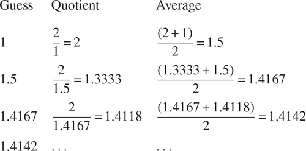
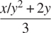

### 1.1.7 举例:牛顿法求平方根

如上所述，函数很像普通的数学函数。它们指定由一个或多个参数确定的值。但是数学函数和计算机函数有一个重要的区别。电脑功能必须有效。

作为一个恰当的例子，考虑计算平方根的问题。我们可以将平方根函数定义为

```js
 = the y such that y ≥ 0 and y2 = x
```

这描述了一个完全合法的数学函数。我们可以用它来识别一个数是否是另一个数的平方根，或者得出关于平方根的一般事实。另一方面，这个定义没有描述计算机的功能。事实上，它几乎没有告诉我们如何实际找到一个给定数字的平方根。用伪 JavaScript 重新表述这个定义没有任何帮助:

```js
function sqrt(x) {
    return the y with y >= 0 && square(y) === x;
}
```

这只能回避问题。

数学函数和计算机函数之间的对比反映了描述事物的属性和描述如何做事情之间的一般区别，或者有时被称为陈述性知识和命令性知识之间的区别。在数学中，我们通常关心陈述性(是什么)描述，而在计算机科学中，我们通常关心命令性(如何)描述。 [^(17)](#c1-fn-0017)

如何计算平方根？最常见的方法是使用牛顿的逐次逼近法，即每当我们对一个数`x`的平方根值有一个猜测`y`时，我们可以通过对`y`与 x /`y`求平均值来执行一个简单的操作，以获得一个更好的猜测值(更接近实际的平方根)。 [^(18)](#c1-fn-0018) 例如，我们可以如下计算 2 的平方根。假设我们最初的猜测是 1:



继续这个过程，我们获得了对平方根越来越好的近似。

现在让我们从功能的角度来形式化这个过程。我们从根号(我们试图计算其平方根的数字)的值和猜测值开始。如果猜测对我们的目的来说足够好，我们就完成了；如果没有，我们必须用改进的猜测重复这个过程。我们把这个基本策略写成一个函数:

```js
function sqrt_iter(guess, x) {
    return is_good_enough(guess, x)
           ? guess
           : sqrt_iter(improve(guess, x), x);
}
```

通过用根号和旧猜测值的商对猜测值进行平均，可以改进猜测值:

```js
function improve(guess, x) {
    return average(guess, x / guess);
}
```

在哪里

```js
function average(x, y) {
    return (x + y) / 2;
}
```

我们还必须说明我们所说的“足够好”是什么意思以下内容可以作为示例，但这并不是一个很好的测试。(参见练习 1.7。)想法是改进答案，直到它足够接近，使得它的平方与根号的差异小于预定的容差(这里是 0.001): [^(19)](#c1-fn-0019)

```js
function is_good_enough(guess, x) {
    return abs(square(guess) - x) < 0.001;
}
```

最后，我们需要一个开始的方法。例如，我们总是可以猜测任何数字的平方根是 1:

```js
function sqrt(x) {
    return sqrt_iter(1, x);
}
```

如果我们向解释器输入这些声明，我们可以像使用任何函数一样使用`sqrt`:

```js
sqrt(9);
3.00009155413138

sqrt(100 + 37);
11.704699917758145

sqrt(sqrt(2) + sqrt(3));
1.7739279023207892

square(sqrt(1000));
1000.000369924366
```

`sqrt`程序也说明了我们到目前为止介绍的简单函数语言足以编写任何纯数字程序，比如用 C 或 Pascal 编写的程序。这可能看起来令人惊讶，因为我们的语言中没有包含任何指导计算机反复做某事的迭代(循环)结构。另一方面,`sqrt_iter`函数演示了除了调用函数的普通能力之外，如何不使用特殊的构造来完成迭代。 [^(20)](#c1-fn-0020)

##### 练习 1.6

Alyssa P. Hacker 不喜欢条件表达式的语法，涉及到字符`?`和`:`。"为什么我不能声明一个普通的条件函数，它的应用就像条件表达式一样？"她问道。21 Alyssa 的朋友 EvaLuAtor 声称这确实可以实现，她声明了一个`conditional`函数如下:

```js
function conditional(predicate, then_clause, else_clause) {
    return predicate ? then_clause : else_clause;
}
```

Eva 为 Alyssa 演示了该计划:

```js
conditional(2 === 3, 0, 5);
5
conditional(1 === 1, 0, 5);
0
```

欣喜之余，Alyssa 用`conditional`重写了平方根程序:

```js
function sqrt_iter(guess, x) {
    return conditional(is_good_enough(guess, x),
                        guess,
                        sqrt_iter(improve(guess, x),
                                  x));
}
```

当 Alyssa 试图用这个来计算平方根时会发生什么？解释一下。

##### 练习 1.7

用于计算平方根的`is_good_enough`测试对于寻找非常小的数字的平方根不是很有效。此外，在真实的计算机中，算术运算几乎总是以有限的精度执行。这使得我们的测试不适用于非常大的数量。请解释这些陈述，并举例说明测试在小数字和大数字情况下是如何失败的。实现`is_good_enough`的另一个策略是观察`guess`如何从一个迭代变化到下一个迭代，当变化只是猜测的一小部分时停止。设计一个使用这种终结测试的平方根函数。这对小数字和大数字更有效吗？

##### 练习 1.8

牛顿的立方根方法基于以下事实:如果`y`是`x`的立方根的近似值，则该值给出了更好的近似值



使用此公式实现类似于平方根函数的立方根函数。(在 1.3.4 节中，我们将看到如何实现牛顿法作为这些平方根和立方根函数的抽象。)
