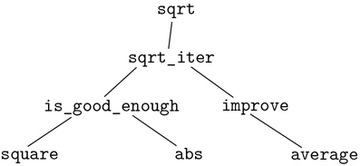

### 1.1.8 起到黑盒抽象的作用

函数`sqrt`是由一组相互定义的函数定义的流程的第一个例子。注意`sqrt_iter`的声明是递归；也就是说，函数是根据它本身来定义的。能够根据函数本身来定义函数的想法可能会令人不安；这种“循环”定义怎么可能有意义，这似乎还不清楚，更不用说指定一个由计算机执行的明确定义的过程了。这将在第 1.2 节中详细讨论。但是首先让我们考虑一下`sqrt`这个例子所展示的其他一些要点。

请注意，计算平方根的问题自然会分解成许多子问题:如何判断猜测是否足够好，如何改进猜测，等等。这些任务中的每一项都由单独的功能来完成。整个`sqrt`程序可以被视为一簇功能(如图 1.2：所示)，反映了问题分解成子问题。



图 1.2：`sqrt`程序的功能分解。

这种分解策略的重要性不仅仅在于将程序分成几个部分。毕竟，我们可以把任何一个大程序分成几个部分——前十行，接下来十行，接下来十行，等等。相反，每个功能完成一个可识别的任务是至关重要的，这个任务可以作为定义其他功能的模块。例如，当我们根据`square`定义`is_good_enough`函数时，我们可以将`square`函数视为一个“黑盒”。我们现在并不关心函数如何计算结果，只关心函数计算平方的事实。如何计算平方的细节可以省略，稍后再考虑。事实上，就`is_good_enough`功能而言，`square`并不完全是一个功能，而是一个功能的抽象，即所谓的功能抽象。在这个抽象层次上，任何计算平方的函数都是一样好的。

因此，仅考虑它们返回的值，下面两个平方一个数的函数应该是不可区分的。每个都接受一个数字参数，并产生该数字的平方作为值。 [^(22)](#c1-fn-0022)

```js
function square(x) {
    return x * x;
}

function square(x) {
    return math_exp(double(math_log(x)));
}

function double(x) {
    return x + x;
}
```

所以函数应该能够抑制细节。该函数的用户可能没有自己编写该函数，但可能从另一个程序员那里作为黑盒获得了该函数。用户不需要知道该功能是如何实现的就可以使用它。

##### 本地名称

对于函数的用户来说，函数实现的一个细节应该无关紧要，那就是实现者对函数参数名称的选择。因此，以下功能应该是不可区分的:

```js
function square(x) {
    return x * x;
}

function square(y) {
    return y * y;
}
```

这个原则——函数的意义应该独立于其作者使用的参数名——表面上似乎是不言而喻的，但其后果是深远的。最简单的结果是函数的参数名必须位于函数体的局部。例如，我们在平方根函数中的`is_good_enough`声明中使用了`square`:

```js
function is_good_enough(guess, x) {
    return abs(square(guess) - x) < 0.001;
}
```

`is_good_enough`作者的意图是确定第一个参数的平方是否在第二个参数的给定容差内。我们看到`is_good_enough`的作者用`guess`这个名字指代第一个论点，用`x`指代第二个论点。`square`的论点是`guess`。如果`square`的作者用`x`(如上)来指代那个论点，我们看到`is_good_ enough`中的`x`一定是与`square`不同的`x`。运行函数`square`不得影响`is_good_enough`使用的`x`的值，因为在`square`完成计算后`is_good_enough`可能需要`x`的值。

如果参数对于它们各自的函数体不是本地的，那么`square`中的参数`x`可能会与`is_good_ enough`中的参数`x`混淆，`is_good_enough`的行为将取决于我们使用的`square`的版本。因此，`square`不是我们想要的黑盒。

函数的参数在函数声明中有一个非常特殊的角色，因为参数的名称无关紧要。这样的名字叫做绑定，我们说函数声明绑定它的参数。如果绑定名称在整个声明中被一致地重命名，那么函数声明的意义是不变的。 [^(23)](#c1-fn-0023) 如果一个名字没有被绑定，我们说它是自由的。绑定为其声明名称的语句集被称为该名称的作用域。在函数声明中，声明为函数参数的绑定名称的作用域是函数体。

在上面的`is_good_enough`声明中，`guess`和`x`是绑定名称，而`abs`和`square`是自由名称。`is_good_enough`的含义应该独立于我们为`guess`和`x`选择的名称，只要它们与`abs`和`square`不同。(如果我们将`guess`重命名为`abs`，我们会因为捕获名称`abs`而引入一个 bug。它会从自由变成束缚。)然而，`is_good_enough`的含义并不独立于其自由名称的选择。这当然取决于这样一个事实(声明之外的):名字`abs`指的是计算一个数的绝对值的函数。如果我们在声明中用`math_cos`(原始余弦函数)代替`abs`，函数`is_good_enough`将计算一个不同的函数。

##### 内部声明和块结构

到目前为止，我们有一种可用的名称隔离:函数的参数对于函数体是局部的。平方根程序展示了我们控制名字使用的另一种方式。现有程序由单独的功能组成:

```js
function sqrt(x) {
    return sqrt_iter(1, x);
}
function sqrt_iter(guess, x) {
    return is_good_enough(guess, x)
           ? guess
           : sqrt_iter(improve(guess, x), x);
}
function is_good_enough(guess, x) {
    return abs(square(guess) - x) < 0.001;
}
function improve(guess, x) {
    return average(guess, x / guess);
}
```

这个程序的问题在于，对`sqrt`的用户来说唯一重要的功能是`sqrt`。其他功能(`sqrt_iter`、`is_good_enough`和`improve`)只会让他们头脑混乱。他们可能没有声明任何其他名为`is_good_enough`的函数作为另一个程序的一部分来与平方根程序一起工作，因为`sqrt`需要它。在由许多独立的程序员构建大型系统时，这个问题尤其严重。例如，在大型数值函数库的构建中，许多数值函数被计算为逐次逼近，因此可能有名为`is_good_enough`和`improve`的函数作为辅助函数。我们希望将子函数本地化，将它们隐藏在`sqrt`中，这样`sqrt`可以与其他逐次逼近共存，每个都有自己的私有`is_good_enough`函数。
为了使这成为可能，我们允许一个函数拥有对该函数来说是局部的内部声明。例如，在平方根问题中，我们可以写

```js
function sqrt(x) {
    function is_good_enough(guess, x) {
        return abs(square(guess) - x) < 0.001;
    }
    function improve(guess, x) {
        return average(guess, x / guess);
        }
    function sqrt_iter(guess, x) {
        return is_good_enough(guess, x)
               ? guess
               : sqrt_iter(improve(guess, x), x);
    }
    return sqrt_iter(1, x);
}
```

任何匹配的大括号对都指定了一个块，并且该块内部的声明是该块的局部声明。这种声明的嵌套，称为块结构，基本上是最简单的名称包装问题的正确解决方案。但是这里隐藏着一个更好的想法。除了内部化辅助函数的声明，我们还可以简化它们。由于`x`被绑定在`sqrt`的声明中，所以`sqrt`内部声明的`is_good_enough`、`improve`、`sqrt_iter`都在`x`的范围内。因此，没有必要明确地将`x`传递给这些函数中的每一个。相反，我们允许`x`在内部声明中是一个自由名称，如下所示。然后`x`从调用封闭函数`sqrt`的参数中获取其值。这个规程叫做词法范围。 [^(24)](#c1-fn-0024)

```js
function sqrt(x) {
    function is_good_enough(guess) {
        return abs(square(guess) - x) < 0.001;
    }
    function improve(guess) {
        return average(guess, x / guess);
    }
    function sqrt_iter(guess) {
        return is_good_enough(guess)
               ? guess
               : sqrt_iter(improve(guess));
    }
    return sqrt_iter(1);
}
```

我们将广泛使用块结构来帮助我们将大型程序分解成易于处理的部分。 [^(25)](#c1-fn-0025) 块结构的思想起源于编程语言 Algol 60。它出现在大多数高级编程语言中，是帮助组织大型程序构造的重要工具。*  *
