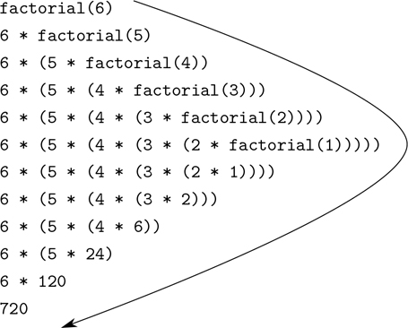
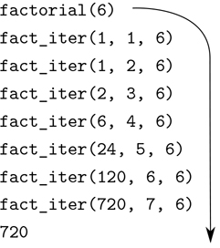

### 1.2.1 线性递归与迭代

我们首先考虑阶乘函数，定义如下

```js
n! = n · (n – 1) · (n – 2) ... 3 · 2 · 1
```

有许多方法可以计算阶乘。一种方法是利用观察到的 n ！等于`n`倍(n–1)！对于任意正整数 n :

```js
n! = n · [(n – 1) · (n – 2) ... 3 · 2 · 1] = n · (n – 1)!
```

这样，我们就可以计算出 n ！通过计算(n–1)！并将结果乘以 n 。如果我们加上规定 1！等于 1，这个观察结果直接转化为计算机函数:

```js
function factorial(n) {
    return n === 1
           ? 1
           : n * factorial(n - 1);
}
```

我们可以用 1.1.5 节的替代模型来观看动作计算 6 中的这个函数！，如图 1.3：所示。



图 1.3：一个用于计算 6 的线性递归过程！。

现在让我们从不同的角度来看阶乘的计算。我们可以描述一个计算规则。通过指定我们首先将 1 乘以 2，然后将结果乘以 3，然后乘以 4，等等，直到我们到达 n 。更正式的说法是，我们维护一个运行的产品，以及一个从 1 数到`n`的计数器。我们可以这样描述计算:计数器和乘积根据规则同时从一个步骤变化到下一个步骤

```js
product ← counter · product 
counter ← counter + 1
```

并规定 n ！是计数器超过`n`时的乘积值。

同样，我们可以将我们的描述改写为计算阶乘的函数: [^(26)](#c1-fn-0026)

```js
function factorial(n) {
    return fact_iter(1, 1, n);
}
function fact_iter(product, counter, max_count) {
    return counter > max_count
           ? product
           : fact_iter(counter * product,
                       counter + 1,
                       max_count);
}
```

和前面一样，我们可以用代入模型来形象化计算 6 的过程！，如图 1.4：所示。



图 1.4：用于计算 6 的线性迭代过程！。

比较这两个过程。从一个角度来看，他们似乎没有什么不同。两者在相同的域上计算相同的数学函数，并且每一个都需要与`n`成比例的步骤来计算 n ！。事实上，这两个过程甚至执行相同的乘法序列，获得相同的部分乘积序列。另一方面，当我们考虑这两个过程的“形状”时，我们发现它们的发展完全不同。

考虑第一个过程。替代模型揭示了先膨胀后收缩的形状，如图 1.3 中[的箭头所示。当该过程建立起一串延迟操作(在本例中，是一串乘法)时，就会发生扩展。收缩是在实际操作时发生的。这种以一系列延迟操作为特征的过程被称为递归过程。执行这个过程需要解释器跟踪随后要执行的操作。在`n`的计算中！延迟乘法链的长度以及跟踪它所需的信息量随着`n`线性增长(与`n`成比例)，就像步骤的数量一样。这样的过程被称为线性递归过程。](#c1-fig-0009)

相比之下，第二个过程不会增长和收缩。在每一步，对于任何 n ，我们需要跟踪的只是名字`product`、`counter`和`max_count`的当前值。我们称之为迭代过程。一般来说，一个迭代过程的状态可以用固定数量的状态变量来概括，还有一个固定的规则来描述当过程从一个状态移动到另一个状态时状态变量应该如何更新，以及一个(可选的)结束测试来指定过程应该终止的条件。在计算 n ！，所需的步骤数随着`n`线性增长。这样的过程被称为线性迭代过程。

这两个过程之间的差异可以从另一个角度来看。在迭代的情况下，状态变量提供了过程在任一点的状态的完整描述。如果我们在两个步骤之间停止计算，我们需要做的就是向解释器提供三个状态变量的值来恢复计算。递归过程并非如此。在这种情况下，有一些附加的“隐藏”信息，由解释器维护，不包含在状态变量中，它指示在协商延迟操作链中“进程在哪里”。链条越长，必须维护的信息就越多。 [^(27)](#c1-fn-0027)

在对比迭代和递归时，我们必须小心不要混淆递归过程和递归函数的概念。当我们将一个函数描述为递归时，我们指的是语法事实，即函数声明(直接或间接)指的是函数本身。但是当我们将一个过程描述为遵循一种模式时，比如说线性递归，我们谈论的是过程如何演化，而不是函数如何编写的语法。我们将诸如`fact_iter`这样的递归函数称为生成迭代过程，这似乎令人不安。然而，这个过程实际上是迭代的:它的状态完全由它的三个状态变量捕获，为了执行这个过程，解释器只需要记住三个名字。

过程和函数之间的区别可能令人困惑的一个原因是，大多数公共语言(包括 C、Java 和 Python)的实现都是以这样一种方式设计的，即任何递归函数的解释都会消耗大量的内存，这些内存随着函数调用的数量而增长，即使所描述的过程原则上是迭代的。因此，这些语言只能通过求助于特殊目的的“循环结构”来描述迭代过程，例如`do`、`repeat`、`until`、`for`和`while`。我们将在第五章中讨论的 JavaScript 实现没有这个缺陷。它将在常数空间中执行一个迭代过程，即使这个迭代过程是用递归函数描述的。具有该属性的实现被称为尾递归。 [^(28)](#c1-fn-0028) 在 tailrecursive 实现中，迭代可以用普通的函数调用机制来表达，因此特殊的迭代构造只在语法上有用。 [^(29)](#c1-fn-0029)

##### 练习 1.9

下面两个函数中的每一个都根据函数`inc`定义了一个将两个正整数相加的方法，其中函数`inc`的参数增加 1，函数`dec`的参数减少 1。

```js
function plus(a, b) {
    return a === 0 ? b : inc(plus(dec(a), b));
}

function plus(a, b) {
    return a === 0 ? b : plus(dec(a), inc(b));
}
```

使用替代模型，说明每个函数在评估`plus(4, 5);`时产生的过程。这些过程是迭代的还是递归的？

##### 练习 1.10

下面的函数计算一个称为阿克曼函数的数学函数。

```js
function A(x, y) {
    return y === 0
           ? 0
           : x === 0
           ? 2 * y
           : y === 1
           ? 2
           : A(x - 1, A(x, y - 1));
}
```

下列陈述的价值是什么？

```js
A(1, 10);

A(2, 4);

A(3, 3);
```

考虑以下函数，其中`A`是上面声明的函数:

```js
function f(n) {
    return A(0, n);
}
function g(n) {
    return A(1, n);
}
function h(n) {
    return A(2, n);
}
function k(n) {
    return 5 * n * n;
}
```

给出函数`f`、`g`、`h`对`n`的正整数值计算的函数的简明数学定义。比如 k ( n )计算 5n2。
