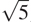

### 1.2.2 树递归

另一种常见的计算模式叫做树递归。例如，考虑计算斐波那契数列，其中每个数字都是前两个数字的和:

```js
0, 1, 1, 2, 3, 5, 8, 13, 21, . . .
```

一般来说，斐波纳契数可以由规则来定义


我们可以立即将这个定义转化为计算斐波纳契数的递归函数:

```js
function fib(n) {
    return n === 0
           ? 0
           : n === 1
           ? 1
           : fib(n - 1) + fib(n - 2);
}
```

考虑一下这种计算的模式。为了计算`fib(5)`，我们计算`fib(4)`和`fib(3)`。为了计算`fib(4)`，我们计算`fib(3)`和`fib(2)`。一般来说，演化后的流程看起来像一棵树，如图 1.5：所示。请注意，分支在每一层都分裂成两个(底部除外)；这反映了一个事实，即`fib`函数每次被调用时都会调用自己两次。


图 1.5：计算`fib(5)`中生成的树递归过程。

这个函数作为一个典型的树递归是有指导意义的，但是它是一个计算斐波那契数的糟糕方法，因为它做了太多多余的计算。请注意图 1.5 中的[和](#c1-fig-0012)中的`fib(3)`的整个计算——几乎一半的工作——都是重复的。事实上，不难看出，函数将计算`fib(1)`或`fib(0)`的次数(一般来说是上述树中的叶子数)恰恰是 Fib( n + 1)。为了了解这有多糟糕，我们可以展示 Fib( n )的值随着`n`呈指数增长。更准确地说(见练习 1.13)，Fib( n )是最接近 ϕ ^n / 的整数，其中

```js
ϕ = (1 + )/2 ≈ 1.6180
```

是黄金分割比，满足等式

```js
ϕ2 = ϕ + 1
```

因此，该过程使用随着输入呈指数增长的许多步骤。另一方面，所需的空间仅随输入线性增长，因为我们只需要跟踪在计算中的任何点上树中哪些节点在我们之上。通常，树递归过程所需的步骤数将与树中的节点数成比例，而所需的空间将与树的最大深度成比例。

我们也可以制定一个迭代过程来计算斐波纳契数。这个想法是使用一对整数`a`和`b`，初始化为 Fib(1) = 1 和 Fib(0) = 0，并重复应用同时变换

```js
a ← a + b
b ← a
```

不难看出，在应用这个变换`n`次之后，`a`和`b`将分别等于 Fib( n + 1)和 Fib( n )。因此，我们可以使用函数迭代计算斐波那契数

```js
function fib(n) {
    return fib_iter(1, 0, n);
}
function fib_iter(a, b, count) {
    return count === 0
           ? b
           : fib_iter(a + b, a, count - 1);
}
```

计算 Fib( n )的第二种方法是线性迭代。这两种方法所需的步骤数量差异巨大——一种是线性的，另一种与 Fib( n )本身增长一样快——即使对于小的输入也是如此。

人们不应该由此得出结论，树递归过程是无用的。当我们考虑对层次结构数据而不是数字进行操作的过程时，我们会发现树递归是一种自然而强大的工具。[30但是即使在数值运算中，树递归过程也可以帮助我们理解和设计程序。例如，尽管第一个`fib`函数的效率比第二个低得多，但它更简单，只不过是将斐波那契数列的定义翻译成 JavaScript。为了制定迭代算法，需要注意到计算可以被重铸为具有三个状态变量的迭代。](#c1-fn-0030)

##### 示例:计数变化

提出迭代斐波那契算法只需要一点小聪明。相比之下，考虑下面的问题:给定半美元、25 美分、10 美分、5 美分和 1 美分(分别为 50 美分、25 美分、10 美分、5 美分和 1 美分)，我们可以用多少种不同的方法兑换 1 美元(100 美分)？更一般地说，我们能不能写一个函数来计算改变任何给定金额的方法的数量？

这个问题有一个简单的递归函数解决方案。假设我们认为可用的硬币类型是按照某种顺序排列的。那么下面的关系成立:

使用`n`种硬币来兑换数量个的方法等于

*   使用除第一种硬币之外的所有硬币来改变数量的方法`a`，加上
*   使用所有`n`种硬币兑换金额的方式数量 a–d，其中 d 为第一种硬币的面额。

要明白为什么这是真的，可以观察到改变的方式可以分为两组:一组不使用第一种硬币，另一组使用第一种硬币。因此，在不使用任何第一种硬币的情况下，对某一数量进行兑换的方法的总数等于对该数量进行兑换的方法的总数，加上假设我们使用第一种硬币进行兑换的方法的总数。但是后一个数字等于使用第一种硬币后剩余的零钱的数量。

因此，我们可以递归地将兑换给定金额的问题简化为兑换较小金额或使用较少种类硬币的问题。仔细考虑这个归约规则，并说服自己，如果我们指定以下退化情况，我们可以用它来描述一个算法: [^(31)](#c1-fn-0031)

*   如果`a`正好是 0，我们应该把它算作一种改变的方式。
*   如果`a`小于 0，我们应该把它算作 0 种改变的方法。
*   如果`n`是 0，我们应该把它算作 0 种改变的方式。

我们可以很容易地将这种描述转化为递归函数:

```js
function count_change(amount) {
    return cc(amount, 5);
}
function cc(amount, kinds_of_coins) {
    return amount === 0
           ? 1
           : amount < 0 || kinds_of_coins === 0
           ? 0
           : cc(amount, kinds_of_coins - 1)
             +
             cc(amount - first_denomination(kinds_of_coins), 
                kinds_of_coins);
}
function first_denomination(kinds_of_coins) {
    return kinds_of_coins === 1 ? 1
         : kinds_of_coins === 2 ? 5
         : kinds_of_coins === 3 ? 10
         : kinds_of_coins === 4 ? 25
         : kinds_of_coins === 5 ? 50
         : 0;
}
```

(`first_denomination`函数将可用硬币种类的数量作为输入，并返回第一种硬币的面额。这里我们认为硬币是按照从大到小的顺序排列的，但是任何顺序都可以。)我们现在可以回答我们最初关于兑换一美元的问题了:

```js
count_change(100);
292
```

函数`count_change`生成一个具有冗余的树递归过程，类似于我们的第一个实现`fib`中的那些。另一方面，如何设计一个更好的算法来计算结果并不明显，我们把这个问题作为一个挑战。观察到树递归过程可能效率非常低，但通常易于指定和理解，这使得人们提出可以通过设计“智能编译器”来获得两个世界的最佳效果，该编译器可以将树递归函数转换为计算相同结果的更有效的函数。 [^(32)](#c1-fn-0032)

##### 练习 1.11

一个函数`f`由规则 f(n)=nifn<3 和 f(n)=f(n–1)+2f(n–2)+定义编写一个 JavaScript 函数，通过递归过程计算 f 。编写一个通过迭代过程计算`f`的函数。

##### 练习 1.12

下面这个数字的模式叫做帕斯卡三角形。


三角形边上的数字都是 1，三角形里面的每个数字都是它上面两个数字之和。写一个函数，通过递归过程计算帕斯卡三角形的元素。

##### 练习 1.13

证明 Fib( n )是最接近ϕ^n/的整数，其中 ϕ = (1 +  )/2。提示:用归纳法和斐波那契数列的定义证明 fib(n)=(ϕ^n–ψ^n)/，其中ψ=(1—)/2。
