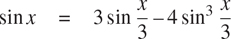

### 1.2.3 订单增长

前面的例子说明了进程消耗计算资源的速度可能有很大的不同。描述这种差异的一个方便的方法是使用增长顺序的概念来获得一个过程在投入变大时所需资源的总量。

设`n`为衡量问题大小的参数，设 R ( n )为处理大小为`n`的问题所需的资源量。在我们之前的例子中，我们将`n`作为要计算给定函数的数字，但是也有其他的可能性。例如，如果我们的目标是计算一个数的平方根的近似值，我们可以将`n`作为所需精度的位数。对于矩阵乘法来说，我们可能会将`n`作为矩阵的行数。一般来说，问题有许多特性，根据这些特性来分析一个给定的过程是可取的。类似地， R ( n )可能测量使用的内部存储寄存器的数量，执行的基本机器操作的数量，等等。在一次只进行固定次数运算的计算机中，所需的时间将与基本的机器运算次数成正比。

我们说 R ( n )有增长顺序θ(f(n【T7]))，写成 R(n)=θ(f(n)(读作“θoff(n)”)，如果有正常数 k 【T21

```js
k1 f (n) ≤ R(n) ≤ k2 f (n)
```

对于任何足够大的`n`值。(换句话说，对于大的 n ，值 R ( n )夹在 k[1]f(n)和 k[2f(n)之间。)]

例如，使用第 1.2.1 节中描述的计算阶乘的线性递归过程，步骤数与输入`n`成比例增长。因此，该过程所需的步骤随着θ(n)而增长。我们还看到，所需空间随着θ(n)而增长。对于迭代阶乘，步数仍然是θ(n)，但空间是θ(1)——即常数。 [^(34)](#c1-fn-0034) 树递归斐波纳契运算需要θ(ϕ^n)步数和空间θ(n)，其中 ϕ 是 1.2.2 节所述的黄金分割比。

增长的顺序仅仅提供了一个过程行为的粗略描述。比如一个需要 n ² 步的流程和一个需要 1000 n ² 步的流程和一个需要 3n²+10n+17 步的流程都有θ(n²)的增长顺序。另一方面，增长的顺序提供了一个有用的指示，当我们改变问题的规模时，我们可以期望过程的行为如何改变。对于一个θ(n)(线性)进程，大小加倍将会使使用的资源量大致加倍。对于指数过程，问题规模的每一个增量都会将资源利用率乘以一个常数因子。在 1.2 节的剩余部分，我们将考察两个增长顺序为对数的算法，因此问题规模加倍会增加恒定量的资源需求。

##### 练习 1.14

画出说明 1.2.2 节的`count_change`函数在找零 11 美分时产生的过程的树。当要改变的量增加时，该过程使用的空间和步骤数量的增长顺序是什么？

##### 练习 1.15

如果`x`足够小，角度的正弦(以弧度表示)可以通过利用近似 sin x ≈`x`和三角恒等式来计算



来减少罪的论点的篇幅。(在本练习中，如果角度的大小不大于 0.1 弧度，则认为该角度“足够小”。)这些想法被合并到以下功能中:

```js
function cube(x) {
    return x * x * x;
}
function p(x) {
    return 3 * x - 4 * cube(x);
}
function sine(angle) {
    return ! (abs(angle) > 0.1)
           ? angle
           : p(sine(angle / 3));
}
```

1.  a. 评估`sine(12.15)`时，函数`p`应用了多少次？
2.  b. 对`sine(a)`求值时，`sine`函数生成的进程所使用的空间和步数(作为`a`的函数)的增长顺序是什么？
