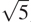

### 1.2.5 最大公约数

两个整数`a`和`b`的最大公约数(GCD)被定义为除以`a`和`b`且没有余数的最大整数。比如 16 和 28 的 GCD 是 4。在第二章中，当我们研究如何实现有理数算术时，我们需要能够计算 gcd，以便将有理数减少到最低项。(为了将有理数化为最低项，我们必须将分子和分母都除以它们的 GCD。例如，16/28 减少到 4/7。)求两个整数的 GCD 的一个方法是对它们进行因式分解，寻找公因式，但是有一个著名的算法要高效得多。

该算法的思想基于这样的观察，如果当`a`被`b`除时 r 是余数，那么`a`和`b`的公约数与`b`和 r 的公约数完全相同。因此，我们可以使用等式

```js
GCD(a, b) = GCD(b, r)
```

将计算 GCD 的问题逐步简化为计算越来越小的整数对的 GCD 的问题。举个例子，

```js
GCD(206, 40) = GCD(40, 6)
       = GCD(6, 4)
       = GCD(4, 2)
       = GCD(2, 0)
       = 2
```

将 GCD(206，40)缩减为 GCD(2，0)，即 2。可以证明，从任意两个正整数开始并执行重复的归约，最终总是会产生第二个数为 0 的对。那么 GCD 就是配对中的另一个数。这种计算 GCD 的方法被称为欧几里德算法。 [^(40)](#c1-fn-0040)

很容易将欧几里德算法表达为一个函数:

```js
function gcd(a, b) {
    return b === 0 ? a : gcd(b, a % b);
}
```

这产生了一个迭代过程，其步骤数随着所涉及数字的对数而增长。

欧几里德算法所需的步骤数呈对数增长，这一事实与斐波纳契数有着有趣的关系:

* * *

**Lamé定理:**如果欧几里德算法需要`k`步计算某对的 GCD，那么该对中较小的数一定大于或等于第`k`个斐波那契数。 [^(41)](#c1-fn-0041)

* * *

我们可以用这个定理来得到欧几里德算法的增长阶估计。设`n`为函数的两个输入中较小的一个。如果流程需要`k`步，那么我们必须有 n≥fib(k)≈ϕ^k/。因此步数`k`随着`n`的对数(以 ϕ 为底)增长。因此，增长的顺序是θ(logn)。

##### 练习 1.20

函数生成的过程当然取决于解释器使用的规则。作为一个例子，考虑上面给出的迭代`gcd`函数。假设我们使用正常顺序评估来解释这个函数，如 1.1.5 节所讨论的。(练习 1.5 中描述了条件表达式的正常顺序求值规则。)使用替换法(对于正常订单)，说明评估`gcd(206, 40)`产生的过程，并指出实际执行的`remainder`操作。在`gcd(206, 40)`的正常顺序评估中，实际执行了多少次`remainder`操作？在应用顺序评估中？
