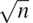

### 1.2.6 示例:测试素性

本节描述了检查整数`n`的素性的两种方法，一种是使用增长顺序θ()，另一种是使用增长顺序θ(logn)的“概率”算法。本节末尾的练习提出了基于这些算法的编程项目。

##### 寻找约数

自古以来，数学家们就对有关素数的问题着迷，许多人都致力于确定检验数字是否为素数的方法的问题。检验一个数是否是质数的一种方法是找出这个数的约数。下面的程序找到给定数字`n`的最小整数除数(大于 1)。它通过测试`n`是否能被从 2 开始的连续整数整除，以一种简单的方式实现这一点。

```js
function smallest_divisor(n) {
    return find_divisor(n, 2);
}
function find_divisor(n, test_divisor) {
    return square(test_divisor) > n
           ? n
           : divides(test_divisor, n)
           ? test_divisor
           : find_divisor(n, test_divisor + 1);
}
function divides(a, b) {
    return b % a === 0;
}
```

我们可以这样来检验一个数是否是质数:`n`是质数当且仅当`n`是它自己的最小除数。

```js
function is_prime(n) {
    return n === smallest_divisor(n);
}
```

对`find_divisor`的最终测试是基于这样的事实:如果`n`不是质数，那么它必须有一个小于或等于的除数。 [^( 42 )](#c1-fn-0042) 这意味着算法只需要测试 1 和之间的除数。因此，将`n`识别为素数所需的步骤数将具有增长顺序θ()。

##### 费马试验

θ(logn)素性测试基于数论的一个结果，即费马小定理。 [^(43)](#c1-fn-0043)

* * *

**费马小定理:**若`n`为素数，`a`为任意小于`n`的正整数，则`a`的`n`次幂全等于`a`模 n 。

* * *

(如果两个数被`n`除后有相同的余数，则称这两个数为同余模 n 。一个数`a`除以`n`的余数也被称为`a`模`n`的余数或简称为`a`模`n`的余数。)

如果`n`不是素数，那么，一般来说，大多数数 an 都不会满足上述关系。这就产生了下面的测试素性的算法:给定一个数 n ，选取一个随机数 an 并计算 a^n模`n`的余数。如果结果不等于`a`，那么`n`肯定不是素数。如果是 a，那么很有可能`n`是质数。现在选择另一个随机数`a`，用同样的方法测试。如果它也满足等式，那么我们可以更加确信`n`是质数。通过尝试越来越多的`a`的值，我们可以增加对结果的信心。这种算法被称为费马测试。

为了实现费马测试，我们需要一个函数来计算一个数对另一个数的指数:

```js
function expmod(base, exp, m) {
    return exp === 0
           ? 1
           : is_even(exp)
           ? square(expmod(base, exp / 2, m)) % m
           : (base * expmod(base, exp - 1, m)) % m;
}
```

这与 1.2.4 节的`fast_expt`功能非常相似。它使用连续平方，因此步数与指数成对数增长。 [^(44)](#c1-fn-0044)

费马试验是在 1 和 n–1 之间随机选择一个数字`a`并检查`a`的`n`次方的余数模`n`是否等于`a`。使用原始函数`math_random`选择随机数`a`，该函数返回一个小于 1 的非负数。因此，为了获得一个介于 1 和 n–1 之间的随机数，我们将`math_random`的返回值乘以 n–1，用原始函数`math_floor`将结果向下舍入，并加上 1:

```js
function fermat_test(n) {
    function try_it(a) {
        return expmod(a, n, n) === a;
    }
    return try_it(1 + math_floor(math_random() * (n - 1)));
}
```

下面的函数按照参数指定的次数运行测试。如果测试每次都成功，则其值为 true，否则为 false。

```js
function fast_is_prime(n, times) {
    return times === 0
           ? true
           : fermat_test(n)
           ? fast_is_prime(n, times - 1)
           : false;
}
```

##### 概率方法

费马测试在性质上不同于大多数熟悉的算法，在这些算法中，计算出的答案保证是正确的。这里，得到的答案只是可能正确。更准确地说，如果`n`没有通过费马测试，我们可以确定`n`不是质数。但是，`n`通过测试的事实，虽然是一个非常强烈的暗示，但仍然不能保证`n`是质数。我们想说的是，对于任何一个数 n ，如果我们进行足够多次的测试，发现`n`总是通过测试，那么我们的素性测试中的错误概率就可以做到我们喜欢的那样小。

不幸的是，这种说法并不完全正确。确实存在欺骗费马测试的数字:不是质数的数字 n ，但具有这样的性质:对于所有整数 a < n ，a ^n 同余于`a`模 n 。这样的数字是极其罕见的，所以费马试验在实践中是相当可靠的。 [^(45)](#c1-fn-0045) 费马试验有变异，不能被忽悠。在这些测试中，与费马方法一样，人们通过选择一个随机整数 an 并检查依赖于`n`和`a`的某些条件来测试整数`n`的素性。(参见练习 1.28 中的测试示例。)另一方面，与费马测试相反，人们可以证明，对于任何 n ，条件对于大多数整数 an 都不成立，除非`n`是素数。因此，如果`n`通过随机选择`a`的测试，那么几率甚至比`n`是质数还要大。如果`n`通过两次随机选择`a`的测试，则`n`为质数的几率大于 3/4。通过使用越来越多随机选择的和值进行测试，我们可以使错误概率尽可能小。

可以证明错误概率变得任意小的测试的存在激发了人们对这种算法的兴趣，这种算法被称为概率算法。在这个领域有大量的研究活动，概率算法已经卓有成效地应用于许多领域。 [^(46)](#c1-fn-0046)

##### 练习 1.21

使用`smallest_divisor`函数找出下列每个数字的最小除数:199，1999，19999。

##### 练习 1.22

假设一个没有参数的原始函数`get_time`返回自 1970 年 1 月 1 日星期四 00:00:00 UTC 以来经过的毫秒数。 [^(47)](#c1-fn-0047) 下面的`timed_prime_test`函数，当用整数`n`调用时，打印`n`并检查`n`是否为质数。如果`n`为质数，该功能将打印三个星号 [^(48)](#c1-fn-0048) ，后跟执行测试所用的时间。

```js
function timed_prime_test(n) { 
    display(n);
    return start_prime_test(n, get_time());
}
function start_prime_test(n, start_time) {
    return is_prime(n)
           ? report_prime(get_time() - start_time)
           : true;
}
function report_prime(elapsed_time) {
    display(" *** ");
    display(elapsed_time);
}
```

使用这个函数，写一个函数`search_for_primes`,检查指定范围内连续奇数整数的素性。用你的函数求大于 1000 的三个最小素数；大于 10000；大于 10 万；大于 100 万。注意测试每个素数所需的时间。因为测试算法的增长顺序是θ()，所以你应该预计测试 10，000 左右的素数所需的时间大约是测试 1000 左右的素数所需的时间的倍。你的计时数据证实了这一点吗？10 万和 100 万的数据在多大程度上支持了的预测？你的结果是否符合你机器上的程序运行时间与计算所需的步骤数成正比的概念？

##### 练习 1.23

本节开头显示的`smallest_divisor`函数做了许多不必要的测试:在它检查这个数是否能被 2 整除之后，检查它是否能被任何更大的偶数整除就没有意义了。这表明用于`test_divisor`的值不应该是 2，3，4，5，6，.。。而是 2，3，5，7，9，为了实现这种变化，声明一个函数`next`，如果它的输入等于 2，则返回 3，否则返回它的输入加 2。修改`smallest_divisor`功能，用`next(test_divisor)`代替`test_divisor + 1`。用`timed_prime_test`合并这个`smallest_divisor`的修改版本，对练习 1.22 中找到的 12 个素数中的每一个进行测试。因为这个修改将测试步骤的数量减半，所以您应该期望它的运行速度提高一倍。这个预期得到证实了吗？如果不是，观察到的两种算法的速度之比是多少，如何解释它不同于 2 的事实？

##### 练习 1.24

修改练习 1.22 的`timed_prime_test`函数以使用`fast_is_prime`(费马方法)，并测试你在练习中发现的 12 个素数。因为费马测试有θ(logn)增长，你认为测试接近 100 万的素数所需的时间与测试接近 1000 的素数所需的时间相比如何？你的数据证实了这一点吗？你能解释你发现的任何差异吗？

##### 练习 1.25

Alyssa P. Hacker 抱怨说我们在写`expmod`的时候做了很多额外的工作。毕竟，她说，既然我们已经知道如何计算指数，我们可以简单地写

```js
function expmod(base, exp, m) {
    return fast_expt(base, exp) % m;
}
```

她是正确的吗？这个功能也适用于我们的快速 prime 测试器吗？解释一下。

##### 练习 1.26

路易斯·雷森纳做练习 1.24 有很大困难。他的`fast_is_prime`测试似乎比他的`is_prime`测试运行得更慢。路易斯叫他的朋友伊娃·卢阿特尔过来帮忙。当他们检查 Louis 的代码时，他们发现他重写了`expmod`函数以使用显式乘法，而不是调用`square`:

```js
function expmod(base, exp, m) {
    return exp === 0
           ? 1
           : is_even(exp)
           ? (  expmod(base, exp / 2, m)
              * expmod(base, exp / 2, m)) % m
           : (base * expmod(base, exp - 1, m)) % m;
}
```

“我看不出这有什么不同，”路易斯说。“我愿意。”伊娃说。“通过编写这样的函数，您已经将θ(logn)过程转换为θ(n)过程。”解释一下。

##### 练习 1.27

证明脚注 45 中列出的卡迈克尔数字确实欺骗了费马检验。也就是说，编写一个函数，该函数取一个整数 n ，并测试对于每个 a < n ， a ^n 是否与`a`模`n`同余，并在给定的 Carmichael 数上尝试您的函数。

##### 练习 1.28

费马试验的一个变体被称为米勒-拉宾试验(米勒 1976；拉宾 1980)。这从费马小定理的另一种形式开始，即如果`n`是一个质数，并且`a`是任何小于`n`的正整数，那么`a`的(n–1)次方等于 1 模 n 。为了通过米勒-拉宾测试来测试一个数`n`的素性，我们选取一个随机数 a <`n`并使用`expmod`函数将`a`提升到(n【T28–1】的 st 次幂模 n 。然而，每当我们执行`expmod`中的平方步骤时，我们检查是否发现了“1 模`n`的非平凡平方根”，也就是说，一个不等于 1 或 n–1 的数的平方等于 1 模 n 。有可能证明，如果存在这样一个 1 的非平凡平方根，那么`n`不是素数。也有可能证明，如果`n`是一个不是素数的奇数，那么，对于至少一半的数 a < n ，以这种方式计算 a^n^(–1)将揭示 1 模`n`的非平凡平方根。(这就是米勒-拉宾测试不能被愚弄的原因。)修改`expmod`函数，如果它发现 1 的非平凡平方根，则发出信号，并使用类似于`fermat_test`的函数来实现米勒-拉宾测试。通过测试各种已知的素数和非素数来检查你的函数。提示:产生`expmod`信号的一种简便方法是让它返回 0。
