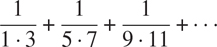
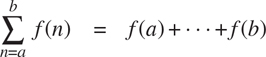
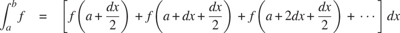
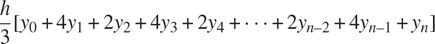
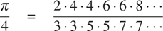

### 1.3.1 用作自变量

考虑以下三个函数。第一个函数计算从`a`到`b`的整数之和:

```js
function sum_integers(a, b) {
    return a > b
           ? 0
           : a + sum_integers(a + 1, b);
}
```

第二个函数计算给定范围内整数的立方之和:

```js
function sum_cubes(a, b) {
    return a > b
           ? 0
           : cube(a) + sum_cubes(a + 1, b);
}
```

第三个函数计算数列中一系列项的总和



收敛到 π /8(非常慢): [^(49)](#c1-fn-0049)

```js
function pi_sum(a, b) {
    return a > b
           ? 0
           : 1 / (a * (a + 2)) + pi_sum(a + 4, b);
}
```

这三个功能显然共享一个共同的底层模式。它们在很大程度上是相同的，不同之处仅在于函数的名称，用于计算要添加的项的函数`a`，以及提供`a`的下一个值的函数。我们可以通过填充同一个模板中的槽来生成每个函数:

```js
function name(a, b) {
    return a > b
           ? 0
           : term(a) + name(next(a), b);
}
```

这种常见模式的存在是一个强有力的证据，表明有一个有用的抽象正等待被呈现出来。事实上，数学家很久以前就发现了级数求和的抽象概念，并发明了“西格玛符号”，例如



来表达这个概念。sigma 符号的强大之处在于，它允许数学家处理求和本身的概念，而不仅仅是特定的和，例如，制定与被求和的特定序列无关的和的一般结果。

同样，作为程序设计者，我们希望我们的语言足够强大，这样我们就可以编写一个函数来表达求和本身的概念，而不仅仅是计算特定和的函数。我们可以在函数式语言中很容易地做到这一点，方法是采用上面显示的通用模板，并将“插槽”转换为参数:

```js
function sum(term, a, next, b) {
    return a > b
           ? 0
           : term(a) + sum(term, next(a), next, b);
}
```

注意，`sum`将上下界`a`和`b`以及函数`term`和`next`作为它的参数。我们可以像使用任何函数一样使用`sum`。例如，我们可以使用它(以及一个将其参数增加 1 的函数`inc`)来定义`sum_cubes`:

```js
function inc(n) {
    return n + 1;
}
function sum_cubes(a, b) {
    return sum(cube, a, inc, b);
}
```

利用这个，我们可以计算从 1 到 10 的整数的立方之和:

```js
sum_cubes(1, 10);
3025
```

借助于计算该项的恒等函数，我们可以用`sum`来定义`sum_ integers`:

```js
function identity(x) {
    return x;
}

function sum_integers(a, b) {
    return sum(identity, a, inc, b);
}
```

然后我们可以把从 1 到 10 的整数加起来:

```js
sum_integers(1, 10);
55
```

我们也可以同样定义`pi_sum`:[^(50)](#c1-fn-0050)

```js
function pi_sum(a, b) {
    function pi_term(x) {
        return 1 / (x * (x + 2));
    }
    function pi_next(x) {
        return x + 4;
    }
    return sum(pi_term, a, pi_next, b);
}
```

使用这些函数，我们可以计算出 π 的近似值:

```js
8 * pi_sum(1, 1000);
3.139592655589783
```

一旦我们有了`sum`，我们就可以用它作为构建进一步概念的基础。例如，在极限值`a`和`b`之间的函数`f`的定积分可以使用以下公式进行数值近似



对于 dx 的小值。我们可以将它直接表示为一个函数:

```js
function integral(f, a, b, dx) {
    function add_dx(x) {
        return x + dx;
    }
    return sum(f, a + dx / 2, add_dx, b) * dx;
}

integral(cube, 0, 1, 0.01);
0.24998750000000042

integral(cube, 0, 1, 0.001);
0.249999875000001
```

(0 和 1 之间的`cube`积分的精确值是 1/4。)

##### 练习 1.29

辛普森法则是一种比上述方法更精确的数值积分方法。使用辛普森法则，函数`f`在`a`和`b`之间的积分近似为



其中 h=(b–a)/n，对于某些偶数整数 n ，以及 y[k]=f(a+KH)。(增加`n`会增加近似的精确度。)声明一个函数，该函数将参数 f、`a`、`b`和`n`作为参数，并返回使用辛普森规则计算的积分值。使用您的函数在 0 和 1 之间积分`cube`(其中 n = 100， n = 1000)，并将结果与上面所示的`integral`函数的结果进行比较。

##### 练习 1.30

上面的`sum`函数生成一个线性递归。可以重写该函数，以便迭代地执行求和。通过填写以下声明中缺少的表达式来说明如何做到这一点:

```js
function sum(term, a, next, b) {
    function iter(a, result) {
        return 〈??〉
               ? 〈??〉
               : iter(〈??〉, 〈??〉);
    }
    return iter(〈??〉, 〈??〉);
}
```

##### 练习 1.31

1.  a .`sum`函数只是大量类似抽象中最简单的一个，这些抽象可以被捕捉为高阶函数。写一个类似的函数叫做`product`，它返回一个函数在给定范围内各点的值的乘积。演示如何根据`product`定义`factorial`。同样使用`product`计算 π 的近似值，使用公式[^(52)](#c1-fn-0052)

2.  b. 如果你的`product`函数生成了一个递归过程，那就写一个生成迭代过程的。如果它生成一个迭代过程，那么就写一个生成递归过程的程序。

##### 练习 1.32

1.  a. Show that `sum` and `product` (exercise 1.31) are both special cases of a still more general notion called `accumulate` that combines a collection of terms, using some general accumulation function:

    ```js
    accumulate(combiner, null_value, term, a, next, b);
    ```

    函数`accumulate`将与`sum`和`product`相同的术语和范围规格作为参数，以及一个`combiner`函数(两个参数),指定当前术语如何与前面术语的累积相结合，以及一个`null_value`,指定当术语用完时使用什么基值。编写`accumulate`并展示如何将`sum`和`product`都声明为对`accumulate`的简单调用。

    b.如果你的`accumulate`函数生成了一个递归过程，写一个生成迭代过程的函数。如果它生成一个迭代过程，那么就写一个生成递归过程的程序。

##### 练习 1.33

通过在要组合的术语上引入过滤器的概念，您可以获得一个更加通用的`accumulate`(练习 1.32)。也就是说，只组合那些从满足指定条件的范围内的值派生的术语。产生的`filtered_ accumulate`抽象采用与 accumulate 相同的参数，以及一个指定过滤器的参数的附加谓词。将`filtered_accumulate`写成一个函数。展示如何使用`filtered_accumulate`表达以下内容:

1.  a. 区间`a`到`b`的素数的平方和(假设你已经写好了一个`is_prime`谓词)
2.  b. 所有小于`n`且与`n`互质的正整数的乘积(即所有正整数 i <`n`使得 GCD( i ， n ) = 1)。
