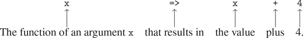

### 1.3.2 使用 Lambda  表达式构造函数

在 1.3.1 节中使用`sum`时，不得不声明像`pi_term`和`pi_next`这样的小函数，以便我们可以将它们用作高阶函数的参数，这看起来非常尴尬。比起声明`pi_next`和`pi_term`，更方便的方法是直接指定“返回其输入递增 4 的函数”和“返回其输入乘以输入加 2 的倒数的函数”我们可以通过引入λ表达式作为创建函数的语法形式来做到这一点。使用 Lambda  表达式，我们可以将我们想要的描述为

```js
x => x + 4
```

和

```js
x => 1 / (x * (x + 2))
```

然后我们可以不用声明任何辅助函数来表达我们的`pi_sum`函数:

```js
function pi_sum(a, b) {
    return sum(x => 1 / (x * (x + 2)),
               a,
               x => x + 4,
               b);
}
```

再次使用 Lambda  表达式，我们可以编写`integral`函数，而不必声明辅助函数`add_dx`:

```js
function integral(f, a, b, dx) {
    return sum(f,
               a + dx / 2,
               x => x + dx,
               b)
           * 
           dx;
}
```

一般来说，Lambda  表达式用于创建函数的方式与函数声明相同，只是没有为函数指定名称，并且省略了`**return**`关键字和大括号(如果只有一个参数，参数列表两边的括号也可以省略，就像我们看到的例子一样)。 [^(53)](#c1-fn-0053)

```js
(parameters) => expression
```

结果函数就像使用函数声明语句创建的函数一样。唯一的区别是它没有与环境中的任何名称相关联。我们认为

```js
function plus4(x) {
    return x + 4;
}
```

相当于 [^(54)](#c1-fn-0054)

```js
const plus4 = x => x + 4;
```

我们可以如下阅读 Lambda  表达式:



像任何以函数作为其值的表达式一样，Lambda  表达式可以用作应用程序中的函数表达式，例如

```js
((x, y, z) => x + y + square(z))(1, 2, 3);
12
```

或者，更一般地，在我们通常使用函数名的任何上下文中。 [^(55)](#c1-fn-0055) 注意`=>`的优先级比函数应用程序低，因此 Lambda  表达式两边的括号在这里是必要的。

##### 使用`const`创建本地名称

Lambda  表达式的另一个用途是创建本地名称。在我们的函数中，除了那些已经作为参数绑定的名字之外，我们经常需要局部名字。例如，假设我们希望计算函数

```js
f (x, y) = x(1 + xy)2 + y(1 – y) + (1 + xy)(1 – y) 
```

我们也可以表达为

```js
   a = 1 + xy
   b = 1 – y
f (x, y) = xa2 + yb + ab
```

在编写计算 f、的函数时，我们希望不仅包括局部名称`x`和`y`，还包括中间量的名称，如`a`和`b`。实现这一点的一种方法是使用辅助函数来绑定本地名称:

```js
function f(x, y) {
    function f_helper(a, b) {
        return x * square(a) + y * b + a * b;
    }
    return f_helper(1 + x * y, 1 - y);
}
```

当然，我们可以使用 Lambda  表达式指定一个匿名函数来绑定我们的本地名称。然后，函数体变成对该函数的单个调用:

```js
function f_2(x, y) {
    return ( (a, b) => x * square(a) + y * b + a * b
           )(1 + x * y, 1 - y);
}
```

声明局部名称的一个更方便的方法是在函数体中使用常量声明。使用`const`，该函数可以写成

```js
function f_3(x, y) {
    const a = 1 + x * y; 
    const b = 1 - y;
    return x * square(a) + y * b + a * b;
}
```

在一个块中用`const`声明的名字以紧邻的块的主体作为它们的作用域。[^(56)](#c1-fn-0056)^([^(57)](#c1-fn-0057))

##### 条件语句

我们已经看到，声明函数声明的局部名称通常是有用的。当函数变大时，我们应该尽可能缩小名字的范围。以练习 1.26 中的`expmod`为例。

```js
function expmod(base, exp, m) {
    return exp === 0
           ? 1
           : is_even(exp)
           ? ( expmod(base, exp / 2, m)
              * expmod(base, exp / 2, m)) % m
           : (base * expmod(base, exp - 1, m)) % m;
}
```

这个函数的效率非常低，因为它包含两个相同的调用:

```js
expmod(base, exp / 2, m);
```

虽然在本例中使用`square`函数可以很容易地解决这个问题，但这通常并不容易。如果不使用`square`，我们可能会为表达式引入一个本地名称，如下所示:

```js
function expmod(base, exp, m) {
    const half_exp = expmod(base, exp / 2, m);
    return exp === 0
           ? 1
           : is_even(exp)
           ? (half_exp * half_exp) % m
           : (base * expmod(base, exp - 1, m)) % m;
}
```

这将使函数不仅效率低下，而且实际上没有终止性！问题是常量声明出现在条件表达式之外，这意味着即使满足基本情况`exp === 0`也要执行。为了避免这种情况，我们提供了条件语句，并允许返回语句出现在语句的分支中。使用条件语句，我们可以如下编写函数`expmod`:

```js
function expmod(base, exp, m) {
    if (exp === 0) {
        return 1;
    } else {
        if (is_even(exp)) {
            const half_exp = expmod(base, exp / 2, m);
            return (half_exp * half_exp) % m;
        } else {
            return (base * expmod(base, exp - 1, m)) % m;
        }
    }
}
```

条件语句的一般形式是

```js
if (predicate) { consequent-statements } else { alternative-statements }
```

至于条件表达式，解释器首先评估谓词。如果评估为真，解释器依次评估结果 - 语句，如果评估为假，解释器依次评估替代 - 语句。return 语句的计算从周围函数返回，忽略序列中 return 语句之后的任何语句以及条件语句之后的任何语句。请注意，出现在任一部分中的任何常量声明都是该部分的局部声明，因为每个部分都用大括号括起来，从而形成了自己的块。

##### 练习 1.34

假设我们声明

```js
function f(g) {
    return g(2);
}
```

那么我们有

```js
f(square);
4

f(z => z * (z + 1));
6
```

如果我们(固执地)要求解释者评估应用程序`f(f)`，会发生什么？解释一下。
