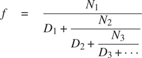
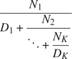
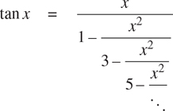

### 1.3.3 功能为一般方法

我们在 1.1.4 节中介绍了复合函数，作为抽象数字运算模式的一种机制，以使它们独立于所涉及的特定数字。对于高阶函数，比如 1.3.1 节中的`integral`函数，我们开始看到一种更强大的抽象:用于表达一般计算方法的函数，独立于所涉及的特定函数。在本节中，我们将讨论两个更详细的例子——寻找零点和函数不动点的一般方法——并展示如何将这些方法直接表示为函数。

##### 用半区间法求方程的根

半区间法是一种简单而强大的技术，用于寻找方程 f ( x ) = 0 的根，其中`f`是一个连续函数。其思想是，如果给我们点`a`和`b`，使得 f(a)<0<f(b)，那么`f`在`a`和`b`之间必须至少有一个零。为了定位零点，让`x`是`a`和`b`的平均值，并计算 f ( x )。如果 f ( x ) >为 0，那么`f`在`a`和`x`之间必须为零。如果 f ( x ) < 0，那么`f`在`x`和`b`之间必须有一个零。这样继续下去，我们可以识别出越来越小的区间，在这些区间上`f`必须为零。当我们到达一个间隔足够小的点时，这个过程就停止了。由于不确定性的区间在过程的每一步减少一半，所需的最大步骤数增长为θ(log(L/T)，其中 L 是原始区间的长度， T 是误差容限(即我们将认为“足够小”的区间大小)。下面是实现这一策略的函数:

```js
function search(f, neg_point, pos_point) {
    const midpoint = average(neg_point, pos_point);
    if (close_enough(neg_point, pos_point)) {
        return midpoint;
    } else {
        const test_value = f(midpoint);
        return positive(test_value)
               ? search(f, neg_point, midpoint)
               : negative(test_value)
               ? search(f, midpoint, pos_point)
               : midpoint;
    }
}
```

我们假设最初给定函数`f`以及其值为负和正的点。我们首先计算两个给定点的中点。接下来，我们检查给定的区间是否足够小，如果足够小，我们就返回中点作为我们的答案。否则，我们计算中点处`f`的值作为测试值。如果测试值是正的，那么我们继续这个过程，从原来的负点到中点运行一个新的区间。如果测试值为负，我们继续从中点到正点的区间。最后，测试值有可能是 0，在这种情况下，中点本身就是我们要寻找的根。为了测试端点是否“足够接近”，我们可以使用一个类似于 1.1.7 节中用于计算平方根的函数: [^(58)](#c1-fn-0058)

```js
function close_enough(x, y) {
    return abs(x - y) < 0.001;
}
```

函数`search`很难直接使用，因为我们可能会不小心给它一些点，在这些点上`f`的值没有所需的符号，在这种情况下，我们会得到一个错误的答案。相反，我们将通过下面的函数使用`search`,该函数检查哪个端点具有负函数值，哪个端点具有正值，并相应地调用`search`函数。如果该函数在两个给定点上具有相同的符号，则不能使用半区间方法，在这种情况下，该函数发出错误信号。 [^(59)](#c1-fn-0059)

```js
function half_interval_method(f, a, b) {
    const a_value = f(a);
    const b_value = f(b);
    return negative(a_value) && positive(b_value)
           ? search(f, a, b)
           : negative(b_value) && positive(a_value)
           ? search(f, b, a)
           : error("values are not of opposite sign");
}
```

以下示例使用半区间法将 π 近似为 sin x = 0 的 2 和 4 之间的根:

```js
half_interval_method(math_sin, 2, 4);
3.14111328125
```

这里再举一个例子，用半区间法在 1 和 2 之间求方程 x3–2x–3 = 0 的根:

```js
half_interval_method(x => x * x * x - 2 * x - 3, 1, 2);
1.89306640625
```

##### 寻找函数的不动点

如果`x`满足方程 f(x)=x，则一个数`x`称为函数`f`的不动点。对于一些函数`f`我们可以通过从初始猜测开始并重复应用`f`来定位固定点，

```js
f (x), f (f (x)), f (f (f (x))), . . .
```

直到数值变化不大。使用这个想法，我们可以设计一个函数`fixed_point`,它将一个函数和一个初始猜测作为输入，并产生该函数的一个固定点的近似值。我们重复应用该函数，直到找到两个连续值，它们的差小于某个规定的容差:

```js
const tolerance = 0.00001;
function fixed_point(f, first_guess) {
    function close_enough(x, y) {
        return abs(x - y) < tolerance;
    }
    function try_with(guess) {
        const next = f(guess);
        return close_enough(guess, next)
               ? next
               : try_with(next);
    }
    return try_with(first_guess);
}
```

比如我们可以用这个方法来近似余弦函数的不动点，从 1 开始作为初始近似: [^(60)](#c1-fn-0060)

```js
fixed_point(math_cos, 1);
0.7390822985224023
```

同样，我们可以找到方程 y= siny+cosy 的解:

```js
fixed_point(y => math_sin(y) + math_cos(y), 1);
1.2587315962971173
```

定点过程使人想起我们在 1.1.7 节中用来求平方根的过程。这两种方法都是基于反复改进猜测直到结果满足某种标准的想法。事实上，我们可以很容易地将平方根计算公式化为定点搜索。计算某数`x`的平方根需要找到一个`y`使得 y2=x。将这个等式转换成等价形式 y=x/y，我们认识到我们正在寻找函数[^(61)](#c1-fn-0061)y x/`y`的一个固定点，因此我们可以尝试计算平方根为

```js
function sqrt(x) {
    return fixed_point(y => x / y, 1);
}
```

不幸的是，这种定点搜索并不收敛。考虑一个最初的猜测 yT2【1】。下一个猜测是 y[2]=x/y[1]下一个猜测是 y[3]=x/y[2]=x/(x/`y`这导致了一个无限循环，其中两个猜测 y1 和 y2 一遍又一遍地重复，围绕着答案振荡。

控制这种波动的一个方法是防止猜测变化太大。由于答案总是在我们的猜测`y`和 x /`y`之间，所以我们可以通过将`y`与 x /`y`进行平均来做出一个新的猜测，这个新的猜测距离`y`没有距离 x /`y`远，这样在`y`之后的下一个猜测就是 ( 【T21 做出这样一系列猜测的过程，简单来说就是寻找 y(y+x/y)不动点的过程:

```js
function sqrt(x) {
    return fixed_point(y => average(y, x / y), 1);
}
```

(注意 y=(y+x/y)是方程 y=x/`y`的简单变换；要导出它，将`y`加到等式的两边，然后除以 2。)

通过这种修改，平方根函数可以工作。事实上，如果我们解开定义，我们可以看到这里生成的平方根的近似序列与我们在 1.1.7 节中的原始平方根函数生成的序列完全相同。这种将逐次逼近平均到一个解的方法，我们称之为平均阻尼的技术，通常有助于定点搜索的收敛。

##### 练习 1.35

证明黄金分割比ϕ(1 . 2 . 2 节)是变换 x1+1/`x`的不动点，并利用这个事实通过`fixed_point`函数计算 ϕ 。

##### 练习 1.36

使用练习 1.22 中显示的原函数`display`，修改`fixed_point`，使其打印生成的近似序列。然后通过找到 xlog(1000)/log(x)的一个不动点，求出 x^xx= 1000 的解。(使用原始函数`math_log`，它计算自然对数。)比较使用和不使用平均阻尼时的步数。(注意，不能以猜测值 1 开始`fixed_point`，因为这会导致除以 log(1) = 0。)

##### 练习 1.37

一个无限的连分数是以下形式的表达式



作为一个例子，一个人可以表明，在 n[I]t31】和 d[I]t35】都等于 1 的情况下，无限连分数展开产生 1/ ϕ ，其中 ϕ 是黄金分割比例(在 1.2.2 节中描述)。逼近无穷连分数的一种方法是在给定项数后截断展开式。这种截断——所谓的`k`项有限连分式——具有以下形式



1.  a. Suppose that `n` and `d` are functions of one argument (the term index i) that return the N[i] and D[i] of the terms of the continued fraction. Declare a function `cont_frac` such that evaluating `cont_frac(n, d, k)` computes the value of the k-term finite continued fraction. Check your function by approximating 1ϕ using

    ```js
    cont_frac(i => 1, i => 1, k);
    ```

    用于`k`的连续值。为了得到精确到小数点后 4 位的近似值，必须使`k`多大？

2.  b. 如果你的`cont_frac`函数生成一个递归过程，写一个生成迭代过程的函数。如果它生成一个迭代过程，那么就写一个生成递归过程的程序。

##### 练习 1.38

1737 年，瑞士数学家莱昂哈德·欧拉出版了回忆录 De Fractionibus Continuis ，其中包括对 e–2 的连分数展开，其中`e`是自然对数的底数。在这个分数里，N[I]都是 1，D[I]依次是 1，2，1，1，1，4，1，1，6，1，1，8，写一个程序，用你练习 1.37 里的`cont_frac`函数来近似 e ，基于欧拉展开式。

##### 练习 1.39

德国数学家 J.H. Lambert 在 1770 年发表了正切函数的连分式表示:



其中`x`以弧度为单位。声明一个函数`tan_cf(x, k)`，它根据 Lambert 公式计算正切函数的近似值。和练习 1.37 一样，`k`指定了要计算的项数。
