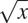
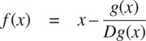
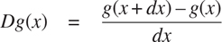
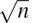
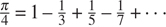

### 1.3.4 功能为返回值

上面的例子展示了将函数作为参数传递的能力如何显著增强了我们的编程语言的表达能力。通过创建返回值本身就是函数的函数，我们可以获得更强的表达能力。

我们可以通过再次查看 1.3.3 节末尾描述的定点例子来说明这一点。我们将平方根函数的新版本公式化为定点搜索，从观察到是函数 yx/`y`的定点开始。然后我们使用平均阻尼使近似收敛。平均阻尼本身是一种有用的通用技术。也就是说，给定一个函数 f，我们考虑这个函数在`x`的值等于`x`和 f ( x )的平均值。

我们可以用下面的函数来表达平均阻尼的概念:

```js
function average_damp(f) {
    return x => average(x, f(x));
}
```

函数`average_damp`将函数`f`作为其参数，并返回一个函数(由 Lambda  表达式生成)作为其值，当该函数应用于数字`x`时，会生成`x`和`f(x)`的平均值。例如，将`average_damp`应用于`square`函数会产生一个函数，该函数在某个数字`x`处的值是`x`和 x2 的平均值。将此结果函数应用于 10 将得出 10 和 100 的平均值，即 55: [^(62)](#c1-fn-0062)

```js
average_damp(square)(10);
55
```

使用`average_damp`，我们可以将平方根函数重新表述如下:

```js
function sqrt(x) {
    return fixed_point(average_damp(y => x / y), 1);
}
```

注意这个公式是如何使方法中的三个概念变得清晰的:定点搜索、平均阻尼和函数 y x /`y`。将平方根法的公式与第 1.1.7 节给出的原始公式进行比较是有益的。请记住，这些函数表达了相同的过程，请注意，当我们用这些抽象来表达过程时，这个想法变得多么清晰。一般来说，有许多方法可以将过程公式化为一个函数。有经验的程序员知道如何选择特别清晰的流程公式，以及流程中有用的元素被公开为可以在其他应用程序中重用的独立实体。作为重用的一个简单例子，请注意，`x`的立方根是函数 y x/y²的一个不动点，因此我们可以立即将我们的平方根函数推广为提取立方根的函数: [^(63)](#c1-fn-0063)

```js
function cube_root(x) {
   return fixed_point(average_damp(y => x / square(y)), 1);
}
```

##### 牛顿方法

当我们第一次介绍平方根函数时，在 1.1.7 节中，我们提到这是牛顿法的特例。如果 xg(x)是一个可微函数，那么方程 g ( x ) = 0 的一个解就是函数 xf(x)的一个不动点其中



而 Dg ( x )是在`x`处求的 g 的导数。牛顿法就是我们上面看到的不动点法的运用，通过寻找函数`f`的不动点来逼近方程的一个解。 [^(64)](#c1-fn-0064) 对于许多函数 g 以及对于`x`的足够好的初始猜测，牛顿法非常迅速地收敛到 g ( x ) = 0 的解。 [^(65)](#c1-fn-0065)

为了将牛顿法实现为函数，首先要表达导数的思想。注意，“导数”和平均阻尼一样，是将一个函数转换成另一个函数的东西。例如，函数 xx3 的导数就是函数 x3x2。一般来说，如果 g 是一个函数，而 dx 是一个小数字，那么 g 的导数 Dg 是这样一个函数，它在任意数字`x`处的值由下式给出(在小 dx 的范围内)



因此，我们可以将导数的概念(取 dx 为 0.00001)表示为函数

```js
function deriv(g) {
    return x => (g(x + dx) - g(x)) / dx;
}
```

与宣言一起

```js
const dx = 0.00001;
```

和`average_damp`一样，`deriv`是一个以函数为自变量，以值返回函数的函数。例如，为了逼近 xx³在 5 处的导数(其精确值为 75 ),我们可以计算

```js
function cube(x) { return x * x * x; }

deriv(cube)(5);
75.00014999664018
```

借助`deriv`，我们可以把牛顿法表述为一个定点过程:

```js
function newton_transform(g) {
    return x => x - g(x) / deriv(g)(x);
}
function newtons_method(g, guess) {
    return fixed_point(newton_transform(g), guess);
}
```

`newton_transform`函数表达了本节开头的公式，而`newtons_method`很容易根据这个公式来定义。它以一个函数作为参数，这个函数计算我们想要找到零的函数，以及一个初始猜测。例如，为了找到`x`的平方根，我们可以使用牛顿法来找到函数 yy2–`x`的零点，从最初的猜测 1 开始。 [^(66)](#c1-fn-0066) 这提供了平方根函数的另一种形式:

```js
function sqrt(x) {
    return newtons_method(y => square(y) - x, 1);
}
```

##### 抽象和一流的功能

我们已经看到了两种将平方根计算表示为更一般方法的实例的方法，一种是定点搜索，另一种是使用牛顿法。由于牛顿的方法本身被表达为定点过程，我们实际上看到了两种计算平方根的方法作为定点。每一种方法都是从一个函数开始，找到这个函数的某个变换的不动点。我们可以将这一总体想法本身表达为一个函数:

```js
function fixed_point_of_transform(g, transform, guess) {
    return fixed_point(transform(g), guess);
}
```

这个非常普通的函数以一个计算某个函数的函数`g`、一个转换函数`g`和一个初始猜测为参数。返回的结果是转换函数的固定点。

使用这个抽象，我们可以改写本节中的第一个平方根计算(这里我们寻找平均阻尼版本的 yx/y)作为这个通用方法的一个实例:

```js
function sqrt(x) {
    return fixed_point_of_transform(
               y => x / y,
               average_damp,
               1);
}
```

类似地，我们可以将这一节中的第二次平方根计算(牛顿法的一个实例，用于找到 yy²–`x`的牛顿变换的一个固定点)表示为

```js
function sqrt(x) {
    return fixed_point_of_transform(
               y => square(y) - x,
               newton_transform,
               1);
}
```

我们在 1.3 节开始时观察到复合函数是一个重要的抽象机制，因为它们允许我们将一般的计算方法表达为编程语言中的显式元素。现在我们已经看到了高阶函数如何允许我们操纵这些通用方法来创建进一步的抽象。

作为程序员，我们应该注意识别程序中底层抽象的机会，并在此基础上构建和概括它们以创建更强大的抽象。这并不是说一个人应该总是尽可能用最抽象的方式编写程序；专业程序员知道如何选择适合他们任务的抽象层次。但是，能够根据这些抽象进行思考是很重要的，这样我们就可以准备好在新的环境中应用它们。高阶函数的意义在于，它们使我们能够将这些抽象明确地表示为编程语言中的元素，这样它们就可以像其他计算元素一样被处理。

一般来说，编程语言对计算元素的操作方式施加了限制。限制最少的元素据说拥有一级状态。一流元素的一些“权利和特权”有: [^(67)](#c1-fn-0067)

*   他们可以用名字来称呼。
*   它们可以作为参数传递给函数。
*   它们可以作为函数的结果返回。
*   它们可以包含在数据结构中。 [^(68)](#c1-fn-0068)

与其他高级编程语言一样，JavaScript 赋予函数完全的一流地位。这给高效实现带来了挑战，但由此带来的表达能力的提升是巨大的。 [^(69)](#c1-fn-0069)

##### 练习 1.40

声明一个函数`cubic`,它可以与函数`newtons_method`一起用于以下形式的表达式中

```js
newtons_method(cubic(a, b, c), 1)
```

求三次 x3+ax2+bx+`c`的近似零点。

##### 练习 1.41

声明一个函数`double`，该函数将一个参数的函数作为参数，并返回一个应用原始函数两次的函数。举个例子，如果`inc`是一个给自变量加 1 的函数，那么`double(inc)`应该是一个加 2 的函数。由返回什么值

```js
double(double(double))(inc)(5);
```

##### 练习 1.42

设`f`和`g`为两个单参数函数。 `g`后的成分`f`定义为函数`x -> f(g(x))`。声明一个实现组合的函数`compose`。例如，如果`inc`是一个参数加 1 的函数，

```js
compose(square, inc)(6);
49
```

##### 练习 1.43

如果`f`是一个数值函数，`n`是一个正整数，那么我们就可以形成`f`的第`n`次重复应用，定义为在`x`处的值为 f ( f ( )的函数。。。(f(x)。。。))。例如:如果`f`是函数 x  x + 1，那么`f`的第`n`次重复应用就是函数 xx+n。如果`f`是一个数的平方运算，那么`f`的第`n`次重复应用就是将其自变量提升到 2 ^( n ) 次方的函数。编写一个函数，将计算`f`和正整数`n`的函数作为输入，并返回计算第`n`次重复应用`f`的函数。您的函数应该能够按如下方式使用:

```js
repeated(square, 2)(5);
625
```

提示:你可能会发现使用练习 1.42 中的`compose`很方便。

##### 练习 1.44

平滑函数的思想是信号处理中的一个重要概念。如果`f`是一个函数而 dx 是某个小数字，那么`f`的平滑版本就是这样一个函数，它在某个点`x`的值是`f(x–dx)`、 `f ( x )`和 f (编写一个函数`smooth`，它将计算`f`的函数作为输入，并返回一个计算平滑后的`f`的函数。重复平滑一个函数(即平滑平滑后的函数，等等)以获得`n`重平滑函数有时是有价值的。演示如何使用练习 1.43 中的`smooth`和`repeated`生成任意给定函数的`n`倍平滑函数。

##### 练习 1.45

我们在 1.3.3 节中看到，试图通过天真地找到一个固定点`y -> x / y`来计算平方根并不收敛，这可以通过平均阻尼来解决。同样的方法也适用于寻找作为平均阻尼的`y -> x/y²`的不动点的立方根。不幸的是，该过程不适用于第四根——单个平均阻尼不足以对`y -> x/y³`收敛进行定点搜索。另一方面，如果我们平均阻尼两次(即，使用平均阻尼的平均阻尼为`y -> x/y³`)，定点搜索确实收敛。根据`y -> x/y^n^(–1)`的重复平均阻尼，做一些实验来确定作为定点搜索计算`n`根需要多少个平均阻尼。用这个实现一个简单的函数，用练习 1.43 中的`fixed_point`、`average_damp`和`repeated`函数计算`n`次方根。假设您需要的任何算术运算都可以作为原语获得。

##### 练习 1.46

本章中描述的几种数值方法是一种非常通用的计算策略的实例，称为迭代改进。迭代改进是指，为了计算某个东西，我们从答案的初始猜测开始，测试猜测是否足够好，否则改进猜测，并使用改进的猜测作为新的猜测继续这个过程。编写一个函数`iterative_improve`,它采用两个函数作为参数:一个判断猜测是否足够好的方法和一个改进猜测的方法。函数`iterative_improve`应该返回一个函数作为它的值，该函数将猜测作为参数，并不断改进猜测，直到它足够好。将 1.1.7 节的`sqrt`功能和 1.3.3 节的`fixed_point`功能用`iterative_improve`改写。*  *将数字描述为“简单数据”是赤裸裸的虚张声势。事实上，对数字的处理是任何编程语言中最棘手和最令人困惑的方面之一。涉及的一些典型问题是这样的:一些计算机系统区分整数，如 2，和实数，如 2.71。实数 2.00 和整数 2 有区别吗？整数使用的算术运算和实数使用的运算一样吗？6 除以 2 等于 3，还是等于 3.0？我们能代表多大的数字？我们可以表示多少位小数精度？整数的范围和实数的范围一样吗？当然，除了这些问题之外，还有一系列关于舍入和截断误差的问题——整个数值分析科学。由于本书的重点是大规模程序设计而不是数值技术，我们将忽略这些问题。本章中的数值示例将展示在非整数运算中使用保留有限小数位数精度的算术运算时观察到的常见舍入行为。

[2](#c1-fn-0002a) 在本书中，我们通过用倾斜的字符显示解释器打印的文本来区分用户输入的内容和解释器打印的文本。

[3](#c1-fn-0003a) JavaScript 遵循每个语句都有一个值的惯例(参见练习 4.8)。这种惯例，再加上 JavaScript 程序员不关心效率的名声，让我们套用 Alan Perlis 对 Lisp 程序员的一句俏皮话(他自己也在套用 Oscar Wilde 的话): JavaScript 程序员知道所有东西的价值，却不知道任何东西的成本。

在本书中，我们没有展示解释器对以声明结尾的程序的评估的反应，因为这可能依赖于先前的语句。详见练习 4.8。

第三章将展示环境的概念对于理解解释器如何工作是至关重要的。第四章将使用环境来实现解释器。

[6](#c1-fn-0006a) 注意，这里有两个不同的操作被组合在一起:我们正在创建函数，并给它命名为`square`。将这两个概念分开是可能的，也是非常重要的——创建函数而不命名，以及给已经创建的函数命名。我们将在 1.3.2 节中看到如何做到这一点。

[7](#c1-fn-0007a) 在整本书中，我们将使用斜体符号来描述表达式的一般语法——例如 name——来表示表达式中的“槽”,以便在实际使用这样的表达式时进行填充。

更一般地说，函数体可以是一系列语句。在这种情况下，解释器依次评估序列中的每个语句，直到一个返回语句确定函数应用的值。

[9](#c1-fn-0009a) 像`sum_of_squares`这样由多个部分组成的名字的书写方式会影响程序的可读性，编程社区对此有不同的看法。根据常见的 JavaScript 约定，名为的骆驼案，其名称应该是`sumOfSquares`。本书中使用的约定被称为蛇形，选择它是因为它与本书 Scheme 版本中使用的约定更相似，在 Scheme 版本中，连字符扮演我们的下划线角色。

我们的 JavaScript 环境包含了 ECMAScript 的 Math 对象的所有函数和常量，命名为`math_. . .`。例如，ECMAScript 的`Math.log`可用作`math_log`。这本书的麻省理工学院出版社网页包括 JavaScript 包`sicp`，它提供了这些和所有其他在书中被认为是基本的 JavaScript 函数。

[11](#c1-fn-0011a) 如果函数体是一个语句序列，则用替换的参数对函数体求值，应用的值就是遇到的第一个返回语句的返回表达式的值。

[12](#c1-fn-0012a) 尽管替换的想法很简单，但给替换过程下一个严格的数学定义却异常复杂。这个问题是由于函数的参数名和函数可能应用的表达式中使用的(可能相同的)名称可能会混淆。事实上，在逻辑和编程语义的文献中，对替换的错误定义由来已久。参见 Stoy 1977 对替代的详细讨论。

[13](#c1-fn-0013a) 在第 3 章中，我们将介绍流处理，这是一种处理明显“无限”数据结构的方式，通过合并有限形式的正常顺序评估。在 4.2 节中，我们将修改 JavaScript 解释器来产生 JavaScript 的正常顺序变体。

完整 JavaScript 中的条件接受任何值，而不仅仅是布尔值，作为评估谓词表达式的结果(详见 4.1.3 节的脚注 14)。本书中的程序只使用布尔值作为条件句的谓语。

现在，我们将这些操作符限制为数字参数。在 2.3.1 和 3.3.1 节中，我们将概括等式和不等式谓词`===`和`!==`。

用彼得·兰丁创造的一个短语来说， [16](#c1-fn-0016a) 句法形式是可以用更统一的方式书写的事物的简单方便的替代表层结构，有时被称为句法糖。

陈述性和命令性描述密切相关，数学和计算机科学也是如此。例如，说一个程序产生的答案是“正确的”,就是对这个程序做一个声明性的陈述。有大量的研究旨在建立证明程序是正确的技术，并且该主题的大部分技术困难与协商命令性语句(从中构造程序)和声明性语句(可用于推断事物)之间的转换有关。与此相关，编程语言设计者已经探索了所谓的超高级语言，在这种语言中，人们实际上是根据声明性语句来编程的。这个想法是让解释器足够复杂，这样，给定程序员指定的“是什么”的知识，它们可以自动生成“如何”的知识。这在总体上是做不到的，但在一些重要领域已经取得了进展。我们将在第四章重新讨论这个观点。

[18](#c1-fn-0018a) 这个平方根算法其实是牛顿法的一个特例，牛顿法是一种求方程根的通用技术。平方根算法本身是在公元一世纪由亚历山大的 Heron 开发的。我们将在 1.3.4 节中看到如何将一般的牛顿法表达为一个 JavaScript 函数。

我们通常以`is_`开头给谓词命名，以帮助我们记住它们是谓词。

担心使用函数调用实现迭代所涉及的效率问题的读者应该注意 1.2.1 节中关于“尾部递归”的注释。

[21](#c1-fn-0021a) 作为一个 Lisp 黑客从最初的计算机程序的结构和解释开始，Alyssa 更喜欢更简单、更统一的语法。

甚至不清楚这些功能中哪一个是更有效的实现。这取决于可用的硬件。有些机器的“明显”实现是效率较低的。考虑一台机器，它有大量的对数和反对数表，并以非常有效的方式存储着。

[23](#c1-fn-0023a) 一致重命名的概念实际上很微妙，很难正式定义。著名的逻辑学家在这里犯了令人尴尬的错误。

[24](#c1-fn-0024a) 词法作用域规定函数中的自由名被用来引用封闭函数声明所做的绑定；也就是说，它们是在声明函数的环境中查找的。当我们在第三章学习环境和解释者的详细行为时，我们将会看到这是如何工作的。

嵌入式声明必须首先出现在函数体中。管理层不对运行将声明和使用交织在一起的程序的后果负责；另见第 1.3.2 节脚注 54 和 56。

[26](#c1-fn-0026a) 在一个真实的程序中我们可能会使用上一节介绍的块结构来隐藏`fact_iter`的声明:
**function**factorial(n){
**function**ITER(product，counter){
**return**counter>n
？乘积
: iter(计数器*乘积，
计数器+1)；
}
**返回** iter(1，1)；
}
我们在这里避免这样做，以尽量减少要同时考虑的事情。

[27](#c1-fn-0027a) 当我们在第五章讨论寄存器机器上的函数实现时，我们会看到，任何迭代过程都可以“在硬件中”实现为一台具有固定寄存器集且没有辅助存储器的机器。相比之下，实现一个递归过程需要一台机器，它使用一种叫做栈的辅助数据结构。

尾递归作为一种编译器优化技巧早已广为人知。卡尔·休伊特(1977)为尾部递归提供了一个连贯的语义基础，他用我们将在第三章讨论的计算的“信息传递”模型来解释它。受此启发，杰拉德·让伊·萨斯曼和小盖伊·路易斯·斯蒂尔(见斯蒂尔 1975)为 Scheme 构造了一个尾递归解释器。Steele 后来展示了尾部递归是编译函数调用的自然方式的结果(Steele 1977)。IEEE Scheme 标准要求 Scheme 实现是尾递归的。JavaScript 的 ECMA 标准最终紧随其后推出了 ECMAScript 2015 (ECMA 2015)。但是，请注意，在撰写本文时(2021 年)，大多数 JavaScript 实现在尾部递归方面都不符合这个标准。

练习 4.7 探索了 JavaScript 的`while`循环，作为产生迭代过程的函数的语法糖。与其他传统语言一样，完整的 JavaScript 语言具有大量的语法形式，所有这些都可以用 Lisp 语言更统一地表达。这一点，再加上这些结构通常包含分号，而分号的位置规则有时并不明显，艾伦·珀利斯(Alan Perlis)开玩笑说:“句法糖导致分号的癌症。”

第 1.1.3 节暗示了一个例子:解释器本身使用一个树递归过程来评估表达式。

[31](#c1-fn-0031a) 例如，详细研究归约规则如何应用于用便士和镍币兑换 10 美分的问题。

处理冗余计算的一种方法是安排事情，这样我们可以在计算时自动构建一个数值表。每当我们被要求将函数应用于某个参数时，我们首先查看该值是否已经存储在表中，在这种情况下，我们避免执行多余的计算。这种策略被称为列表或记忆，可以以一种简单的方式实现。制表有时可用于将需要指数数量步骤的过程(如`count_change`)转化为空间和时间需求随输入线性增长的过程。参见练习 3.27。

[33](#c1-fn-0033a) 帕斯卡三角形的元素称为二项式系数，因为第`n`行由(x+y)^n展开式中各项的系数组成。这种计算系数的模式出现在布莱士·帕斯卡 1653 年关于概率理论的开创性著作《三角形算法教程》中。根据 Edwards (2019)，同样的模式也出现在 11 世纪波斯数学家 Al-Karaji、12 世纪印度数学家 Bhaskara 和 13 世纪中国数学家杨辉的著作中。

这些说法掩盖了大量的过分简单化。例如，如果我们把过程步骤算作“机器操作”,我们就假设执行一次乘法所需的机器操作的数量与被乘数字的大小无关，如果数字足够大，这个假设就是错误的。类似的评论也适用于对空间的估计。像过程的设计和描述一样，过程的分析可以在不同的抽象层次上进行。

[35](#c1-fn-0035a) 更准确地说，所需乘法次数等于比`n`的对数基数 2 少 1，加上`n`的二进制表示中的 1 的数量。这个总数总是小于`n`的对数基数 2 的两倍。顺序符号定义中的任意常数`k[1]`和`k[2]`意味着，对于对数过程来说，取对数的底数并不重要，因此所有这样的过程都被描述为`θ(logn)`。

你可能想知道为什么有人会关心数字的 1000 次方。参见第 1.2.6 节。

[37](#c1-fn-0037a) 这种迭代算法是古老的。它出现在Á·查里亚写于公元前 200 年前的《大藏经》中。参见 Knuth 1997b，第 4.6.3 节，对这种方法和其他取幂方法的全面讨论和分析。

这种算法很古老，有时被称为乘法的“俄罗斯农民方法”。使用它的例子可以在 Rhind Papyrus 中找到，这是现存的两个最古老的数学文献之一，由一个名叫 A'h-mose 的埃及抄写员写于公元前 1700 年(从一个更古老的文献中复制而来)。

这个练习是 Joe Stoy 根据 Kaldewaij 1990 年的一个例子提出的。

[40](#c1-fn-0040a) 欧几里得算法之所以这样叫，是因为它出现在欧几里得的元素(第 7 册，ca。公元前 300 年)。根据 Knuth (1997a)，它可以被认为是已知的最古老的非平凡算法。古埃及的乘法方法(练习 1.18)肯定更古老，但是，正如 Knuth 解释的那样，欧几里得算法是已知的最古老的算法，它是作为一种通用算法提出的，而不是作为一组说明性的例子。

这个定理在 1845 年被法国数学家和工程师加布里埃尔·拉米证明，他主要以对数学物理的贡献而闻名。为了证明该定理，我们考虑成对(a[k]T5、b[k]T9)，其中 a[k]b[k]，为此欧几里德算法终止于`k`步。这个证明是基于这样的主张，如果(a[k][+1]，b[k][+1])(a[k]，b[k])(a[k][-1] 那么我们必须有 b[k][+1]b[k]+b[k][–1]。 为了验证该声明，考虑通过应用变换 a[k][–1]=b[k]，b[k][–1]= a[k]除以来定义缩减步长第二个等式是指 a[k]=QB[k]+b[k][–1]对于某正整数 q 。而既然 q 至少必须是 1 我们有 a[k]=QB[k]+b[k][–1]b[k]+b[k 但是在前面的缩减步骤中我们有 b[k][+1]=a[k]。因此，b[k][+1]=a[k]b[k]+b[k][–1]。这证实了这一说法。现在我们可以在`k`上用归纳法证明定理，算法需要终止的步数。对于 k = 1，结果是正确的，因为这仅仅要求`b`至少与 Fib(1) = 1 一样大。现在，假设对于所有小于或等于`k`的整数，结果为真，并为 k + 1 建立结果。让(a[k][+1]，b[k][+1])(a[k]，b[k])(a[k 通过我们的归纳假设，我们有 b[k][–1]Fib(k–1)和 b[k]Fib(k)。因此，应用我们刚刚证明的要求以及斐波纳契数的定义，给出了 b[k][+1]b[k]+b[k][–1]Fib(k+Fib(]]

[42](#c1-fn-0042a) 如果 d 是`n`的约数，那么 n / d 也是。但是 d 和 n / d 不能都大于。

皮耶·德·费玛(1601-1665)被认为是现代数论的创始人。他获得了许多重要的数论结果，但他通常只公布结果，而不提供证明。费马的小定理在他 1640 年写的一封信中陈述过。欧拉在 1736 年给出了第一个公开发表的证明(在莱布尼茨未发表的手稿中发现了更早的相同证明)。费马最著名的结果——被称为费马大定理——在 1637 年被他写在《算术》(由三世纪的希腊数学家丢番图所著)一书中，并注明“我发现了一个真正了不起的证明，但这个范围太小，不足以包含它”寻找费马大定理的证明成为数论中最著名的挑战之一。普林斯顿大学的安德鲁·怀尔斯终于在 1995 年给出了一个完整的解决方案。

[44](#c1-fn-0044a) 指数`e`大于 1 的情况下的归约步骤是基于这样一个事实:对于任意整数`x`、`y`和`m`，我们可以通过分别计算`x`乘以`y`模`e`的余数来找到`x`模`e`的余数例如，在`e`为偶数的情况下，我们计算`b^e^(/2)`模`e`的余数，对其求平方，并取余数模`m`。这项技术很有用，因为它意味着我们可以执行我们的计算，而不必处理比`e`大得多的数字。(对比练习 1.25。)

欺骗费马测试的数字被称为卡尔麦克数，除了知道它们极其罕见之外，人们对它们知之甚少。有 255 个卡迈克尔数字低于 100，000，000。最小的几个是 561，1105，1729，2465，2821，6601。在测试随机选择的非常大的数的素性时，偶然发现一个愚弄费马测试的值的机会小于宇宙辐射导致计算机在执行“正确”算法时出错的机会。考虑一个算法不适合第一个原因，而不适合第二个原因，说明了数学和工程之间的区别。

概率素数测试最引人注目的应用之一是在密码学领域。尽管截至本文撰写之时(2021 年)，对任意 300 位数字进行因式分解在计算上是不可行的，但这种数字的素性可以通过费马测试在几秒钟内检查出来。这个事实构成了 Rivest、Shamir 和 Adleman (1977)提出的构造“牢不可破的代码”的技术的基础。由此产生的 RSA 算法已经成为一种广泛使用的增强电子通信安全性的技术。由于这一点和相关的发展，素数的研究，曾经被认为是“纯”数学中的一个主题的缩影，仅仅是为了它本身而研究，现在被证明对密码学、电子资金转移和信息检索有重要的实际应用。

[47](#c1-fn-0047a) 这个日期被称为 UNIX 纪元，是 UNIX™ 操作系统中处理时间的函数规范的一部分。

[48](#c1-fn-0048a) 原始函数`display`返回它的参数，但也打印它。这里的`" *** "`是一个字符串，一个我们作为参数传递给`display`函数的字符序列。2.3.1 节更全面地介绍了字符串。

[49](#c1-fn-0049a) 这一系列，通常以对等形式写成，是由于莱布尼茨。我们将在 3.5.3 节中看到如何使用它作为一些奇特的数字技巧的基础。

请注意，我们使用了块结构(1.1.8 节)来将`pi_next`和`pi_term`的声明嵌入到`pi_sum`中，因为这些函数不太可能用于任何其他目的。我们将在 1.3.2 节中看到如何完全摆脱它们。

练习 1.31-1.33 的目的是展示通过使用适当的抽象来整合许多看似不同的操作所获得的表达能力。然而，尽管积累和过滤是很好的想法，但是我们在使用它们的时候还是有些束手束脚，因为我们还没有数据结构来为这些抽象提供合适的组合方式。当我们展示如何使用序列作为接口来组合过滤器和累加器以构建更强大的抽象时，我们将在第 2.2.3 节回到这些想法。我们将在那里看到这些方法如何真正成为设计程序的强大而优雅的方法。

[52](#c1-fn-0052a) 这个公式是十七世纪英国数学家约翰·沃利斯发现的。

在第 2.2.4 节中，我们将扩展 Lambda  表达式的语法，以允许块作为主体，而不仅仅是一个表达式，就像函数声明语句一样。

在 JavaScript 中，两个版本之间有细微的差别:函数声明语句被自动“提升”(移动)到周围块的开头，或者如果它出现在任何块之外，则移动到程序的开头，而常量声明则不移动。用函数声明声明的名字可以用赋值重新赋值(3.1.1 节)，而用常量声明声明的名字则不能。在本书中，我们避开这些特性，将函数声明视为与相应的常量声明等价。

如果使用一个比 Lambda  表达式更明显的术语，比如函数定义，对学习 JavaScript 的人来说会更清楚，也不会那么吓人。但是这种约定已经根深蒂固了，不仅对于 Lisp 和 Scheme，对于 JavaScript、Java 和其他语言也是如此，毫无疑问，这部分是由于本书 Scheme 版本的影响。这个符号来自于数学逻辑学家阿隆佐·邱奇(1941 年)引入的数学形式体系 λ 微积分。丘奇开发了 λ 微积分，为研究函数和函数应用的概念提供了一个严格的基础。T20 演算已经成为对编程语言语义进行数学研究的基本工具。

[56](#c1-fn-0056a) 注意，在一个块中声明的名字不能在声明被完全评估之前使用，不管在块外是否声明了相同的名字。因此，在下面的程序中，试图使用在顶层声明的`a`来为在`f`中声明的`b`的计算提供一个值是行不通的。
**常量**a = 1；
**函数**f(x){
constb = a+x；
consta = 5；
**回车**a+b；
}
f(10)；
程序导致错误，因为`a + x`中的`a`在它的声明被求值之前被使用。我们将在 4.1.6 节(练习 4.19)中回到这个程序，在我们了解了更多关于评估的内容之后。

[57](#c1-fn-0057a) 替换模型可以扩展为，对于一个常量声明，`=`之后的表达式的值被替换为其余块体中`=`之前的名称(声明之后)，类似于函数应用的求值中自变量对参数的替换。

[58](#c1-fn-0058a) 我们使用 0.001 作为一个代表性的“小”数字，来表示计算中可接受误差的公差。实际计算的适当容差取决于要解决的问题以及计算机和算法的局限性。这通常是一个非常微妙的问题，需要数字分析师或其他魔术师的帮助。

[59](#c1-fn-0059a) 这可以通过使用`error`来完成，它将一个字符串作为参数，这个字符串作为错误信息显示，同时显示的还有引起`error`调用的程序行号。

[60](#c1-fn-0060a) 要在计算器上获得余弦的固定点，将其设置为弧度模式，然后重复按 cos 按钮，直到数值不再变化。

[61](#c1-fn-0061a) (读作“映射到”)是数学家书写 Lambda  表达式的方式。 y x /`y`表示`y => x / y`，即在`y`处取值为 x /`y`的函数。

注意，这是一个应用程序，它的函数表达式本身就是一个应用程序。练习 1.4 已经展示了形成这种应用程序的能力，但这只是一个玩具示例。在这里，我们开始看到这种应用程序的真正需求——当应用一个作为高阶函数返回值而获得的函数时。

进一步的概括参见练习 1.45。

[64](#c1-fn-0064a) 初等微积分书籍通常用逼近的顺序来描述牛顿法 x[n][+1]=x[n]–g(x[n]【T41)/Dg(x[n]【T47 用语言来谈论过程和使用不动点的概念简化了方法的描述。

牛顿法并不总是收敛到一个答案，但是可以证明，在有利的情况下，每次迭代都会使近似解的位数精度加倍。在这种情况下，牛顿法比半区间法收敛得快得多。

[66](#c1-fn-0066a) 对于求平方根，牛顿法从任意一个起点都很快收敛到正确的解。

[67](#c1-fn-0067a) 编程语言元素一流地位的概念源于英国计算机科学家克里斯托弗·斯特雷奇(1916-1975)。

[68](#c1-fn-0068a) 我们在第二章介绍数据结构后会看到这方面的例子。

[69](#c1-fn-0069a) 一流函数的主要实现成本是，允许函数作为值返回需要为函数的自由名称保留存储空间，即使函数没有执行。在我们将在 4.1 节中研究的 JavaScript 实现中，这些名称存储在函数的环境中。*
