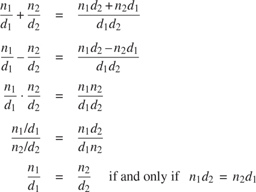

### 2.1.1 示例:有理数的算术运算

假设我们想用有理数做算术。我们希望能够将它们相加、相减、相乘和相除，并测试两个有理数是否相等。

让我们从假设我们已经有了从分子和分母构造有理数的方法开始。我们还假设，给定一个有理数，我们有办法提取(或选择)它的分子和分母。让我们进一步假设构造函数和选择器可以作为函数使用:

*   `make_rat(n, d)`返回分子为整数`n`分母为整数`d`的有理数。
*   `numer(x)`返回有理数`x`的分子。
*   `denom(x)`返回有理数`x`的分母。

我们在这里使用了一个强大的综合策略:如意算盘。我们还没有说有理数是如何表示的，或者函数`numer`、`denom`和`make_rat`应该如何实现。即便如此，如果我们有这三个函数，我们就可以用下面的关系式进行加、减、乘、除和等式检验:



我们可以将这些规则表示为函数:

```js
function add_rat(x, y) {
    return make_rat(numer(x) * denom(y) + numer(y) * denom(x),
                    denom(x) * denom(y));
}
function sub_rat(x, y) {
    return make_rat(numer(x) * denom(y) - numer(y) * denom(x),
                    denom(x) * denom(y));
}
function mul_rat(x, y) {
    return make_rat(numer(x) * numer(y),
                    denom(x) * denom(y));
}
function div_rat(x, y) {
    return make_rat(numer(x) * denom(y),
                    denom(x) * numer(y));
}
function equal_rat(x, y) {
    return numer(x) * denom(y) === numer(y) * denom(x);
}
```

现在我们有了根据选择器定义的有理数运算

以及构造函数`numer`、`denom`和`make_rat`。但是我们还没有定义这些。我们需要的是用某种方法把分子和分母粘在一起，形成一个有理数。

##### 双；对；副

为了使我们能够实现数据抽象的具体层次，我们的 JavaScript 环境提供了一个叫做对的复合结构，它可以用原语函数`pair`来构造。该函数接受两个参数，并返回包含这两个参数的复合数据对象。给定一对，我们可以使用原语函数`head`和`tail`提取零件。因此，我们可以如下使用`pair`、`head`和`tail`:

```js
const x = pair(1, 2);
head(x);
1
tail(x);
2
```

请注意，偶对是一个数据对象，它可以被命名和操作，就像原始数据对象一样。而且，`pair`可以用来组成元素为对的对，以此类推:

```js
const x = pair(1, 2);

const y = pair(3, 4);

const z = pair(x, y);

head(head(z));
1

head(tail(z));
3
```

在 2.2 节中，我们将看到这种组合数据对的能力意味着数据对可以作为通用的构建模块来创建各种复杂的数据结构。由函数`pair`、`head`和`tail`实现的单一复合数据原语对，是我们需要的唯一粘合剂。成对构造的数据对象被称为列表结构数据。

##### 表示有理数

结对提供了一种完成有理数系统的自然方法。简单地把一个有理数表示成一对两个整数:一个分子和一个分母。那么`make_rat`、`numer`、`denom`很容易实现如下: [²](#c2-fn-0002)

```js
function make_rat(n, d) { return pair(n, d); }
function numer(x) { return head(x); }
function denom(x) { return tail(x); }
```

此外，为了显示我们的计算结果，我们可以通过打印分子、斜线和分母来打印有理数。我们使用原语函数`stringify`将任何值(这里是一个数字)转换成一个字符串。JavaScript 中的运算符`+`被重载；它可以应用于两个数字或两个字符串，在后一种情况下，它返回连接两个字符串的结果。 [³](#c2-fn-0003)

```js
function print_rat(x) {
    return display(stringify(numer(x)) + " / " + stringify(denom(x)));
}
```

现在我们可以试试我们的有理数函数: [⁴](#c2-fn-0004)

```js
const one_half = make_rat(1, 2);

print_rat(one_half);
"1 / 2"

const one_third = make_rat(1, 3);

print_rat(add_rat(one_half, one_third));
"5 / 6"

print_rat(mul_rat(one_half, one_third));
"1 / 6"

print_rat(add_rat(one_third, one_third));
"6 / 9"
```

如最后一个例子所示，我们的有理数实现没有将有理数减少到最低项。我们可以通过改变`make_rat`来补救。如果我们有一个像 1.2.5 节中那样的`gcd`函数，它产生两个整数的最大公约数，我们可以在构造对之前使用`gcd`将分子和分母减少到最低项:

```js
function make_rat(n, d) {
    const g = gcd(n, d);
    return pair(n / g, d / g);
}
```

现在我们有了

```js
print_rat(add_rat(one_third, one_third));
"2 / 3"
```

如你所愿。这个修改是通过改变构造函数`make_ rat`来完成的，而没有改变任何实现实际操作的函数(比如`add_rat`和`mul_rat`)。

##### 练习 2.1

定义一个更好的版本的`make_rat`,处理正反两个参数。函数`make_rat`应该将符号归一化，这样如果有理数为正，分子和分母都为正，如果有理数为负，只有分子为负。
