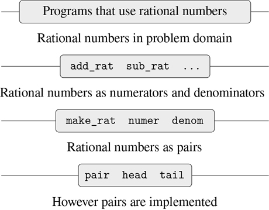

### 2.1.2 抽象障碍

在继续更多复合数据和数据抽象的例子之前，让我们考虑一下有理数例子提出的一些问题。我们根据构造函数`make_rat`和选择器`numer`和`denom`定义了有理数运算。一般而言，数据抽象的基本思想是为每种类型的数据对象标识一组基本操作，根据这些操作，该类型的数据对象的所有操作将被表达，然后在操作数据时仅使用那些操作。

我们可以想象有理数系统的结构，如图 2.1：所示。水平线代表隔离系统不同“层次”的抽象障碍。在每一层，屏障将使用数据抽象的程序(上图)与实现数据抽象的程序(下图)分开。使用有理数的程序只根据有理数包提供的“公共使用”的函数来操纵它们:`add_rat`、`sub_rat`、`mul_rat`、`div_rat`和`equal_rat`。反过来，这些仅根据构造函数和选择器`make_rat`、`numer`和`denom`来实现，它们本身是成对实现的。只要可以通过使用`pair`、`head`和`tail`来操作偶对，偶对是如何实现的细节与其余的有理数包无关。实际上，每一层的功能都是定义抽象障碍和连接不同层的接口。这个简单的想法有很多优点。一个优点是它使程序更容易维护和修改。任何复杂的数据结构都可以用编程语言提供的原始数据结构以多种方式表示。当然，表示的选择会影响对其进行操作的程序；因此，如果表示在以后某个时间被改变，所有这样的程序可能必须相应地被修改。在大型程序的情况下，这项任务可能既费时又费钱，除非通过设计将对表示的依赖限制在很少的程序模块中。



图 2.1：有理数包中的数据抽象壁垒。

例如，解决将有理数归约到最低项的问题的另一种方法是，每当我们访问有理数的部分时，而不是当我们构造它时，执行归约。这导致了不同的构造函数和选择器函数:

```js
function make_rat(n, d) {
    return pair(n, d);
}
function numer(x) {
    const g = gcd(head(x), tail(x));
    return head(x) / g;
}
function denom(x) {
    const g = gcd(head(x), tail(x));
    return tail(x) / g;
}
```

这个实现与前一个实现的区别在于我们何时计算`gcd`。如果在我们对有理数的典型使用中，我们多次访问同一个有理数的分子和分母，那么最好在构造有理数时计算`gcd`。如果没有，我们最好等到访问时间再计算`gcd`。在任何情况下，当我们从一种表示转换到另一种表示时，函数`add_rat`、`sub_rat`等等根本不需要修改。

将对表示的依赖约束到几个接口函数有助于我们设计程序以及修改它们，因为它允许我们保持考虑替代实现的灵活性。继续我们简单的例子，假设我们正在设计一个有理数包，我们最初不能决定是在构造时还是在选择时执行`gcd`。数据抽象方法为我们提供了一种推迟决策的方式，而不会丧失在系统的其余部分取得进展的能力。

##### 练习 2.2

考虑在平面中表示线段的问题。每个线段被表示为一对点:起点和终点。声明一个构造函数`make_segment`和选择器`start_segment`和`end_segment`，它们根据点来定义段的表示。此外，一个点可以表示为一对数字:`x`坐标和`y`坐标。相应地，指定一个构造函数`make_point`和定义这个表示的选择器`x_point`和`y_point`。最后，使用您的选择器和构造函数，声明一个函数`midpoint_segment`,它将一条线段作为参数，并返回它的中点(其坐标是端点坐标的平均值的点)。要尝试您的函数，您需要一种打印点的方法:

```js
function print_point(p) {
    return display("(" + stringify(x_point(p)) + ", "
                       + stringify(y_point(p)) + ")");
}
```

##### 练习 2.3

实现平面中矩形的表示。(提示:你可能想利用练习 2.2。)根据您的构造函数和选择器，创建计算给定矩形的周长和面积的函数。现在为矩形实现一个不同的表示。你能为你的系统设计合适的抽象障碍吗，这样同样的周长和面积函数就可以使用任何一种表示了？
