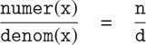

### 2.1.3 什么是数据？

我们在第 2.1.1 节开始了有理数的实现，根据三个未指定的函数:`make_rat`、`numer`和`denom`实现了有理数运算`add_rat`、`sub_rat`等等。在这一点上，我们可以认为操作是根据数据对象定义的——分子、分母和有理数——其行为由后三个函数指定。

但是数据到底是什么意思呢？仅仅说“由给定的选择器和构造器实现的东西”是不够的显然，不是每一组任意的三个函数都可以作为有理数实现的适当基础。我们需要保证，如果我们从一对整数`n`和`d`中构造一个有理数`x`，那么提取`x`中的`numer`和`denom`并将它们相除将会产生与用`n`除以`d`相同的结果。换句话说，`make_rat`、`numer`、`denom`必须满足条件，对于任意整数`n`和任意非零整数`d`，如果`x`为`make_rat(n, d)`，则



事实上，这是`make_rat`、`numer`和`denom`必须满足的唯一条件，以便形成有理数表示的合适基础。一般来说，我们可以认为数据是由一些选择器和构造函数的集合定义的，以及这些函数必须满足的特定条件，以便成为有效的表示。 [⁵](#c2-fn-0005)

这个观点不仅可以用来定义“高级”数据对象，比如有理数，也可以用来定义低级对象。考虑对的概念，我们用它来定义我们的有理数。我们实际上从未说过什么是偶对，只知道该语言提供了函数`pair`、`head`和`tail`来对偶对进行操作。但是关于这三个操作，我们唯一需要知道的是，如果我们使用`pair`将两个对象粘合在一起，我们可以使用`head`和`tail`来检索对象。也就是说，这些操作满足这样的条件:对于任意对象`x`和`y`，如果`z`是`pair(x, y)`，那么`head(z)`是`x`并且`tail(z)`是`y`。事实上，我们提到这三个函数作为原语包含在我们的语言中。然而，满足上述条件的任何三元组函数都可以用作实现函数对的基础。我们可以实现`pair`、`head`和`tail`而不使用任何数据结构，只使用函数，这一事实突出地说明了这一点。下面是定义: [⁶](#c2-fn-0006)

```js
function pair(x, y) {
    function dispatch(m) {
        return m === 0
               ? x
               : m === 1
               ? y
               : error(m, "argument not 0 or 1 – pair");
    }
    return dispatch;
}
function head(z) { return z(0); }
function tail(z) { return z(1); }
```

函数的这种用法与我们对数据应该是什么的直观概念完全不同。然而，为了证明这是一种有效的表示对的方法，我们需要做的就是验证这些函数满足上面给出的条件。

需要注意的一点是，`pair(x, y)`返回的值是一个函数，即内部定义的函数`dispatch`，它接受一个参数，并根据参数是 0 还是 1 返回`x`或`y`。相应地，`head(z)`被定义为将`z`应用于 0。因此，如果`z`是由`pair(x, y)`形成的函数，那么`z`应用于 0 将产生`x`。因此，我们已经表明`head(pair(x, y))`按照预期产生`x`。同样，`tail(pair(x, y))`将`pair(x, y)`返回的函数应用于 1，1 返回`y`。因此，偶对的这个函数实现是一个有效的实现，如果我们只使用`pair`、`head`和`tail`来访问偶对，我们就无法将这个实现与使用“真实”数据结构的实现区分开来。

展示偶对的函数表示的要点不在于我们的语言是这样工作的(偶对的有效实现可能使用 JavaScript 的原语向量数据结构),而在于它可以这样工作。函数表示虽然晦涩难懂，但却是表示线对的完美方式，因为它满足了线对需要满足的唯一条件。这个示例还演示了将函数作为对象进行操作的能力自动提供了表示复合数据的能力。现在这可能看起来有点奇怪，但是数据的函数表示将在我们的编程清单中扮演核心角色。这种编程风格通常被称为消息传递，我们将在第 3 章中使用它作为解决建模和仿真问题的基本工具。

##### 练习 2.4

这是对的另一种函数表示。对于这个表示，验证`head(pair(x, y))`对于任何对象`x`和`y`都产生`x`。

```js
function pair(x, y) {
    return m => m(x, y);
}
function head(z) {
    return z((p, q) => p);
}
```

`tail`的对应定义是什么？(提示:要验证这是否可行，请使用 1.1.5 节中的替代模型。)

##### 练习 2.5

说明如果我们将偶对`a`和`b`表示为是`2^a · 3^b`的乘积的整数，我们可以仅使用数字和算术运算来表示非负整数对。给出`pair`、`head`和`tail`功能的相应定义。

##### 练习 2.6

如果将对表示为函数(练习 2.4)还不够令人难以置信，那么考虑一下，在一种可以操作函数的语言中，我们可以通过实现 0 和将 1 加为的运算来处理没有数字的情况(至少就非负整数而言)

```js
const zero = f => x => x;

function add_1(n) {
    return f => x => f(n(f)(x));
}
```

这种表示法被称为教会数字，以其发明者阿隆佐·邱奇的名字命名，他是发明了 λ 微积分的逻辑学家。

直接定义`one`和`two`(不用`zero`和`add_1`)。(提示:使用替换来评估`add_1(zero)`)。直接给出加法函数`plus`的定义(不是就`add_1`的重复应用而言)。
