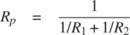
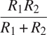
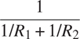

### 2.1.4 扩展练习:区间算术

Alyssa P. Hacker 正在设计一个系统来帮助人们解决工程问题。她想在自己的系统中提供的一个功能是能够以已知的精度处理不精确的量(如物理设备的测量参数)，这样当用这样的近似量进行计算时，结果将是已知精度的数字。

电气工程师将使用艾丽莎的系统来计算电量。他们有时需要用公式计算两个电阻`R[1]`和`R[2]`的并联等效电阻`R[p]`的值



电阻值通常只在电阻制造商保证的一定容差范围内。例如，如果您购买一个标有“6.8 欧姆，10%容差”的电阻器，您只能确定该电阻器的电阻在`6.8 - 0.68 = 6.12`和`6.8 + 0.68 = 7.48`欧姆之间。因此，如果有一个 6.8 欧姆的 10% 电阻与一个 4.7 欧姆的 5%电阻并联，组合电阻的范围可以从约 2.58 欧姆(如果两个电阻在下限)到约 2.97 欧姆(如果两个电阻在上限)。

Alyssa 的想法是将“区间算术”实现为一组用于组合“区间”(代表一个不精确量的可能值范围的对象)的算术运算。两个区间加、减、乘、除的结果本身就是一个区间，代表结果的范围。

Alyssa 假设存在一个称为“区间”的抽象对象，它有两个端点:一个下界和一个上界。她还假设，给定一个区间的端点，她可以使用数据构造函数`make_interval`来构造区间。Alyssa 首先编写了一个将两个音程相加的函数。她推断该和的最小值可能是两个下限的和，最大值可能是两个上限的和:

```js
function add_interval(x, y) {
    return make_interval(lower_bound(x) + lower_bound(y),
                         upper_bound(x) + upper_bound(y));
}
```

Alyssa 还通过找出边界乘积的最小值和最大值，并使用它们作为结果区间的边界，来计算两个区间的乘积。(函数`math_min`和`math_max`是找到任意数量参数的最小值或最大值的原语。)

```js
function mul_interval(x, y) {
    const p1 = lower_bound(x) * lower_bound(y); 
    const p2 = lower_bound(x) * upper_bound(y);
    const p3 = upper_bound(x) * lower_bound(y);
    const p4 = upper_bound(x) * upper_bound(y);
    return make_interval(math_min(p1, p2, p3, p4),
                         math_max(p1, p2, p3, p4));
}
```

为了划分两个区间，Alyssa 将第一个区间乘以第二个区间的倒数。请注意，倒数区间的界限依次是上界的倒数和下界的倒数。

```js
function div_interval(x, y) {
    return mul_interval(x, make_interval(1 / upper_bound(y),
                                         1 / lower_bound(y)));
}
```

##### 练习 2.7

Alyssa 的程序是不完整的，因为她没有指定区间抽象的实现。以下是区间构造函数的定义:

```js
function make_interval(x, y) { return pair(x, y); }
```

定义选择器`upper_bound`和`lower_bound`来完成实现。

##### 练习 2.8

使用类似于 Alyssa 的推理，描述如何计算两个区间的差。定义一个相应的减法函数，叫做`sub_interval`。

##### 练习 2.9

区间的宽度是其上下界之差的一半。宽度是由区间指定的数的不确定性的度量。对于一些算术运算，组合两个区间的结果的宽度仅仅是自变量区间宽度的函数，而对于其他运算，组合的宽度不是自变量区间宽度的函数。证明两个区间的和(或差)的宽度仅仅是被加(或减)的区间宽度的函数。举例说明这对于乘法或除法是不成立的。

##### 练习 2.10

系统编程专家本·比特德尔(Ben Bitdiddle)越过艾丽莎的肩膀评论说，不清楚除以零区间意味着什么。修改 Alyssa 的程序来检查这种情况，并在出现错误时发出信号。

##### 练习 2.11

顺便提一下，Ben 还神秘地评论道:“通过测试区间端点的符号，可以将`mul_interval`分成九种情况，其中只有一种需要两次以上的乘法运算。”使用 Ben 的建议重写这个函数。

在调试完她的程序后，Alyssa 将它展示给一个潜在用户，该用户抱怨她的程序解决了错误的问题。他想要一个程序，可以处理表示为中心值和附加公差的数字；例如，他希望使用`3.5±0.15`这样的区间，而不是`[3.35, 3.65]`。Alyssa 回到自己的办公桌前，通过提供备用构造函数和备用选择器来解决这个问题:

```js
function make_center_width(c, w) {
    return make_interval(c - w, c + w);
}
function center(i) {
    return (lower_bound(i) + upper_bound(i)) / 2;
}
function width(i) {
    return (upper_bound(i) - lower_bound(i)) / 2;
}
```

不幸的是，Alyssa 的大多数用户都是工程师。实际工程情况通常涉及只有很小不确定性的测量，测量为区间宽度与区间中点的比值。工程师通常规定器件参数的百分比容差，如前面给出的电阻规格。

##### 练习 2.12

定义一个构造函数`make_center_percent`，它采用一个中心和一个百分比公差，并产生所需的间隔。您还必须定义一个选择器`percent`来产生给定间隔的百分比公差。`center`选择器如上图所示。

##### 练习 2.13

证明在小百分比容差的假设下，根据因子的容差，有一个简单的公式来计算两个区间乘积的近似百分比容差。你可以通过假设所有的数字都是正数来简化这个问题。

经过大量的工作，Alyssa P. Hacker 交付了她完成的系统。几年后，当她完全忘记这件事的时候，她接到一个愤怒的用户 Lem E. Tweakit 打来的疯狂电话。Lem 似乎已经注意到，并联电阻的公式可以用两种代数等价的方式来表示:



和



他编写了以下两个程序，每个程序都以不同的方式计算并联电阻公式:

```js
function par1(r1, r2) {
    return div_interval(mul_interval(r1, r2),
                        add_interval(r1, r2));
}
function par2(r1, r2) {
    const one = make_interval(1, 1);
    return div_interval(one,
                        add_interval(div_interval(one, r1),
                                     div_interval(one, r2)));
}
```

Lem 抱怨说，Alyssa 的程序对这两种计算方式给出了不同的答案。这是一个严重的投诉。

##### 练习 2.14

证明 Lem 是正确的。研究系统在各种算术表达式上的行为。做一些区间`A`和`B`，用它们来计算表达式`A / A`和`A / B`。通过使用宽度为中心值一小部分的间隔，您将获得最大的洞察力。检查中心百分比形式的计算结果(参见练习 2.12)。

##### 练习 2.15

另一位用户 EvaLuAtor 也注意到由不同但代数等价的表达式计算的不同间隔。她说，如果一个用 Alyssa 系统计算区间的公式可以写成这样一种形式，即代表一个不确定数的名字不会重复，那么它将产生更严格的误差界限。因此，她说，`par2`是一个比`par1`更“好”的并联电阻程序。她说得对吗？为什么？

##### 练习 2.16

解释，一般来说，为什么等价的代数表达式可能导致不同的答案。你能设计一个没有这个缺点的区间算术软件包吗？或者这个任务是不可能的？(警告:这个问题很难。)
