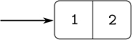
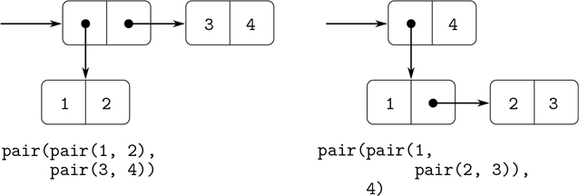

## 2.2 分层数据和闭合属性

正如我们所看到的，偶对提供了一种原始的“粘合剂”,我们可以用它来构造复合数据对象。图 2.2：显示了一种标准的可视化配对方式——在本例中，配对由`pair(1, 2)`组成。在这个被称为盒子和指针符号的表示中，每个复合对象被显示为一个盒子的指针。一对的盒子有两个部分，左边部分是头部，右边部分是尾部。

图 2.2：`pair(1, 2)`的盒指针表示。

我们已经看到,`pair`不仅可以用来组合数字，也可以用来组合成对。(在做练习 2.2 和 2.3 时，你利用了这个事实，或者应该利用了这个事实。)因此，偶对提供了一个通用的构建模块，我们可以从中构建各种数据结构。图 2.3：显示了使用配对组合数字 1、2、3 和 4 的两种方式。

图 2.3：两种方式组合 1、2、3、4 使用成对。

创建元素是对的对的能力是列表结构作为表示工具的重要性的本质。我们将这种能力称为`pair`的闭包属性。一般来说，如果组合数据对象的操作的结果本身可以使用相同的操作来组合，则该操作满足闭包属性。 [⁷](#c2-fn-0007) 封闭是任何组合方式中权力的关键，因为它允许我们创建层级结构——由零件组成的结构，而结构本身又由零件组成，如此等等。

从第一章开始，我们已经在处理函数时使用了闭包，因为除了最简单的程序之外，所有程序都依赖于这样一个事实，即组合的元素本身也可以是组合。在这一节中，我们将讨论复合数据闭包的后果。我们描述了一些使用对来表示序列和树的传统技术，并且展示了一种图形语言，它以一种生动的方式说明了闭包。