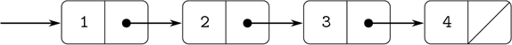

### 2.2.1 表示顺序

我们可以用偶对构建的一个有用的结构是一个序列——数据对象的有序集合。当然，有许多方法可以用对来表示序列。图 2.4 给出了一个特别直观的表示，其中序列 1，2，3，4 被表示为一串对。每对的`head`是链中对应的物品，该对的`tail`是链中的下一对。最后一对的`tail`表示序列的结束，在盒指针图中表示为对角线，在程序中表示为 JavaScript 的原始值`null`。整个序列由嵌套的`pair`操作构成:



图 2.4：把序列 1、2、3、4 表示为一串对子。

```js
pair(1,
     pair(2,
          pair(3,
               pair(4, null))));
```

这种由嵌套的`pair`应用程序形成的序列对被称为列表，我们的 JavaScript 环境提供了一个称为`list`的原语来帮助构建列表。 [⁸](#c2-fn-0008) 以上序列可能由`list(1, 2, 3, 4)`产生。总的来说，

```js
list(a[1], a[2], . . ., a[n])
```

相当于

```js
pair(a[1], pair(a[2], pair(. . ., pair(a[n], null). . .)))
```

我们的解释器使用我们称之为盒符号的盒指针图的文本表示来打印对。`pair(1, 2)`的结果打印为`[1, 2]`，图 2.4：中的数据对象打印为`[1, [2, [3, [4, null]]]]`:

```js
const one_through_four = list(1, 2, 3, 4);

one_through_four;
[1, [2, [3, [4, null]]]]
```

我们可以认为`head`选择了列表中的第一项，而`tail`选择了除第一项之外的所有子列表。`head`和`tail`的嵌套应用可用于提取列表中的第二、第三和后续项目。构造函数`pair`制作了一个类似于原始列表的列表，但是在开头添加了一个附加项。

```js
head(one_through_four);
1

tail(one_through_four);
[2, [3, [4, null]]]

head(tail(one_through_four));
2

pair(10, one_through_four);
[10, [1, [2, [3, [4, null]]]]]

pair(5, one_through_four);
[5, [1, [2, [3, [4, null]]]]]
```

用于终止线对链的值`null`可以被认为是一个没有元素的序列，即空列表。 [⁹](#c2-fn-0009)

方框符号有时很难读懂。在本书中，当我们想要指出一个数据结构的列表性质时，我们将使用替代的列表符号:只要有可能，列表符号使用`list`的应用程序，它的评估将产生期望的结构。例如，代替方框符号

```js
[1, [[2, 3], [[4, [5, null]], [6, null]]]]
```

我们写作

```js
list(1, [2, 3], list(4, 5), 6)
```

在列表符号中。 [^(10)](#c2-fn-0010)

##### 列表操作

使用对来表示列表中的元素序列伴随着传统的编程技术，通过连续使用`tail`遍历列表来操纵列表。例如，函数`list_ref`将一个列表和一个数字`n`作为参数，并返回列表的第`n`项。习惯上从 0 开始给列表中的元素编号。计算`list_ref`的方法如下:

*   对于`n = 0`，`list_ref`应该返回列表的`head`。
*   否则，`list_ref`应该返回列表中`tail`的第`(n–1)`项。

```js
function list_ref(items, n) {
    return n === 0
           ? head(items)
           : list_ref(tail(items), n - 1);
}

const squares = list(1, 4, 9, 16, 25);

list_ref(squares, 3);
16
```

通常我们会遍历整个列表。为了帮助实现这一点，我们的 JavaScript 环境包含了一个基本谓词`is_null`，它测试它的参数是否为空列表。返回列表中项目数量的函数`length`展示了这种典型的使用模式:

```js
function length(items) {
    return is_null(items)
           ? 0
           : 1 + length(tail(items));
}

const odds = list(1, 3, 5, 7);

length(odds);
4
```

`length`函数实现了一个简单的递归计划。还原步骤是:

*   任何列表的`length`都是 1 加上列表的`tail`的`length`。

这是连续应用的，直到我们达到基本情况:

*   空单的`length`为 0。

我们也可以以迭代的方式计算`length`:

```js
function length(items) {
    function length_iter(a, count) {
        return is_null(a)
               ? count
               : length_iter(tail(a), count + 1);
    }
    return length_iter(items, 0);
}
```

另一种传统的编程技术是通过使用`pair`将元素连接到列表的前面来构造答案列表，同时使用`tail`向下遍历列表，如在函数`append`中，该函数将两个列表作为参数，并将它们的元素组合成一个新列表:

```js
append(squares, odds);
list(1, 4, 9, 16, 25, 1, 3, 5, 7)

append(odds, squares);
list(1, 3, 5, 7, 1, 4, 9, 16, 25)
```

函数`append`也是使用递归计划实现的。要`append`列出`list1`和`list2`，请执行以下操作:

*   如果`list1`是空单，那么结果就是`list2`。
*   否则，`list1`的`tail`和`list2`的`append`，将`list1`的`head`邻接到结果:

```js
function append(list1, list2) {
    return is_null(list1)
           ? list2
           : pair(head(list1), append(tail(list1), list2));
}
```

##### 练习 2.17

定义一个函数`last_pair`,该函数返回只包含给定(非空)列表的最后一个元素的列表:

```js
last_pair(list(23, 72, 149, 34));
list(34)
```

##### 练习 2.18

定义一个函数`reverse`，该函数将一个列表作为参数，并以相反的顺序返回相同元素的列表:

```js
reverse(list(1, 4, 9, 16, 25));
list(25, 16, 9, 4, 1)
```

##### 练习 2.19

考虑第 1.2.2 节的变更计数程序。如果能够方便地改变程序使用的货币就好了，这样我们就可以计算出兑换英镑的方法。随着程序的编写，货币的知识一部分分布到函数`first_denomination`中，一部分分布到函数`count_change`中(其中知道美国硬币有五种)。如果能提供一个硬币清单，用来找零钱，那就更好了。

我们想重写函数`cc`,这样它的第二个参数是要使用的硬币的值的列表，而不是指定使用哪个硬币的整数。然后我们可以有定义每种货币的列表:

```js
const us_coins = list(50, 25, 10, 5, 1);
const uk_coins = list(100, 50, 20, 10, 5, 2, 1);
```

然后我们可以如下调用`cc`:

```js
cc(100, us_coins);
292
```

为此，需要稍微改变程序`cc`。它仍然具有相同的形式，但是它访问第二个参数的方式不同，如下所示:

```js
function cc(amount, coin_values) {
    return amount === 0
           ? 1
           : amount < 0 || no_more(coin_values)
           ? 0
           : cc(amount, except_first_denomination(coin_values)) +
             cc(amount - first_denomination(coin_values), coin_values);
}
```

根据对列表结构的原始操作定义函数`first_denomination`、`except_first_denomination`和`no_more`。列表的顺序`coin_values`是否影响`cc`产生的答案？为什么或为什么不？

##### 练习 2.20

在存在高阶函数的情况下，函数并不严格需要有多个参数；一个就够了。如果我们有一个像`plus`这样自然需要两个参数的函数，我们可以写一个函数的变体，一次传递一个参数。将变量应用于第一个参数可以返回一个函数，然后我们可以将该函数应用于第二个参数，依此类推。这种被称为柯里化的做法以美国数学家和逻辑学家哈斯凯尔·布鲁克斯·加里的名字命名，在 Haskell 和 OCaml 等编程语言中很常见。在 JavaScript 中，`plus`的一个简化版本如下。

```js
function plus_curried(x) {
    return y => x + y;
}
```

编写一个函数`brooks`,它将一个定制函数作为第一个参数，将定制函数应用到的一系列参数作为第二个参数，一个接一个，按照给定的顺序。例如，下面的`brooks`应用应该与`plus_curried(3)(4)`具有相同的效果:

```js
brooks(plus_curried, list(3, 4));
7
```

既然如此，我们不妨试试这个功能`brooks`！编写一个函数`brooks_curried`，可以应用如下:

```js
brooks_curried(list(plus_curried, 3, 4));
7
```

用这个函数`brooks_curried`，对下面两个语句求值的结果是什么？

```js
brooks_curried(list(brooks_curried,
                    list(plus_curried, 3, 4)));

brooks_curried(list(brooks_curried,
                    list(brooks_curried,
                         list(plus_curried, 3, 4))));
```

##### 列表映射

一个非常有用的操作是对列表中的每个元素进行某种转换，并生成结果列表。例如，下面的函数按给定的因子缩放列表中的每个数字:

```js
function scale_list(items, factor) {
    return is_null(items)
           ? null
           : pair(head(items) * factor,
                  scale_list(tail(items), factor));
}

scale_list(list(1, 2, 3, 4, 5), 10);
[10, [20, [30, [40, [50, null]]]]]
```

我们可以抽象出这个一般的概念，并把它作为一个通用的模式，用一个高阶函数来表达，就像 1.3 节一样。这里的高阶函数称为`map`。函数`map`将一个参数和一个列表的函数作为参数，并返回通过将函数应用于列表中的每个元素而产生的结果列表:

```js
function map(fun, items) {
    return is_null(items)
           ? null
           : pair(fun(head(items)),
                  map(fun, tail(items)));
}

map(abs, list(-10, 2.5, -11.6, 17));
[10, [2.5, [11.6, [17, null]]]]

map(x => x * x, list(1, 2, 3, 4));
[1, [4, [9, [16, null]]]]
```

现在我们可以用`map`来给`scale_list`一个新的定义:

```js
function scale_list(items, factor) {
    return map(x => x * factor, items);
}
```

函数`map`是一个重要的构造，不仅因为它捕获了一个公共模式，还因为它在处理列表时建立了一个更高层次的抽象。在最初的`scale_list`定义中，程序的递归结构把注意力吸引到了列表的元素间处理上。根据`map`定义`scale_list`抑制了细节层次，并强调缩放将元素列表转换为结果列表。这两个定义的区别不在于计算机执行的是不同的过程(它不是),而在于我们对过程的思考方式不同。实际上，`map`有助于建立一个抽象屏障，将转换列表的函数的实现与如何提取和组合列表元素的细节隔离开来。就像图 2.1 所示的障碍一样，这种抽象给了我们改变序列如何实现的底层细节的灵活性，同时保留了将序列转换成序列的操作的概念框架。2.2.3 节详述了序列作为组织程序的框架的这种用途。

##### 练习 2.21

函数`square_list`将一列数字作为参数，并返回这些数字的平方列表。

```js
square_list(list(1, 2, 3, 4));
[1, [4, [9, [16, null]]]]
```

这里有两种不同的`square_list`定义。通过填写缺少的表达式来完成这两个问题:

```js
function square_list(items) {
    return is_null(items)
           ? null
           : pair(〈??〉, 〈??〉);
}

function square_list(items) {
    return map(〈??〉, 〈??〉);
}
```

##### 练习 2.22

Louis Reasoner 试图重写练习 2.21 的第一个`square_list`函数，使其演变成一个迭代过程:

```js
function square_list(items) {
    function iter(things, answer) {
        return is_null(things)
               ? answer
               : iter(tail(things),
                      pair(square(head(things)),
                           answer));
    }
    return iter(items, null);
}
```

不幸的是，以这种方式定义`square_list`会产生与所需顺序相反的答案列表。为什么？

然后，Louis 试图通过与`pair`交换参数来修复他的 bug:

```js
function square_list(items) {
    function iter(things, answer) {
        return is_null(things)
               ? answer
               : iter(tail(things),
                      pair(answer,
                           square(head(things))));
    }
    return iter(items, null);
}
```

这个也不行。解释一下。

##### 练习 2.23

`for_each`的功能与`map`类似。它接受一个函数和一个元素列表作为参数。然而，`for_each`并没有形成一个结果列表，而是将函数从左到右依次应用于每个元素。通过将函数应用到元素而返回的值根本不会被使用— `for_each`用于执行某个动作的函数，比如打印。举个例子，

```js
for_each(x => display(x), list(57, 321, 88));
57
321
88
```

对`for_each`(上面没有说明)的调用返回的值可以是任意的，比如`true`。给出一个`for_each`的实现。
