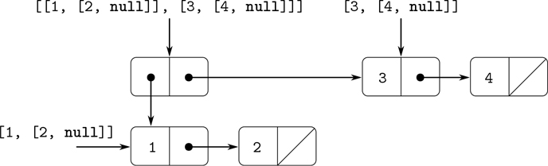
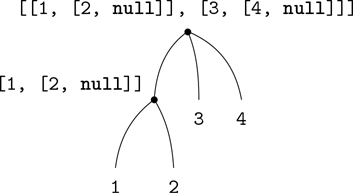

### 2.2.2 层次结构

用列表来表示序列自然地推广到表示其元素本身可能是序列的序列。例如，我们可以把对象`[[1, [2, null]], [3, [4, null]]]`看作由

```js
pair(list(1, 2), list(3, 4));
```

作为三个条目的列表，第一个条目本身就是一个列表，`[1, [2, null]]`。图 2.5：显示了这种结构的线对表示。



图 2.5：由`pair(list(1, 2), list(3, 4))`构成的结构。

另一种考虑元素是序列的序列的方式是树。序列的元素是树的分支，本身是序列的元素是子树。图 2.6：显示了图 2.5 中的树形结构。



图 2.6：图 2.5 中的列表结构视为一棵树。

递归是处理树结构的一种自然工具，因为我们通常可以将树上的操作简化为树枝上的操作，而树枝上的操作又依次简化为树枝上的操作，如此类推，直到到达树叶。例如，比较第 2.2.1 节的`length`函数和`count_leaves`函数，后者返回一棵树的总叶子数:

```js
const x = pair(list(1, 2), list(3, 4));

length(x);
3

count_leaves(x);
4

list(x, x);
list(list(list(1, 2), 3, 4), list(list(1, 2), 3, 4))

length(list(x, x));
2

count_leaves(list(x, x));
8
```

为了实现`count_leaves`，调用计算`length`的递归计划:

*   列表`x`的`length`为 1 加上`x`的`tail`的`length`。
*   空单的`length`为 0。

功能`count_leaves`也差不多。空列表的值是相同的:

*   `count_leaves`空单为 0。

但是在归约步骤中，当我们去掉列表中的`head`时，我们必须考虑到`head`本身可能是一棵树，我们需要计算它的叶子。因此，合适的还原步骤是

*   一棵树`x`的`count_leaves`是`x`的`head`的`count_leaves`加上`x`的`tail`的`count_leaves`。

最后，通过取`head`，我们得到实际的叶子，所以我们需要另一个基本情况:

*   `count_leaves`一片叶子是 1。

为了帮助在树上编写递归函数，我们的 JavaScript 环境提供了基本谓词`is_pair`，它测试它的参数是否是一对。下面是完整的功能: [^(11)](#c2-fn-0011)

```js
function count_leaves(x) {
    return is_null(x)
           ? 0
           : ! is_pair(x)
           ? 1
           : count_leaves(head(x)) + count_leaves(tail(x));
}
```

##### 练习 2.24

假设我们评估表达式`list(1, list(2, list(3, 4)))`。给出解释器打印的结果，相应的盒指针结构，以及对树的解释(如图 2.6： )。

##### 练习 2.25

给出`head`和`tail`的组合，它们将从以下列表中选出 7 个，以列表符号给出:

```js
list(1, 3, list(5, 7), 9)

list(list(7))

list(1, list(2, list(3, list(4, list(5, list(6, 7))))))
```

##### 练习 2.26

假设我们将`x`和`y`定义为两个列表:

```js
const x = list(1, 2, 3);
const y = list(4, 5, 6);
```

用方框表示法和列表表示法计算下列每个表达式的结果是什么？

```js
append(x, y)

pair(x, y)

list(x, y)
```

##### 练习 2.27

修改练习 2.18 中的`reverse`函数，生成一个`deep_reverse`函数，它将一个列表作为参数，并返回一个列表作为它的值，该列表的元素被反转，所有子列表也被深度反转。举个例子，

```js
const x = list(list(1, 2), list(3, 4));

x;
list(list(1, 2), list(3, 4))

reverse(x);
list(list(3, 4), list(1, 2))

deep_reverse(x);
list(list(4, 3), list(2, 1))
```

##### 练习 2.28

编写一个函数`fringe`，它将一棵树(表示为一个列表)作为参数，并返回一个列表，该列表的元素是从左到右排列的所有树叶。举个例子，

```js
const x = list(list(1, 2), list(3, 4));

fringe(x);
list(1, 2, 3, 4)

fringe(list(x, x));
list(1, 2, 3, 4, 1, 2, 3, 4)
```

##### 练习 2.29

二进制手机包括两个分支，一个左分支和一个右分支。每根树枝都是一根有一定长度的杆，上面挂着一个重物或另一个二进制移动物体。我们可以通过从两个分支(例如，使用`list`)构建复合数据来表示二进制移动:

```js
function make_mobile(left, right) {
    return list(left, right);
}
```

分支由一个`length`(必须是一个数字)和一个`structure`构成，后者可以是一个数字(代表简单的重量)或另一个移动:

```js
function make_branch(length, structure) {
    return list(length, structure);
}
```

1.  a. 写对应的选择器`left_branch`和`right_branch`，返回一个移动的分支，`branch_length`和`branch_structure`，返回一个分支的组件。
2.  使用你的选择器，定义一个函数`total_weight`返回一个手机的总重量。
3.  c. 如果左上分支施加的扭矩等于右上分支施加的扭矩(也就是说，如果左侧杆的长度乘以悬挂在该杆上的重量等于右侧相应的乘积)，并且悬挂在其分支上的每个子移动装置都是平衡的，则称该移动装置是平衡的。设计一个测试二进制移动是否平衡的谓词。
4.  d. Suppose we change the representation of mobiles so that the constructors are

    ```js
    function make_mobile(left, right) {
        return pair(left, right);
    }
    function make_branch(length, structure) {
        return pair(length, structure);
    }
    ```

    你需要改变你的程序多少来转换成新的表示？

##### 树上的映射

正如`map`是处理序列的强大抽象一样，`map`和递归一起是处理树的强大抽象。例如，`scale_tree`函数，类似于 2.2.1 节的`scale_list`，将一个数字因子和一个树叶是数字的树作为参数。它返回相同形状的树，其中每个数字都乘以因子。`scale_tree`的递归计划类似于`count_leaves`的递归计划:

```js
function scale_tree(tree, factor) {
    return is_null(tree)
           ? null
           : ! is_pair(tree)
           ? tree * factor
           : pair(scale_tree(head(tree), factor),
                  scale_tree(tail(tree), factor));
}

scale_tree(list(1, list(2, list(3, 4), 5), list(6, 7)),
           10);
list(10, list(20, list(30, 40), 50), list(60, 70))
```

实现`scale_tree`的另一种方式是将树视为一系列子树，并使用`map`。我们映射序列，依次缩放每个子树，并返回结果列表。在基本情况下，树是一片叶子，我们只需乘以因子:

```js
function scale_tree(tree, factor) {
    return map(sub_tree => is_pair(sub_tree)
                           ? scale_tree(sub_tree, factor)
                           : sub_tree * factor,
               tree);
}
```

许多树操作可以通过序列操作和递归的类似组合来实现。

##### 练习 2.30

声明一个类似于练习 2.21 的`square_list`函数的函数`square_tree`。也就是说，`square_tree`应该表现如下:

```js
square_tree(list(1,
                 list(2, list(3, 4), 5),
                 list(6, 7)));
list(1, list(4, list(9, 16), 25), list(36, 49)))
```

直接声明`square_tree`(即不使用任何高阶函数)，也可以使用`map`和递归。

##### 练习 2.31

将练习 2.30 的答案抽象成一个函数`tree_map`，其属性`square_tree`可以声明为

```js
function square_tree(tree) { return tree_map(square, tree); }
```

##### 练习 2.32

我们可以将一个集合表示为不同元素的列表，并且可以将该集合的所有子集的集合表示为列表的列表。例如，如果集合是`list(1, 2, 3)`，那么所有子集的集合是

```js
list(null, list(3), list(2), list(2, 3),
     list(1), list(1, 3), list(1, 2),
     list(1, 2, 3))
```

完成以下生成集合的子集的函数的声明，并给出其工作原理的清晰解释:

```js
function subsets(s) {
    if (is_null(s)) {
        return list(null);
    } else {
        const rest = subsets(tail(s));
        return append(rest, map( ?? , rest));
    }
}
```
