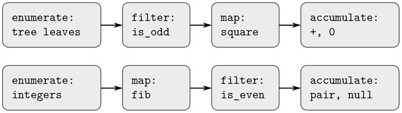
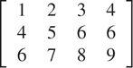
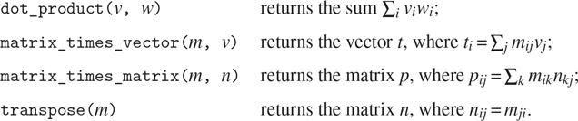
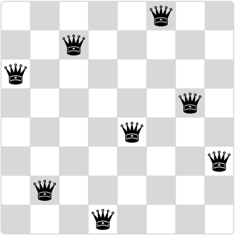

### 2.2.3 序列作为常规接口

在使用复合数据的过程中，我们强调了数据抽象如何允许我们设计程序而不陷入数据表示的细节中，以及抽象如何为我们保留了试验替代表示的灵活性。在本节中，我们将介绍另一个处理数据结构的强大设计原则——使用传统接口。

在 1.3 节中，我们看到了作为高阶函数实现的程序抽象是如何在处理数字数据的程序中捕获通用模式的。我们制定处理复合数据的类似操作的能力主要取决于我们操作数据结构的方式。例如，考虑下面的函数，类似于 2.2.2 节的`count_leaves`函数，它将一棵树作为自变量，并计算奇数树叶的平方和:

```js
function sum_odd_squares(tree) {
    return is_null(tree)
           ? 0
           : ! is_pair(tree)
           ? is_odd(tree) ? square(tree) : 0
           : sum_odd_squares(head(tree)) +
             sum_odd_squares(tail(tree));
}
```

从表面上看，这个函数与下面的函数有很大的不同，后者构造了一个所有偶数 Fibonacci 数`Fib(k)`的列表，其中`k`小于或等于给定的整数`n`:

```js
function even_fibs(n) {
    function next(k) {
        if (k > n) {
            return null;
        } else {
            const f = fib(k);
            return is_even(f)
                   ? pair(f, next(k + 1))
                   : next(k + 1);
        }
    }
    return next(0);
}
```

尽管这两个函数在结构上非常不同，但对这两种计算的更抽象的描述揭示了大量的相似性。第一个程序

*   枚举一棵树的叶子；
*   过滤它们，选择奇数；
*   将选中的每一个方块化；和
*   使用`+`累加结果，从 0 开始。

第二个节目

*   枚举从 0 到`n`的整数；
*   计算每个整数的斐波那契数；
*   过滤它们，选择偶数的；和
*   使用`pair`累加结果，从空列表开始。

信号处理工程师会发现很自然地将这些过程概念化为流经级联阶段的信号，每个阶段实现程序计划的一部分，如图 2.7：所示。在`sum_odd_squares`中，我们从一个枚举器开始，它生成一个由给定树的叶子组成的“信号”。该信号通过一个滤波器，该滤波器除了奇数元素之外，其他元素都被滤除。产生的信号依次通过图，图是一个将`square`功能应用于每个元素的“传感器”。然后，映射的输出被馈送到一个累加器，该累加器使用`+`从初始 0 开始合并元素。`even_fibs`的计划是类似的。



图 2.7：函数`sum_odd_squares`(上图)和`even_fibs`(下图)的信号流程图揭示了两个程序之间的共性。

不幸的是，上面的两个函数声明没有展示这种信号流结构。例如，如果我们检查`sum_odd_squares`函数，我们发现枚举部分由`is_null`和`is_pair`测试实现，部分由函数的树递归结构实现。类似地，这种积累部分出现在测试中，部分出现在递归中使用的加法中。一般来说，两种功能都没有与信号流描述中的元素相对应的独特部分。我们的两个函数以不同的方式分解计算，将枚举分布在程序中，并将其与映射、过滤和累积混合在一起。如果我们能够组织我们的程序，使信号流结构在我们编写的函数中显现出来，这将增加最终程序的概念清晰度。

##### 顺序操作

组织程序以便更清楚地反映信号流结构的关键是集中于从过程的一个阶段流向下一个阶段的“信号”。如果我们将这些信号表示为列表，那么我们可以使用列表操作来实现每个阶段的处理。例如，我们可以使用第 2.2.1 节中的`map`函数实现信号流图的映射阶段:

```js
map(square, list(1, 2, 3, 4, 5));
list(1, 4, 9, 16, 25)
```

过滤一个序列，只选择那些满足给定谓词的元素，这是通过

```js
function filter(predicate, sequence) {
    return is_null(sequence)
           ? null
           : predicate(head(sequence))
           ? pair(head(sequence),
                  filter(predicate, tail(sequence)))
           : filter(predicate, tail(sequence));
}
```

举个例子，

```js
filter(is_odd, list(1, 2, 3, 4, 5));
list(1, 3, 5)
```

累积可以通过以下方式实现

```js
function accumulate(op, initial, sequence) {
    return is_null(sequence)
           ? initial
           : op(head(sequence),
                accumulate(op, initial, tail(sequence)));
}

accumulate(plus, 0, list(1, 2, 3, 4, 5));
15

accumulate(times, 1, list(1, 2, 3, 4, 5));
120

accumulate(pair, null, list(1, 2, 3, 4, 5));
list(1, 2, 3, 4, 5)
```

实现信号流图剩下的工作就是枚举要处理的元素序列。对于`even_fibs`，我们需要生成给定范围内的整数序列，我们可以这样做:

```js
function enumerate_interval(low, high) {
    return low > high
           ? null
           : pair(low,
                  enumerate_interval(low + 1, high));
}

enumerate_interval(2, 7);
list(2, 3, 4, 5, 6, 7)
```

要枚举一棵树的叶子，我们可以用 [^(12)](#c2-fn-0012)

```js
function enumerate_tree(tree) {
    return is_null(tree)
           ? null
           : ! is_pair(tree)
           ? list(tree)
           : append(enumerate_tree(head(tree)),
                    enumerate_tree(tail(tree)));
}

enumerate_tree(list(1, list(2, list(3, 4)), 5));
list(1, 2, 3, 4, 5)
```

现在我们可以将`sum_odd_squares`和`even_fibs`重新表述为信号流程图。对于`sum_odd_squares`，我们枚举树的叶子序列，过滤它以仅保留序列中的奇数，对每个元素求平方，并对结果求和:

```js
function sum_odd_squares(tree) {
    return accumulate(plus,
                      0,
                      map(square,
                          filter(is_odd,
                                 enumerate_tree(tree))));
}
```

对于`even_fibs`，我们枚举从 0 到`n`的整数，为这些整数中的每一个生成斐波那契数，过滤结果序列以仅保留偶数元素，并将结果累积到一个列表中:

```js
function even_fibs(n) {
    return accumulate(pair,
                      null,
                      filter(is_even,
                             map(fib,
                                 enumerate_interval(0, n))));
}
```

将程序表达为序列操作的价值在于，这有助于我们做出模块化的程序设计，即通过组合相对独立的片段来构建的设计。我们可以通过提供标准组件库和以灵活方式连接组件的传统接口来鼓励模块化设计。

模块化结构是控制工程设计复杂性的有力策略。例如，在实际的信号处理应用中，设计人员通常通过级联从标准化的滤波器和传感器系列中选择的元件来构建系统。类似地，序列操作提供了一个标准程序元素库，我们可以混合和匹配这些元素。例如，我们可以在一个程序中重用来自`sum_odd_squares`和`even_fibs`函数的片段，该程序构造第`n + 1`个斐波那契数的正方形列表:

```js
function list_fib_squares(n) {
    return accumulate(pair,
                      null,
                      map(square,
                          map(fib,
                              enumerate_interval(0, n))));
}

list_fib_squares(10);
list(0, 1, 1, 4, 9, 25, 64, 169, 441, 1156, 3025)
```

我们可以重新排列这些片段，并用它们来计算一个序列中奇数的平方的乘积:

```js
function product_of_squares_of_odd_elements(sequence) {
    return accumulate(times,
                      1,
                      map(square,
                          filter(is_odd, sequence)));
}

product_of_squares_of_odd_elements(list(1, 2, 3, 4, 5));
225
```

我们还可以用序列运算来描述传统的数据处理应用程序。假设我们有一个人事记录序列，我们想找到工资最高的程序员的工资。假设我们有一个返回工资记录的选择器`salary`，和一个测试记录是否属于程序员的谓词`is_programmer`。然后我们可以写作

```js
function salary_of_highest_paid_programmer(records) {
    return accumulate(math_max,
                      0,
                      map(salary,
                          filter(is_programmer, records)));
}
```

这些例子只是暗示了可以用序列运算来表达的大量运算。 [^(13)](#c2-fn-0013)

序列，在这里实现为列表，作为一个传统的接口，允许我们组合处理模块。此外，当我们将结构统一表示为序列时，我们已经将程序中的数据结构依赖性局限于少量的序列操作。通过改变这些，我们可以试验序列的替代表示，同时保持程序的整体设计不变。我们将在 3.5 节中利用这种能力，当我们将序列处理范式推广到接受无限序列时。

##### 练习 2.33

填写缺失的表达式，完成以下一些基本列表操作操作的累积定义:

```js
function map(f, sequence) {
    return accumulate((x, y) => 〈??〉,
                      null, sequence);
}
function append(se1, seq2) {
    return accumulatqe(pair, 〈??〉, 〈??〉);
}
function length(sequence) {
    return accumulate( 〈??〉, 0, sequence);
}
```

##### 练习 2.34

在给定的值`x`下，对`x`中的多项式求值可以表示为累加。我们评估多项式

```js
a[n]·x^n + a[n–1]·x^(n–1) + ... + a[1]·x + a[0]
```

使用众所周知的算法霍纳法则，其计算结构如下

```js
(... (a[n]·x + a[n–1]) x + ... + a[1]) x + a[0]
```

换句话说，我们从`a[n]`开始，乘以`x`，加上`a[n–1]`，乘以`x`，以此类推，直到我们到达`a[0]`。 [^(14)](#c2-fn-0014) 填写以下模板，生成一个使用霍纳法则计算多项式的函数。假设多项式的系数是按顺序排列的，从`a[0]`到`a[n]`。

```js
function horner_eval(x, coefficient_sequence) {
    return accumulate((this_coeff, higher_terms) => ?? ,
                      0,
                      coefficient_sequence);
}
```

例如，要计算`1+3x+5x³+x⁵ = 2`，您将计算

```js
horner_eval(2, list(1, 3, 0, 5, 0, 1));
```

##### 练习 2.35

将第 2.2.2 节中的`count_leaves`重新定义为累积:

```js
function count_leaves(t) {
    return accumulate( ?? , ?? , map( ?? , ?? ));
}
```

##### 练习 2.36

函数`accumulate_n`类似于`accumulate`,除了它将一系列序列作为它的第三个参数，这些序列都被假设具有相同数量的元素。它应用指定的累积函数来组合序列的所有第一个元素、序列的所有第二个元素，依此类推，并返回结果序列。例如，如果`s`是一个包含四个序列的序列

```js
list(list(1, 2, 3), list(4, 5, 6), list(7, 8, 9), list(10, 11, 12))
```

那么`accumulate_n(plus, 0, s)`的值应该是序列`list(22, 26, 30)`。在下面`accumulate_n`的定义中填入缺少的表达式:

```js
function accumulate_n(op, init, seqs) {
    return is_null(head(seqs))
           ? null
           : pair(accumulate(op, init, 〈??〉),
                  accumulate_n(op, init, 〈??〉));
}
```

##### 练习 2.37

假设我们将向量 `v = (v[I])`表示为数列，将矩阵`m = (m[ij])`表示为向量序列(矩阵的行)。例如，矩阵



表示为以下序列:

```js
list(list(1, 2, 3, 4),
     list(4, 5, 6, 6),
     list(6, 7, 8, 9))
```

有了这种表示，我们可以用序列运算简明地表达基本的矩阵和向量运算。这些运算(在任何矩阵代数书籍中都有描述)如下:



我们可以将点积定义为 [^(15)](#c2-fn-0015)

```js
function dot_product(v, w) {
    return accumulate(plus, 0, accumulate_n(times, 1, list(v, w)));
}
```

填写下列函数中缺少的表达式，以计算其他矩阵运算。(函数`accumulate_n`在练习 2.36 中声明。)

```js
function matrix_times_vector(m, v) {
    return map( ?? , m);
}
function transpose(mat) {
    return accumulate_n( ?? , ?? , mat);
}
function matrix_times_matrix(n, m) {
    const cols = transpose(n);
    return map( ?? , m);
}
```

##### 练习 2.38

`accumulate`函数也称为`fold_right`，因为它将序列的第一个元素与右侧所有元素的组合结果相结合。还有一个`fold_left`，类似于`fold_right`，除了它组合了反方向工作的元素:

```js
function fold_left(op, initial, sequence) {
    function iter(result, rest) {
        return is_null(rest)
               ? result
               : iter(op(result, head(rest)),
                      tail(rest));
    }
    return iter(initial, sequence);
}
```

的价值观是什么

```js
fold_right(divide, 1, list(1, 2, 3));

fold_left(divide, 1, list(1, 2, 3));

fold_right(list, null, list(1, 2, 3));

fold_left(list, null, list(1, 2, 3));
```

给出一个`op`应该满足的属性，以保证`fold_right`和`fold_left`对于任何序列都会产生相同的值。

##### 练习 2.39

根据练习 2.38 中的`fold_right`和`fold_left`完成以下`reverse`(练习 2.18)的定义:

```js
function reverse(sequence) {
    return fold_right((x, y) => ?? , null, sequence);
}

function reverse(sequence) {
    return fold_left((x, y) => ?? , null, sequence);
}
```

##### 嵌套映射

我们可以扩展 sequence 范式，以包含许多通常使用嵌套循环表示的计算。 [^(16)](#c2-fn-0016) 考虑这个问题:给定一个正整数`n`，求所有有序的互不相同的正整数对`i`和`j`，其中`1 <= j < i <= n`，使得`i + j`为素数。例如，如果`n`为 6，则配对如下:

| `i` | 2 | 3 | 4 | 4 | 5 | 6 | 6 |
| --- | --- | --- | --- | --- | --- | --- | --- |
| `j` | 1 | 2 | 1 | 3 | 2 | 1 | 5 |
| `i + j` | 3 | 5 | 5 | 7 | 7 | 7 | 11 |

组织这种计算的一种自然方式是生成所有小于或等于`n`的正整数有序对的序列，过滤以选择那些和为素数的对，然后，对于通过过滤器的每一对`(i, j)`，生成三元组`(i, j, i + j)`。

这里有一个生成偶对序列的方法:对于每个整数`i < n`，枚举整数`j < i`，对于每个这样的`i`和`j`生成`pair(i, j)`。在序列操作方面，我们沿着序列`enumerate_interval(1, n)`进行映射。对于这个序列中的每个`i`，我们沿着序列`enumerate_interval(1, i - 1)`进行映射。对于后面这个序列中的每个`j`，我们生成一对`list(i, j)`。这给了我们每个`i`的偶对序列。组合所有`i`的所有序列(通过与`append`累加)产生所需的序列对: [^(17)](#c2-fn-0017)

```js
accumulate(append,
           null,
           map(i => map(j => list(i, j),
                        enumerate_interval(1, i - 1)),
               enumerate_interval(1, n)));
```

用`append`进行映射和累加的组合在这类程序中很常见，我们将把它作为一个独立的函数:

```js
function flatmap(f, seq) {
    return accumulate(append, null, map(f, seq));
}
```

现在过滤这一对序列，找出和为质数的对。为序列的每个元素调用过滤器谓词；它的参数是一个对，它必须从对中提取整数。因此，应用于序列中每个元素的谓词是

```js
function is_prime_sum(pair) {
    return is_prime(head(pair) + head(tail(pair)));
}
```

最后，通过使用以下函数映射过滤后的对来生成结果序列，该函数构造一个三元组，由对中的两个元素及其总和组成:

```js
function make_pair_sum(pair) {
    return list(head(pair), head(tail(pair)),
                head(pair) + head(tail(pair)));
}
```

将所有这些步骤结合起来就产生了完整的功能:

```js
function prime_sum_pairs(n) {
    return map(make_pair_sum,
               filter(is_prime_sum,
                      flatmap(i => map(j => list(i, j),
                                       enumerate_interval(1, i - 1)),
                              enumerate_interval(1, n))));
}
```

嵌套映射对于枚举间隔以外的序列也很有用。假设我们希望生成集合`S`的所有排列；也就是对集合中的项目进行排序的所有方式。例如，`{1, 2, 3}`的排列是`{1, 2, 3}`、`{1, 3, 2}`、`{2, 1, 3}`、`{2, 3, 1}`、`{3, 1, 2}`和`{3, 2, 1}`。下面是一个生成`S`排列的方案:对于`S`中的每一项`x`，递归生成`S – x`、[18](#c2-fn-0018)的排列顺序，并将`x`邻接到每一项的前面。对于`S`中的每个`x`，这产生了从`x`开始的`S`的排列序列。组合所有`x`的这些序列给出了`S`[^(19)](#c2-fn-0019)的所有排列：

```js
function permutations(s) {
    return is_null(s) // empty set?
           ? list(null) // sequence containing empty set
           : flatmap(x => map(p => pair(x, p),
                              permutations(remove(x, s))),
                     s);
}
```

注意这个策略是如何将生成`S`的排列的问题简化为生成比`S`更少元素的集合的排列的问题。在最后一种情况下，我们一直工作到空列表，它表示一组没有元素的集合。为此，我们生成`list(null)`，它是一个只有一项的序列，即没有元素的集合。`permutations`中使用的`remove`函数返回给定序列中除给定项目之外的所有项目。这可以表示为一个简单的过滤器:

```js
function remove(item, sequence) {
    return filter(x => ! (x === item),
                  sequence);
}
```

##### 练习 2.40

编写一个函数`unique_pairs`，在给定一个整数`n`的情况下，用 1 j < i`n`生成一系列对( i ， j )。使用`unique_pairs`简化上面给出的`prime_sum_pairs`的定义。

##### 练习 2.41

编写一个函数，找出所有小于或等于给定整数`n`且总和为给定整数`s`的不同正整数`i`、`j`和`k`的有序三元组。

##### 练习 2.42

“八皇后难题”询问如何将八个皇后放置在棋盘上，使得没有皇后被其他皇后牵制(即，没有两个皇后在同一行、列或对角线上)。图 2.8 显示了一种可能的解决方案。解决这个难题的一个方法是全面展开工作，在每列中放置一个皇后。一旦我们放置了`k–1`张皇后牌，我们必须将`k`张皇后牌放置在一个不会检查棋盘上任何一张皇后牌的位置。我们可以递归地制定这种方法:假设我们已经生成了将`k–1`皇后放置在棋盘的前`k–1`列中的所有可能方式的序列。对于这些方法中的每一种，通过在第`k`列的每一行中放置一个皇后来生成一组扩展的位置。现在过滤这些，只保留第`k`列中的皇后相对于其他皇后安全的位置。这产生了将`k`皇后放置在第一个`k`列中的所有方式的顺序。通过继续这个过程，我们将不仅产生一个解决方案，而是这个难题的所有解决方案。



图 2.8：八皇后谜题的一种解法。

我们将该解决方案实现为函数`queens`，该函数返回将`n`个皇后放置在`n x n`棋盘上的问题的所有解决方案的序列。函数`queens`有一个内部函数`queens_cols`，它返回将皇后放入棋盘前`k`列的所有方法的顺序。

```js
function queens(board_size) {
    function queen_cols(k) {
        return k === 0
               ? list(empty_board)
               : filter(positions => is_safe(k, positions),
                        flatmap(rest_of_queens =>
                                  map(new_row =>
                                        adjoin_position(new_row, k,
                                                        rest_of_queens),
                                      enumerate_interval(1, board_size)),
                                queen_cols(k - 1)));
    }
    return queen_cols(board_size);
}
```

在这个函数中，`rest_of_queens`是一种将`k–1`皇后放置在前`k–1`列中的方法，`new_row`是一个建议行，用于放置第`k`列的皇后。通过实现板位置集合的表示来完成程序，包括将一个新的行列位置连接到一个位置集合的函数`adjoin_position`，以及表示一个空的位置集合的函数`empty_board`。您还必须编写函数`is_safe`，它为一组位置确定第`k`列中的皇后相对于其他皇后是否安全。(注意，我们只需要检查新的女王是否安全——其他女王已经被保证相对于彼此是安全的。)

##### 练习 2.43

路易斯·雷森纳在做练习 2.42 的时候很难受。他的`queens`功能看起来可以用，但是运行速度极慢。(路易斯从来没有设法等待足够长的时间来解决甚至 6 6 号案件。)当 Louis 向 EvaLuAtor 寻求帮助时，她指出他互换了`flatmap`中嵌套映射的顺序，写为

```js
flatmap(new_row =>
          map(rest_of_queens =>
                adjoin_position(new_row, k, rest_of_queens),
              queen_cols(k - 1)),
        enumerate_interval(1, board_size));
```

解释为什么这种交换会使程序运行缓慢。估计路易斯的程序解决八皇后难题需要多长时间，假设练习 2.42 中的程序及时解决难题 T 。
