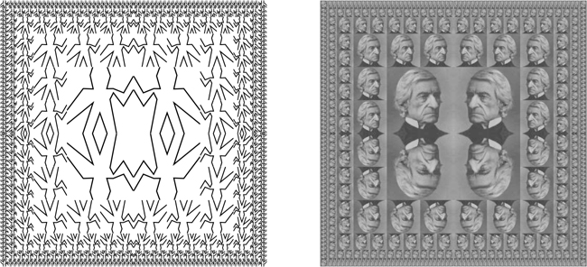
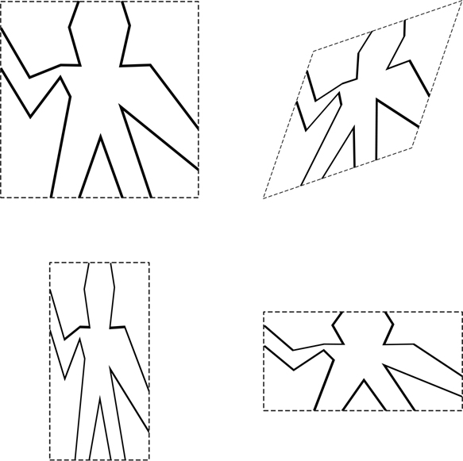
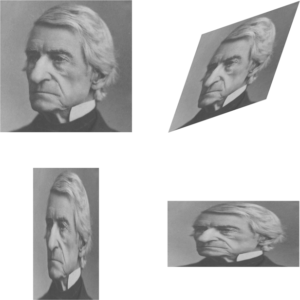
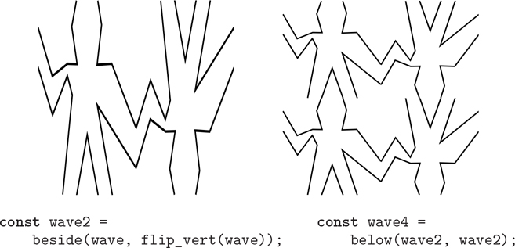
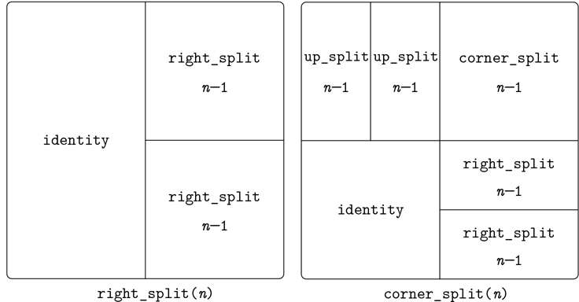
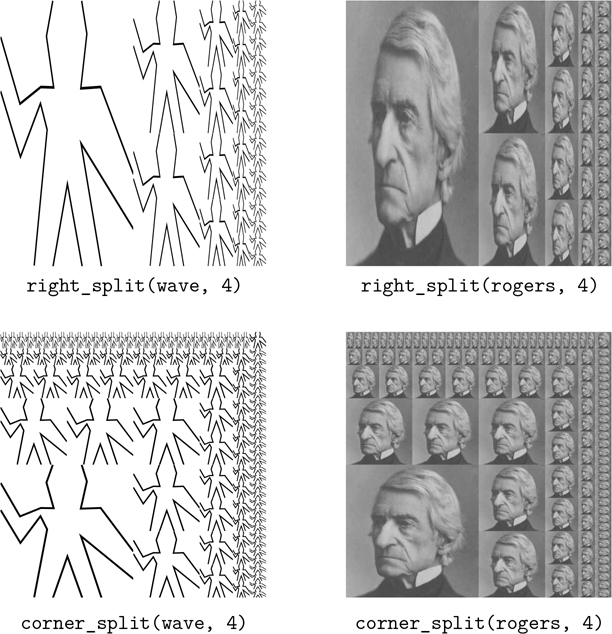
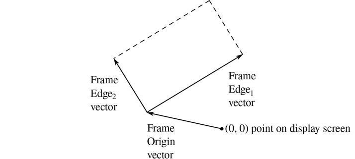

### 2.2.4 举例:一种图片语言

本节介绍了一种简单的绘图语言，它展示了数据抽象和闭包的强大功能，并以一种基本的方式利用了高阶函数。该语言旨在使试验模式变得容易，例如图 2.9 中的模式，这些模式由重复的元素组成，这些元素被移动和缩放。 [^(20)](#c2-fn-0020) 在这种语言中，被组合的数据对象被表示为函数而不是列表结构。正如满足闭包属性的`pair`允许我们轻松构建任意复杂的列表结构一样，这种语言中的操作也满足闭包属性，允许我们轻松构建任意复杂的模式。



图 2.9：用图片语言生成的设计。

##### 图片语言

当我们在 1.1 节开始学习编程时，我们强调了通过关注语言的原语、组合方式和抽象方式来描述语言的重要性。我们将遵循这个框架。

这种画面语言的优雅之处在于只有一种元素，叫做画家。画家绘制图像，该图像被移动和缩放以适合指定的平行四边形框架。例如，有一个我们称之为`wave`的原始画家，他画了一个粗糙的线条画，如图 2.10：所示。图画的实际形状取决于画框——图 2.10：中的所有四幅图像都是由同一个`wave`画家绘制的，但是相对于四个不同的画框。画家可以比这更精细:名为`rogers`的原始画家为麻省理工学院的创始人威廉·巴顿·罗杰斯画了一幅画，如图 2.11：所示。[^(21)](#c2-fn-0021)图 2.11：中的四幅图像是针对与图 2.10：中的`wave`图像相同的四帧绘制的。



图 2.10：由`wave`画师产生的图像，关于四个不同的帧。用虚线显示的帧不是图像的一部分。



图 2.11：麻省理工学院创始人兼首任校长威廉·巴顿·罗杰斯的画像，与图 2.10[中的四个画框相对而画(原图由麻省理工学院博物馆提供)。](#c2-fig-0017)

为了组合图像，我们使用各种操作从给定的画师构造新的画师。例如，`beside`操作采用两个画师，并生成一个新的复合画师，在帧的左半部分绘制第一个画师的图像，在帧的右半部分绘制第二个画师的图像。类似地，`below`采用两个画家并产生一个复合画家，该复合画家在第二个画家的图像下面绘制第一个画家的图像。一些操作转换单个画师以产生新的画师。例如，`flip_vert`取一个画师，产生一个颠倒画其图像的画师，`flip_horiz`产生一个颠倒画原画师图像的画师。

图 2.12：显示了一个名为`wave4`的画家的图，该图从`wave`开始分两个阶段构建:

```js
const wave2 = beside(wave, flip_vert(wave));
const wave4 = below(wave2, wave2);
```

在以这种方式构建一个复杂的图像时，我们利用了这样一个事实，即画家在语言的组合方式下是封闭的。两个画师的`beside`或`below`本身就是画师；因此，我们可以将其作为制作更复杂的画家的元素。与使用`pair`构建列表结构一样，组合方式下的数据闭合对于仅使用少量操作创建复杂结构的能力至关重要。



图 2.12：创建复杂图形，从图 2.10：的`wave`画师开始。

一旦我们可以组合画家，我们希望能够抽象出组合画家的典型模式。我们将把画图操作实现为 JavaScript 函数。这意味着在图片语言中我们不需要特殊的抽象机制:由于组合的方式是普通的 JavaScript 函数，我们自动地拥有了用函数可以做的任何画图操作的能力。例如，我们可以将`wave4`中的模式抽象为

```js
function flipped_pairs(painter) {
    const painter2 = beside(painter, flip_vert(painter));
    return below(painter2, painter2);
}
```

并将`wave4`声明为该模式的一个实例:

```js
const wave4 = flipped_pairs(wave);
```

我们也可以定义递归运算。这里有一个使油漆工向右分裂和分支，如图[图 2.13 和 2.14](#c2-fig-0020) :

```js
function right_split(painter, n) {
    if (n === 0) {
        return painter;
    } else {
        const smaller = right_split(painter, n - 1);
        return beside(painter, below(smaller, smaller));
    }
}
```



图 2.13：为`right_split`和`corner_split`的递归计划。



图 2.14：将递归运算`right_split`应用于画师`wave`和`rogers`。组合四个`corner_split`图形产生对称的`square_limit`，如图 2.9 中的[所示。](#c2-fig-0016)

我们可以通过向上和向右分支来生成平衡的模式(参见练习 2.44 和[图 2.13 和 2.14](#c2-fig-0020) ):

```js
function corner_split(painter, n) {
    if (n === 0) {
        return painter;
    } else {
        const up = up_split(painter, n - 1);
        const right = right_split(painter, n - 1);
        const top_left = beside(up, up);
        const bottom_right = below(right, right);
        const corner = corner_split(painter, n - 1);
        return beside(below(painter, top_left),
                      below(bottom_right, corner));
    }
}
```

通过适当放置四个`corner_split`副本，我们得到一个名为`square_limit`的图案，其在`wave`和`rogers`中的应用如图 2.9：所示:

```js
function square_limit(painter, n) {
    const quarter = corner_split(painter, n);
    const half = beside(flip_horiz(quarter), quarter);
    return below(flip_vert(half), half);
}
```

##### 练习 2.44

声明`corner_split`使用的函数`up_split`。它与`right_split`相似，只是它切换了`below`和`beside`的角色。

##### 高阶运算

除了抽象组合画师的模式，我们还可以在更高的层次上工作，抽象组合画师操作的模式。也就是说，我们可以将`painter`操作视为要操作的元素，并可以编写这些元素的组合方式——将`painter`操作作为参数并创建新的`painter`操作的函数。

例如，`flipped_pairs`和`square_limit`各以正方形图案排列一个画家图像的四个副本；它们的区别仅在于如何定位副本。抽象这种`painter`组合模式的一种方法是使用下面的函数，该函数采用四个单参数`painter`操作，并产生一个`painter`操作，该操作用这四个操作转换给定的`painter`，并将结果排列在一个正方形中。 [^(22)](#c2-fn-0022) 功能`tl`、`tr`、`bl`和`br`分别是应用于左上复印、右上复印、左下复印和右下复印的变换。

```js
function square_of_four(tl, tr, bl, br) {
    return painter => {
        const top = beside(tl(painter), tr(painter));
        const bottom = beside(bl(painter), br(painter));
        return below(bottom, top);
    };
}
```

那么`flipped_pairs`可以用`square_of_four`来定义如下: [^(23)](#c2-fn-0023)

```js
function flipped_pairs(painter) {
    const combine4 = square_of_four(identity, flip_vert,
                                    identity, flip_vert);
    return combine4(painter);
}
```

而`square_limit`可以表示为 [^(24)](#c2-fn-0024)

```js
function square_limit(painter, n) {
    const combine4 = square_of_four(flip_horiz, identity,
                                    rotate180, flip_vert);
    return combine4(corner_split(painter, n));
}
```

##### 练习 2.45

函数`right_split`和`up_split`可以表示为一般分割操作的实例。用求值的属性声明一个函数`split`

```js
const right_split = split(beside, below);
const up_split = split(below, beside);
```

产生与已经声明的函数行为相同的函数`right_split`和`up_split`。

##### 框架

在我们展示如何实现画家和他们的组合方式之前，我们必须首先考虑框架。一个帧可以用三个向量来描述——一个原点向量和两个边缘向量。原点向量指定框架的原点相对于平面中某个绝对原点的偏移量，边缘向量指定框架的角相对于其原点的偏移量。如果边缘垂直，框架将是矩形的。否则框架将是一个更一般的平行四边形。

图 2.15：显示了一个帧及其相关向量。根据数据抽象，我们还不需要具体说明框架是如何表示的，只是说有一个构造函数`make_frame`，它接受三个向量并产生一个框架，以及三个相应的选择器`origin_frame`、`edge1_frame`和`edge2_frame`(见练习 2.47)。



图 2.15：一个帧由三个向量描述——一个原点和两条边。

我们将使用单位正方形中的坐标(0 ≤`x`， y ≤ 1)来指定图像。对于每一帧，我们关联一个帧坐标图，它将用于移动和缩放图像以适应帧。通过将矢量 **v** = (`x`， y )映射到矢量和，地图将单位正方形转换为框架

```js
Origin(Frame) + x · Edge1 (Frame) + y · Edge2 (Frame)
```

例如，(0，0)映射到帧的原点，(1，1)映射到原点对角的顶点，(0.5，0.5)映射到帧的中心。我们可以用下面的函数创建一个帧的坐标图: [^(25)](#c2-fn-0025)

```js
function frame_coord_map(frame) {
    return v => add_vect(origin_frame(frame),
                         add_vect(scale_vect(xcor_vect(v),
                                             edge1_frame(frame)),
                                  scale_vect(ycor_vect(v),
                                             edge2_frame(frame))));
}
```

请注意，将`frame_coord_map`应用于一个帧会返回一个函数，该函数在给定一个向量的情况下会返回一个向量。如果自变量向量在单位正方形中，则结果向量将在框架中。举个例子，

```js
frame_coord_map(a_frame)(make_vect(0, 0)); 
```

返回与相同的向量

```js
origin_frame(a_frame);
```

##### 练习 2.46

从原点到一点的二维向量 v 可以表示为一个由`x`坐标和`y`坐标组成的对。通过给出一个构造函数`make_vect`和相应的选择器`xcor_vect`和`ycor_vect`来实现向量的数据抽象。根据您的选择器和构造器，实现函数`add_vect`、`sub_vect`和`scale_vect`，它们执行向量加法、向量减法和向量乘以标量的操作:

| (x1，y1)+(x2，y2) | = | (x[1]+x[2]，y[1]+y[2]) |
| (x1，y1)–(x2，y2) | = | (x[1]–x[2]，y[1]–y[2]) |
| s (`x`， y ) | = | ( sx ， sy ) |

##### 练习 2.47

下面是两个可能的框架构造函数:

```js
function make_frame(origin, edge1, edge2) {
    return list(origin, edge1, edge2);
}

function make_frame(origin, edge1, edge2) {
   return pair(origin, pair(edge1, edge2));
}
```

为每个构造函数提供适当的选择器来产生框架的实现。

##### 画家

画师被表示为一个函数，给定一个帧作为参数，绘制一个特定的图像，移动和缩放以适合该帧。也就是说，如果`p`是画师，`f`是画框，那么我们通过以`f`为自变量调用`p`来产生`f`中`p`的形象。

原始画师是如何实现的细节取决于图形系统的特定特征和要绘制的图像类型。例如，假设我们有一个函数`draw_line`，它在屏幕上的两个指定点之间画了一条线。然后我们可以为线条画创建画师，例如图 2.10：中的`wave`画师，来自如下的线段列表: [^(26)](#c2-fn-0026)

```js
function segments_to_painter(segment_list) {
    return frame =>
             for_each(segment =>
                        draw_line(
                            frame_coord_map(frame)
                                (start_segment(segment)),
                            frame_coord_map(frame)
                                (end_segment(segment))),
                      segment_list);
}
```

使用相对于单位正方形的坐标给出线段。对于列表中的每个线段，画家用帧坐标图变换线段端点，并在变换后的点之间画一条线。

将画家表现为功能在图像语言中竖起了一个强大的抽象障碍。我们可以创造和混合各种原始画家，基于各种图形能力。它们实现的细节并不重要。任何函数都可以充当画师，只要它以一个框架作为参数，并绘制适合该框架的缩放内容。 [^(27)](#c2-fn-0027)

##### 练习 2.48

平面中的有向线段可以表示为一对向量，一个向量从线段的原点到起点，另一个向量从线段的原点到终点。使用练习 2.46 中的向量表示法，用构造器`make_segment`和选择器`start_segment`和`end_segment`定义线段的表示法。

##### 练习 2.49

使用`segments_to_painter`定义以下原始画家:

1.  a. 画出指定画框轮廓的画家。
2.  b. 通过连接画框的对角来画一个“X”的画家。
3.  c. 通过连接画框两边的中点画出菱形的画家。
4.  d. 那个`wave`油漆工。

##### 转换和组合画家

对画师(如`flip_vert`或`beside`)的操作是通过创建一个画师来工作的，该画师针对从参数帧导出的帧调用原始画师。因此，举例来说，`flip_vert`不需要知道画家如何工作来翻转它——它只需要知道如何颠倒框架:翻转的画家只是使用原始画家，但是在颠倒的框架中。

画师操作基于函数`transform_painter`，该函数将画师和关于如何变换帧并生成新画师的信息作为参数。当在框架上调用转换的画师时，转换框架并在转换的框架上调用原始画师。`transform_painter`的参数是指定新帧角的点(表示为向量):当映射到帧中时，第一个点指定新帧的原点，另外两个点指定其边缘向量的端点。因此，单位正方形内的参数指定包含在原始框架内的框架。

```js
function transform_painter(painter, origin, corner1, corner2) {
    return frame => {
             const m = frame_coord_map(frame);
             const new_origin = m(origin);
             return painter(make_frame(
                                new_origin,
                                sub_vect(m(corner1), new_origin),
                                sub_vect(m(corner2), new_origin)));
           };
}
```

以下是垂直翻转画家图像的方法:

```js
function flip_vert(painter) {
    return transform_painter(painter,
                             make_vect(0, 1),  // new origin
                             make_vect(1, 1),  // new end of edge1
                             make_vect(0, 0)); // new end of edge2
}
```

使用`transform_painter`，我们可以很容易地定义新的转换。例如，我们可以声明一个画师，将其图像缩小到给定帧的右上方四分之一:

```js
function shrink_to_upper_right(painter) {
    return transform_painter(painter,
                             make_vect(0.5, 0.5),
                             make_vect(1, 0.5),
                             make_vect(0.5, 1));
}
```

其他变换将图像逆时针旋转 90 度[28](#c2-fn-0028)

```js
function rotate90(painter) {
    return transform_painter(painter,
                             make_vect(1, 0),
                             make_vect(1, 1),
                             make_vect(0, 0));
}
```

或者向画面中央挤压图像: [^(29)](#c2-fn-0029)

```js
function squash_inwards(painter) {
    return transform_painter(painter,
                             make_vect(0, 0),
                             make_vect(0.65, 0.35),
                             make_vect(0.35, 0.65));
}
```

框架变换也是定义组合两个或更多画家的方法的关键。例如，`beside`函数获取两个画师，将他们转换为分别在一个参数帧的左半部分和右半部分绘画，并生成一个新的复合画师。当给定复合绘制者一个帧时，它调用第一个变换的绘制者在该帧的左半部分进行绘制，并调用第二个变换的绘制者在该帧的右半部分进行绘制:

```js
function beside(painter1, painter2) {
    const split_point = make_vect(0.5, 0);
    const paint_left = transform_painter(painter1,
                                         make_vect(0, 0),
                                         split_point,
                                         make_vect(0, 1));
    const paint_right = transform_painter(painter2,
                                         split_point,
                                         make_vect(1, 0),
                                         make_vect(0.5, 1));
    return frame => {
               paint_left(frame);
               paint_right(frame);
           };
}
```

观察画师数据抽象，尤其是画师作为函数的表示，如何使`beside`易于实现。`beside`函数不需要知道组件绘制者的任何细节，只需要知道每个绘制者将在其指定的框架中绘制一些东西。

##### 练习 2.50

声明水平翻转画师的转换`flip_horiz`，以及逆时针旋转画师 180 度和 270 度的转换。

##### 练习 2.51

为油漆工声明`below`操作。函数`below`以两个画师为参数。给定一个框架，生成的画家在框架的底部绘制第一个画家，在顶部绘制第二个画家。用两种不同的方式定义`below`——首先通过编写一个类似于上面给出的`beside`函数的函数，再次根据`beside`和合适的旋转操作(来自练习 2.50)。

##### 稳健设计的语言层次

图片语言利用了我们已经介绍的关于函数和数据抽象的一些关键思想。基本的数据抽象，画家，是使用函数表示实现的，这使得该语言能够以统一的方式处理不同的基本绘图功能。组合的方式满足封闭性，这允许我们容易地建立复杂的设计。最后，所有抽象功能的工具都可以为我们所用，为画家抽象出组合的方式。

我们还对语言和程序设计的另一个重要概念有所了解。这就是分层设计的方法，即一个复杂的系统应该由一系列的层次构成，这些层次是用一系列的语言描述的。每个级别都是通过组合在该级别被视为图元的部分来构建的，并且在每个级别构建的部分被用作下一级别的图元。在分层设计的每一层使用的语言都有适合该细节层的原语、组合方式和抽象方式。

分层设计遍及复杂系统工程。例如，在计算机工程中，电阻器和晶体管被组合(并用模拟电路语言描述)以产生诸如与门和或门之类的部件，这些部件形成了数字电路设计语言的原语。 [^(30)](#c2-fn-0030) 这些部分组合起来构建处理器、总线结构和存储系统，它们依次组合起来形成计算机，使用适合计算机架构的语言。计算机被组合起来形成分布式系统，使用适合于描述网络互连的语言，等等。

作为分层的一个微小例子，我们的图片语言使用原始元素(原始画家)来指定点和线，以提供像`rogers`这样的画家的形状。我们对图片语言的大部分描述集中在使用几何组合器如`beside`和`below`来组合这些原语。我们还在更高的层次上工作，将`beside`和`below`视为在一种语言中被操纵的原语，其操作，例如`square_of_four`，捕获了组合几何组合器的常见模式。

分层设计有助于使程序变得健壮，也就是说，它使得规范中的小变化可能需要程序中相应的小变化。例如，假设我们想要基于图 2.9 中的[所示的`wave`来改变图像。我们可以在最底层改变`wave`元素的详细外观；我们可以在中层工作，改变`corner_split`复制`wave`的方式；我们可以在最高层工作，改变`square_limit`安排四个角落的方式。一般来说，分层设计的每一层都提供了不同的词汇来表达系统的特征，并提供了不同的能力来改变它。](#c2-fig-0016)

##### 练习 2.52

通过在上述每个水平上工作，改变图 2.9 中[所示的`wave`的平方极限。特别是:](#c2-fig-0016)

1.  a. 在练习 2.49 的图元`wave`画师上添加一些线段(比如添加一个微笑)。
2.  b. 更改由`corner_split`构建的图案(例如，仅使用`up_split`和`right_split`图像的一个副本，而不是两个)。
3.  c. 修改使用`square_of_four`的`square_limit`版本，以便以不同的模式组装拐角。(例如，你可以让大个子罗杰斯先生从广场的每个角落往外看。)
