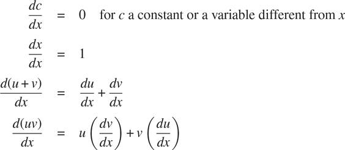
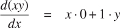
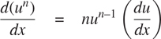

### 2.3.2 示例:符号微分

作为符号操作的说明和数据抽象的进一步说明，考虑执行代数表达式的符号微分的函数的设计。我们希望函数将一个代数表达式和一个变量作为自变量，并返回表达式对变量的导数。例如，如果函数的参数是 ax²+bx+`c`和`x`，那么函数应该返回 2 ax +`b`。符号微分在编程语言 Lisp 中具有特殊的历史意义。这是开发一种用于符号操作的计算机语言背后的激励例子之一。此外，它标志着导致符号数学工作的强大系统开发的研究路线的开始，这些系统今天被应用数学家和物理学家例行使用。

在开发符号微分程序时，我们将遵循我们在开发 2.1.1 节的有理数系统时所遵循的相同的数据抽象策略。也就是说，我们将首先定义一个微分算法，该算法对诸如“和”、“积”和“变量”之类的抽象对象进行运算，而不用担心如何表示这些对象。只有在此之后，我们才会解决表示问题。

##### 抽象数据的微分程序

为了简单起见，我们将考虑一个非常简单的符号微分程序，它处理只使用两个参数的加法和乘法运算构建的表达式。任何这种表达式的微分可以通过应用以下归约规则来进行:



注意，后两个规则本质上是递归的。也就是说，要得到一个和的导数，我们首先要找到各项的导数，然后将它们相加。每一项都可能是一个需要分解的表达式。分解成越来越小的碎片，最终会产生要么是常数要么是变量的碎片，它们的导数要么是 0，要么是 1。

为了在函数中体现这些规则，我们沉溺于一厢情愿的想法，正如我们在设计有理数实现时所做的那样。如果我们有一种表示代数表达式的方法，我们应该能够判断一个表达式是和、积、常数还是变量。我们应该能够提取表达式的各个部分。例如，对于一个和，我们希望能够提取加数(第一项)和被加数(第二项)。我们也应该能够从部件中构造表达式。假设我们已经有了实现以下选择器、构造器和谓词的函数:

| `is_variable(e)` | `e`是变量吗？ |
| `is_same_variable(v1, v2)` | `v1`和`v2`是同一个变量吗？ |
| `is_sum(e)` | `e`是和吗？ |
| `addend(e)` | 总和的加数`e`。 |
| `augend(e)` | 总和的被加数`e`。 |
| `make_sum(a1, a2)` | 构造`a1`和`a2`的和。 |
| `is_product(e)` | `e`是产品吗？ |
| `multiplier(e)` | 产品的乘数`e`。 |
| `multiplicand(e)` | 产品的被乘数`e`。 |
| `make_product(m1, m2)` | 构建`m1`和`m2`的产品。 |

使用这些以及标识数字的基本谓词`is_number`，我们可以将微分规则表示为以下函数:

```js
function deriv(exp, variable) {
    return is_number(exp)
           ? 0
           : is_variable(exp)
           ? is_same_variable(exp, variable) ? 1 : 0
           : is_sum(exp)
           ? make_sum(deriv(addend(exp), variable),
                      deriv(augend(exp), variable))
           : is_product(exp)
           ? make_sum(make_product(multiplier(exp),
                                   deriv(multiplicand(exp),
                                         variable)),
                     make_product(deriv(multiplier(exp),
                                         variable),
                                  multiplicand(exp)))
           : error(exp, "unknown expression type – deriv");
}
```

此`deriv`功能包含完整的微分算法。因为它是用抽象数据表示的，所以无论我们选择如何表示代数表达式，只要我们设计一组合适的选择器和构造器，它都是可行的。这是我们接下来必须解决的问题。

##### 表示代数表达式

我们可以想象用链表结构来表示代数表达式的多种方式。例如，我们可以使用反映通常代数符号的符号列表，将 ax +`b`表示为`list("a", "*", "x", "+", "b")`。但是，如果我们在表示表达式的 JavaScript 值中反映表达式的数学结构，会更方便；即把 ax +`b`表示为`list("+", list("*", "a", "x"), "b")`。将二元运算符放在其操作数前面称为前缀符号，与 1.1.1 节中介绍的中缀符号形成对比。使用前缀符号，我们对微分问题的数据表示如下:

*   变量只是字符串。它们由原始谓词`is_string` :

    ```js
        function is_variable(x) { return is_string(x); }
    ```

    来标识
*   两个变量相同，如果代表它们的字符串相等:

    ```js
        function is_same_variable(v1, v2) {         return is_variable(v1) && is_variable(v2) && v1 === v2;     }
    ```

*   总和与乘积被构造为列表:

    ```js
        function make_sum(a1, a2) { return list("+", a1, a2); }     function make_product(m1, m2) { return list("*", m1, m2); }
    ```

*   sum 是一个列表，它的第一个元素是字符串`"+"` :

    ```js
        function is_sum(x) {         return is_pair(x) && head(x) === "+";     }
    ```

*   加数是求和列表的第二项:

    ```js
        function addend(s) { return head(tail(s)); }
    ```

*   被加数是求和列表的第三项:

    ```js
        function augend(s) { return head(tail(tail(s))); }
    ```

*   产品是一个列表，它的第一个元素是字符串`"*"` :

    ```js
        function is_product(x) {         return is_pair(x) && head(x) === "*";     }
    ```

*   乘数是产品列表的第二项:

    ```js
        function multiplier(s) { return head(tail(s)); }
    ```

*   被乘数是乘积表的第三项:

    ```js
        function multiplicand(s) { return head(tail(tail(s))); }
    ```

因此，我们只需要将这些与`deriv`所体现的算法结合起来，就可以得到一个有效的符号微分程序。让我们看一些它的行为的例子:

```js
deriv(list("+", "x", 3), "x");
list("+", 1, 0)

deriv(list("*", "x", "y"), "x");
list("+", list("*", "x", 0), list("*", 1, "y"))

deriv(list("*", list("*", "x", "y"), list("+", "x", 3)), "x");
list("+", list("*", list("*", "x", "y"), list("+", 1, 0)),
          list("*", list("+", list("*", "x", 0), list("*", 1, "y")), 
                    list("+", "x", 3)))
```

程序产生正确的答案；然而，它们并不简单。的确如此



但是我们希望程序知道 x 0 = 0，1 y =`y`，0 + y =`y`。第二个例子的答案应该是简单的`y`。如第三个例子所示，当表达式很复杂时，这就成了一个严重的问题。

我们的困难很像我们在有理数实现中遇到的困难:我们没有将答案简化为最简单的形式。为了减少有理数，我们只需要改变实现的构造函数和选择器。我们可以在这里采用类似的策略。我们根本不会改变`deriv`。相反，我们将更改`make_sum`，以便如果两个被加数都是数字，`make_sum`将把它们相加并返回它们的和。同样，如果其中一个被加数为 0，那么`make_sum`将返回另一个被加数。

```js
function make_sum(a1, a2) {
    return number_equal(a1, 0)
           ? a2
           : number_equal(a2, 0)
           ? a1
           : is_number(a1) && is_number(a2)
           ? a1 + a2
           : list("+", a1, a2);
}
```

这使用了函数`number_equal`，它检查一个表达式是否等于一个给定的数字:

```js
function number_equal(exp, num) {
    return is_number(exp) && exp === num;
}
```

类似地，我们将改变`make_product`来构建规则，即 0 乘以任何东西都是 0，1 乘以任何东西都是东西本身:

```js
function make_product(m1, m2) {
    return number_equal(m1, 0) || number_equal(m2, 0)
           ? 0
           : number_equal(m1, 1)
           ? m2
           : number_equal(m2, 1)
           ? m1
           : is_number(m1) && is_number(m2)
           ? m1 * m2
           : list("*", m1, m2);
}
```

下面是这个版本在我们的三个示例中的工作方式:

```js
deriv(list("+", "x", 3), "x");
1

deriv(list("*", "x", "y"), "x");
"y"

deriv(list("*", list("*", "x", "y"), list("+", "x", 3)), "x");
list("+", list("*", "x", "y"), list("*", "y", list("+", "x", 3)))
```

虽然这是一个很大的进步，但第三个例子表明，在我们得到一个程序，把表达式转换成我们可能认为“最简单”的形式之前，还有很长的路要走。代数简化的问题是复杂的，因为除了其他原因之外，对一个目的来说最简单的形式对另一个目的来说可能不简单。

##### 练习 2.56

展示如何扩展基本的区分器来处理更多种类的表达式。例如，实现差异化规则



通过在`deriv`程序中添加一个新的子句，并定义适当的功能`is_exp`、`base`、`exponent`和`make_exp`。(您可以使用字符串`"**"`来表示取幂运算。)建立这样的规则:任何事物的 0 次幂都是 1，任何事物的 1 次幂都是事物本身。

##### 练习 2.57

扩展微分程序以处理任意数量(两个或更多)项的和与积。那么上面的最后一个例子可以表示为

```js
deriv(list("*", "x", "y", list("+", "x", 3)), "x");
```

试着只改变求和与乘积的表示，而不改变`deriv`函数。例如，总和的`addend`将是第一项，`augend`将是其余项的总和。

##### 练习 2.58

假设我们想修改微分程序，使其能够使用普通的数学符号，其中`"+"`和`"*"`是中缀而不是前缀运算符。因为微分程序是根据抽象数据定义的，所以我们可以修改它，仅通过改变谓词、选择器和构造函数来处理不同的表达式表示，这些谓词、选择器和构造函数定义了微分器要操作的代数表达式的表示。

1.  a. Show how to do this in order to differentiate algebraic expressions presented in infix form, as in this example:

    ```js
    list("x", "+", list(3, "*", list("x", "+", list("y", "+", 2))))
    ```

    为了简化任务，假设`"+"`和`"*"`总是接受两个参数，并且表达式完全用括号括起来。

2.  b. The problem becomes substantially harder if we allow a notation closer to ordinary infix notation, which omits unnecessary parentheses and assumes that multiplication has higher precedence than addition, as in this example:

    ```js
    list("x", "+", "3", "*", list("x", "+", "y", "+", 2))
    ```

    你能为这种符号设计适当的谓词、选择器和构造函数，使我们的派生程序仍然工作吗？
