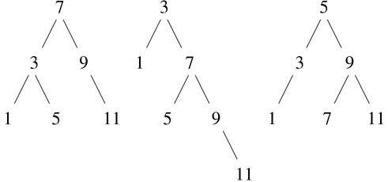
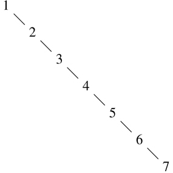

### 2.3.3 示例:表示集合

在前面的例子中，我们构建了两种复合数据对象的表示:有理数和代数表达式。在其中一个例子中，我们可以选择在构造时或选择时简化(减少)表达式，但除此之外，选择这些结构的列表表示是很简单的。当我们转向集合的表示时，表示的选择就不那么明显了。事实上，有许多可能的表现形式，它们在几个方面有很大的不同。

通俗地说，集合就是不同对象的集合。为了给出更精确的定义，我们可以采用数据抽象的方法。也就是说，我们通过指定要在集合上使用的操作来定义“集合”。这些是`union_set`、`intersection_set`、`is_element_of_set`和`adjoin_set`。函数`is_ element_of_set`是一个判定给定元素是否是集合成员的谓词。函数`adjoin_set`将一个对象和一个集合作为参数，并返回一个包含原始集合的元素以及相邻元素的集合。函数`union_set`计算两个集合的并集，这两个集合是包含出现在任一参数中的每个元素的集合。函数`intersection_set`计算两个集合的交集，这两个集合只包含出现在两个参数中的元素。从数据抽象的角度来看，我们可以自由地设计任何表示，以与上面给出的解释一致的方式实现这些操作。 [^(33)](#c2-fn-0033)

##### 设置为无序列表

表示集合的一种方式是作为其元素的列表，其中没有一个元素出现超过一次。空集由空列表表示。在此表示中，`is_element_of_set`类似于第 2.3.1 节中的函数`member`。它使用了`equal`而不是`===`，这样集合元素就不仅仅是数字或字符串了:

```js
function is_element_of_set(x, set) {
    return is_null(set)
           ? false
           : equal(x, head(set))
           ? true
           : is_element_of_set(x, tail(set));
}
```

利用这一点，我们可以写出`adjoin_set`。如果要邻接的对象已经在集合中，我们只需返回集合。否则，我们使用`pair`将对象添加到代表集合的列表中:

```js
function adjoin_set(x, set) {
    return is_element_of_set(x, set)
           ? set
           : pair(x, set);
}
```

对于`intersection_set`,我们可以使用递归策略。如果我们知道如何形成`set2`和`set1`的`tail`的交集，我们只需要决定是否将`set1`的`head`包含在此。但这个要看`head(set1)`是否也在`set2`里。下面是结果函数:

```js
function intersection_set(set1, set2) {
    return is_null(set1) || is_null(set2)
           ? null
           : is_element_of_set(head(set1), set2)
           ? pair(head(set1), intersection_set(tail(set1), set2))
           : intersection_set(tail(set1), set2);
}
```

在设计表现形式时，我们应该关心的问题之一是效率。考虑我们的集合操作所需的步骤数。由于都使用`is_element_of_set`，所以这个操作的速度对 set 整体实现的效率有很大的影响。现在，为了检查一个对象是否是一个集合的成员，`is_element_of_set`可能必须扫描整个集合。(在最坏的情况下，对象不在集合中。)因此，如果集合有`n`个元素，`is_element_of_set`可能会占用`n`个步骤。因此，所需的步数随着θ(n)增加。使用该操作的`adjoin_set`所需的步数也增长为θ(n)。对于对`set1`的每个元素进行`is_element_of_set`检查的`intersection_set`，所需的步数随着所涉及的集合大小的乘积而增加，或者对于两个集合大小`n`的θ(n2)。对于`union_set`来说也是如此。

##### 练习 2.59

实现集合的无序列表表示的`union_set`操作。

##### 练习 2.60

我们指定一个集合将被表示为一个没有重复的列表。现在假设我们允许复制。例如，集合{1，2，3}可以表示为列表`list(2, 3, 2, 1, 3, 2, 2)`。设计功能`is_element_of_set`、`adjoin_set`、`union_set`和`intersection_set`对该表示进行操作。与非重复表示的相应函数相比，每个函数的效率如何？有什么应用程序你会优先使用这种表示而不是非重复的表示吗？

##### 设置为有序列表

加快集合运算速度的一种方法是改变表示法，使集合元素按升序排列。要做到这一点，我们需要某种方法来比较两个对象，以便我们可以说哪个更大。例如，我们可以按字典顺序比较字符串，或者我们可以商定某种方法，为一个对象分配一个唯一的数字，然后通过比较相应的数字来比较元素。为了使我们的讨论简单，我们将只考虑集合元素是数字的情况，这样我们可以使用`>`和`<`来比较元素。我们将通过按升序排列元素来表示一组数字。我们上面的第一个表示允许我们通过以任何顺序列出元素来表示集合{1，3，6，10}，而我们的新表示只允许列表`list(1, 3, 6, 10)`。

排序的一个优势在`is_element_of_set`中显现出来:在检查一个项目的存在时，我们不再需要扫描整个集合。如果我们到达的集合元素大于我们要查找的项目，那么我们知道该项目不在集合中:

```js
function is_element_of_set(x, set) {
    return is_null(set)
           ? false
           : x === head(set)
           ? true
           : x < head(set)
           ? false
           : // x > head(set)
             is_element_of_set(x, tail(set));
}
```

这样节省了多少步骤？在最坏的情况下，我们要寻找的项目可能是集合中最大的一个，所以步骤的数量与无序表示相同。另一方面，如果我们搜索许多不同大小的项目，我们可以预期，有时我们将能够在列表的开始附近停止搜索，而其他时候我们仍然需要检查列表的大部分。平均来说，我们应该预期必须检查该组中大约一半的项目。因此，所需的平均步骤数大约为 n /2。这仍然是θ(n)增长，但是平均来说，它确实比以前的实现节省了 2 倍的步骤。

我们用`intersection_set`获得了更令人印象深刻的加速。在无序表示中，这个操作需要θ(n²)步，因为我们对`set1`的每个元素执行了一次`set2`的完整扫描。但是有了有序表示，我们可以用更巧妙的方法。首先比较两个集合的初始元素`x1`和`x2`。如果`x1`等于`x2`，那么这就给出了交集的一个元素，交集的其余部分就是两个集合的`tail`的交集。然而，假设`x1`小于`x2`。由于`x2`是`set2`中最小的元素，我们可以立即断定`x1`不可能出现在`set2`中的任何地方，因此不在交集中。因此，交点等于`set2`与`set1`的`tail`的交点。同样，如果`x2`小于`x1`，那么交集由`set1`与`set2`的`tail`的交集给出。下面是函数:

```js
function intersection_set(set1, set2) {
    if (is_null(set1) || is_null(set2)) {
        return null;
    } else {
        const x1 = head(set1);
        const x2 = head(set2);
        return x1 === x2
               ? pair(x1, intersection_set(tail(set1), tail(set2)))
               : x1 < x2
               ? intersection_set(tail(set1), set2)
               : // x2 < x1
                 intersection_set(set1, tail(set2));
    }
}
```

为了估计该过程所需的步骤数，请注意，在每一步，我们都将交集问题简化为计算较小集合的交集——从`set1`或`set2`或两者中移除第一个元素。因此，所需的步骤数最多是`set1`和`set2`的大小之和，而不是无序表示中大小的乘积。这是θ(n)增长，而不是θ(n2)—即使对于中等大小的集合来说，这也是一个相当大的加速。

##### 练习 2.61

使用有序表示给出`adjoin_set`的实现。通过与`is_element_of_set`的类比，展示如何利用有序来产生一个函数，这个函数平均需要无序表示一半的步骤。

##### 练习 2.62

对于表示为有序列表的集合，给出`union_set`的θ(n)实现。

##### 作为二叉树的集合

通过以树的形式排列集合元素，我们可以比有序列表表示做得更好。树的每个节点保存集合中的一个元素，称为该节点上的“条目”，以及到另外两个(可能是空的)节点中的每一个的链接。“左”链接指向比节点处的元素小的元素，“右”链接指向比节点处的元素大的元素。图 2.16：显示了一些代表集合{1，3，5，7，9，11}的树。同一集合可以由树以多种不同的方式来表示。对于有效的表示，我们唯一需要的是左子树中的所有元素都小于节点条目，而右子树中的所有元素都大于节点条目。



图 2.16：表示集合{1，3，5，7，9，11}的各种二叉树。

树表示的优点是:假设我们想要检查一个数`x`是否包含在一个集合中。我们首先将`x`与顶部节点中的条目进行比较。如果`x`小于这个，我们知道只需要搜索左边的子树；如果`x`更大，我们只需要搜索右边的子树。现在，如果树是“平衡的”，这些子树中的每一个都将是原来的一半大小。因此，在一个步骤中，我们已经将搜索大小为`n`的树的问题简化为搜索大小为 n /2 的树。由于树的大小在每一步都减半，我们应该预计搜索大小为`n`的树所需的步骤数随着θ(logn)的增加而增加。 [^(34)](#c2-fn-0034)

我们可以用列表来表示树。每个节点都是一个包含三个条目的列表:节点处的条目、左子树和右子树。空列表的左边或右边的子树将指示那里没有连接的子树。我们可以用以下函数来描述这种表示: [^(35)](#c2-fn-0035)

```js
function entry(tree) { return head(tree); }
function left_branch(tree) { return head(tail(tree)); }
function right_branch(tree) { return head(tail(tail(tree))); }
function make_tree(entry, left, right) {
    return list(entry, left, right);
}
```

现在我们可以使用上述策略编写`is_element_of_set`:

```js
function is_element_of_set(x, set) {
    return is_null(set)
           ? false
           : x === entry(set)
           ? true
           : x < entry(set)
           ? is_element_of_set(x, left_branch(set))
           : // x > entry(set)
             is_element_of_set(x, right_branch(set));
}
```

将一个项目连接到集合的实现方式类似，也需要θ(logn)步。为了邻接一个条目`x`，我们将`x`与节点条目进行比较，以确定`x`是应该添加到右边还是左边的分支，在将`x`邻接到适当的分支后，我们将这个新构建的分支与原始条目和另一个分支组合在一起。如果`x`等于条目，我们就返回节点。如果我们被要求将`x`连接到一个空的树，我们将生成一个以`x`为条目的树，并清空左右分支。下面是函数:

```js
function adjoin_set(x, set) {
    return is_null(set)
           ? make_tree(x, null, null)
           : x === entry(set)
           ? set
           : x < entry(set)
           ? make_tree(entry(set),
                       adjoin_set(x, left_branch(set)),
                       right_branch(set))
           : // x > entry(set)
             make_tree(entry(set),
                       left_branch(set),
                       adjoin_set(x, right_branch(set)));
}
```

上面声称搜索树可以在对数数量的步骤中执行，这是基于树是“平衡的”的假设，即每棵树的左右子树具有大约相同数量的元素，使得每个子树包含其父树的大约一半的元素。但是我们怎么能确定我们建造的树是平衡的呢？即使我们从平衡的树开始，用`adjoin_set`添加元素也可能产生不平衡的结果。由于新邻接元素的位置取决于该元素与集合中已有项目的比较情况，我们可以预期，如果我们“随机”添加元素，树将趋于平均平衡。但这不是保证。例如，如果我们从一个空集开始，并依次邻接数字 1 到 7，我们最终会得到一个高度不平衡的树，如图 2.17：所示。在这棵树中，所有左边的子树都是空的，所以它比简单的有序列表没有优势。解决这个问题的一种方法是定义一种操作，将任意树转换成具有相同元素的平衡树。然后，我们可以在每隔几个`adjoin_set`操作之后执行这个转换，以保持我们的集合平衡。还有其他方法可以解决这个问题，其中大多数涉及设计新的数据结构，搜索和插入都可以在θ(logn 步中完成。 [^(36)](#c2-fn-0036)



图 2.17：由邻接 1 到 7 依次产生的不平衡树。

##### 练习 2.63

下面两个函数中的每一个都将二叉树转换成列表。

```js
function tree_to_list_1(tree) {
    return is_null(tree)
           ? null
           : append(tree_to_list_1(left_branch(tree)),
                    pair(entry(tree),
                         tree_to_list_1(right_branch(tree))));
}

function tree_to_list_2(tree) {
    function copy_to_list(tree, result_list) {
        return is_null(tree)
               ? result_list
               : copy_to_list(left_branch(tree),
                              pair(entry(tree),
                                   copy_to_list(right_branch(tree),
                                                result_list)));
    }
    return copy_to_list(tree, null);
}
```

1.  这两个函数对每棵树都产生相同的结果吗？如果不是，结果有什么不同？这两个函数为图 2.16：中的树产生了什么列表？
2.  b. 这两个函数在把一棵有`n`个元素的平衡树转换成一个链表所需的步骤数上，增长顺序是否相同？如果不是，哪个长得更慢？

##### 练习 2.64

下面的函数`list_to_tree`将有序列表转换成平衡二叉树。助手函数`partial_tree`将整数`n`和至少有`n`个元素的列表作为参数，并构建包含列表的前`n`个元素的平衡树。`partial_tree`返回的结果是一个 pair(由`pair`构成)，其`head`是构造的树，其`tail`是树中未包含的元素列表。

```js
function list_to_tree(elements) {
    return head(partial_tree(elements, length(elements)));
}
function partial_tree(elts, n) {
    if (n === 0) {
        return pair(null, elts);
    } else {
        const left_size = math_floor((n - 1) / 2);
        const left_result = partial_tree(elts, left_size);
        const left_tree = head(left_result);
        const non_left_elts = tail(left_result);
        const right_size = n - (left_size + 1);
        const this_entry = head(non_left_elts);
        const right_result = partial_tree(tail(non_left_elts), right_size);
        const right_tree = head(right_result);
        const remaining_elts = tail(right_result);
        return pair(make_tree(this_entry, left_tree, right_tree),
                    remaining_elts);
    }
}
```

1.  写一小段话，尽可能清楚地解释`partial_tree`是如何工作的。为列表`list(1, 3, 5, 7, 9, 11)`绘制`list_to_tree`生成的树。
2.  b .`list_to_tree`转换一个`n`元素列表所需步骤数的增长顺序是什么？

##### 练习 2.65

使用练习 2.63 和 2.64 的结果，给出作为(平衡)二叉树实现的集合的`union_set`和`intersection_set`的θ(n)实现。 [^(37)](#c2-fn-0037)

##### 集合与信息检索

我们已经研究了使用列表来表示集合的选项，并且已经看到了数据对象表示的选择如何对使用数据的程序的性能有很大的影响。关注集合的另一个原因是，这里讨论的技术在涉及信息检索的应用中反复出现。

考虑一个包含大量个人记录的数据库，如公司的人事档案或会计系统中的交易。典型的数据管理系统花费大量时间来访问或修改记录中的数据，因此需要一种高效的方法来访问记录。这是通过识别每个记录的一部分作为识别关键字来实现的。关键字可以是唯一标识记录的任何东西。对于人事档案，它可能是员工的 ID 号。对于会计系统，它可能是一个交易号。无论键是什么，当我们将记录定义为一个数据结构时，我们应该包括一个`key`选择器函数，用于检索与给定记录相关联的键。

现在我们将数据库表示为一组记录。为了定位具有给定键的记录，我们使用了函数`lookup`，它将一个键和一个数据库作为参数，返回具有该键的记录，如果没有这样的记录，则返回 false。功能`lookup`的实现方式与`is_element_of_set`几乎相同。例如，如果记录集被实现为一个无序列表，我们可以使用

```js
function lookup(given_key, set_of_records) {
    return is_null(set_of_records)
           ? false
           : equal(given_key, key(head(set_of_records)))
           ? head(set_of_records)
           : lookup(given_key, tail(set_of_records));
}
```

当然，有比无序列表更好的方式来表示大型集合。必须“随机访问”记录的信息检索系统通常是通过基于树的方法实现的，例如前面讨论的二叉树表示。在设计这样一个系统时，数据抽象的方法会有很大的帮助。设计者可以使用简单、直接的表示(如无序列表)来创建初始实现。这对于最终的系统来说是不合适的，但是对于提供一个“快速而肮脏”的数据库来测试系统的其余部分是有用的。稍后，可以修改数据表示，使其更加复杂。如果根据抽象选择器和构造器访问数据库，这种表示上的改变不需要对系统的其余部分进行任何改变。

##### 练习 2.66

对于记录集被构造为二叉树的情况，实现`lookup`函数，按键的数值排序。
