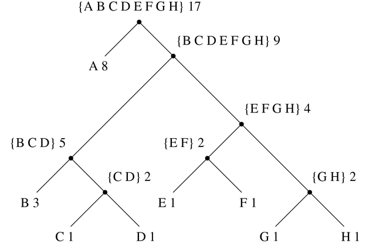

### 2.3.4 举例:霍夫曼编码树

本节提供了使用列表结构和数据抽象来操作集合和树的实践。本申请涉及将数据表示为 1 和 0(比特)序列的方法。例如，用于在计算机中表示文本的 ASCII 标准代码将每个字符编码为七位序列。使用 7 位可以让我们区分 2 个 ^(7 个)，或者 128 个可能的不同字符。一般来说，如果我们想要区分`n`个不同的符号，我们将需要使用每个符号 log[2]n 位。例如，如果我们所有的信息由八个符号 A、B、C、D、E、F、G 和 H 组成，我们可以选择每个字符三位的代码

| A | 000 | C | 010 | E | 100 | G | 110 |
| B | 001 | D | 011 | F | 101 | H | 111 |

有了这个代码，信息

```js
BACADAEAFABBAAAGAH
```

被编码为 54 位的字符串

```js
001000010000011000100000101000001001000000000110000111
```

诸如 ASCII 和上面的`A`到 H 码之类的码被称为固定长度码，因为它们用相同数量的比特来表示消息中的每个符号。有时使用变长码是有利的，其中不同的符号可以用不同的位数来表示。例如，莫尔斯电码对字母表中的每个字母不使用相同数量的点和破折号。特别是 E，最常用的字母，用一个点表示。一般来说，如果我们的消息是这样的，一些符号非常频繁地出现，而一些符号非常罕见，那么如果我们将较短的代码分配给频繁出现的符号，我们可以更有效地编码数据(即，每条消息使用较少的比特)。考虑字母`A`到 H 的以下替代代码:

| A | 0 | C | 1010 | E | 1100 | G | 1110 |
| B | 100 | D | 1011 | F | 1101 | H | 1111 |

使用这段代码，与上面相同的消息被编码为字符串

```js
100010100101101100011010100100000111001111
```

这个字符串包含 42 位，因此与上面显示的固定长度代码相比，它节省了 20%以上的空间。

使用可变长度代码的困难之一是，在读取 0 和 1 的序列时，要知道何时到达了符号的末尾。莫尔斯电码通过在每个字母的点和破折号序列后使用特殊的分隔符(在这种情况下，是一个停顿)来解决这个问题。另一个解决方案是以这样一种方式设计代码，即任何符号的完整代码都不是另一个符号的代码的开始(或前缀)。这样的代码称为前缀代码。在上面的例子中，A 用 0 编码，B 用 100 编码，所以其他符号都不能有以 0 或 100 开头的代码。

一般来说，如果我们使用变长前缀码，利用要编码的消息中符号的相对频率，我们可以实现显著的节约。一种特殊的编码方法叫做霍夫曼编码法，以其发现者大卫·霍夫曼命名。霍夫曼码可以表示为二叉树，其叶子是被编码的符号。在树的每个非叶子节点处，有一个集合包含位于该节点下的叶子中的所有符号。此外，叶子上的每个符号被分配一个权重(这是它的相对频率)，并且每个非叶子节点包含一个权重，该权重是位于它下面的叶子的所有权重之和。在编码或解码过程中不使用权重。我们将在下面看到它们是如何被用来帮助构建树的。

图 2.18：显示了上面给出的`A`到 H 代码的霍夫曼树。叶子上的权重表示该树是为`A`出现的相对频率为 8、B 出现的相对频率为 3、其他字母出现的相对频率为 1 的消息而设计的。



图 2.18：一棵霍夫曼编码树。

给定一个霍夫曼树，我们可以从根开始找到任何符号的编码，并向下移动，直到到达保存该符号的叶子。每次我们向下移动一个左分支，我们给代码加一个 0，每次向下移动一个右分支，我们加一个 1。(我们通过测试看哪个分支是符号的叶节点或者在它的集合中包含符号来决定跟随哪个分支。)例如，从图 2.18：中的树根开始，我们沿着一个右分支，然后一个左分支，然后一个右分支，然后一个右分支，到达 D 的叶子；因此，D 的代码是 1011。

为了使用霍夫曼树解码位序列，我们从根开始，并使用位序列的连续 0 和 1 来确定是向下移动左分支还是右分支。每当我们来到一片树叶，我们就在信息中生成一个新的符号，此时我们从树根开始寻找下一个符号。例如，假设我们得到了上面的树和序列 10001010。从根开始，我们向下移动右分支(因为字符串的第一位是 1)，然后向下移动左分支(因为第二位是 0)，然后向下移动左分支(因为第三位也是 0)。这将我们带到`B`的叶子，所以解码消息的第一个符号是 B。现在我们从根开始，我们向左移动，因为字符串中的下一位是 0。这将我们带到`a`的叶子。然后，我们用字符串 1010 的剩余部分再次从根开始，所以我们向右、向左、向右、向左移动并到达 c。因此，整个消息是 BAC。

##### 生成霍夫曼树

给定一个符号“字母表”及其相对频率，我们如何构造“最佳”代码？(换句话说，哪棵树会用最少的比特来编码消息？)Huffman 给出了这样做的算法，并表明在符号的相对频率与构造代码的频率相匹配的情况下，得到的代码确实是消息的最佳变长代码。这里我们将不证明霍夫曼码的这种最优性，但是我们将展示霍夫曼树是如何构造的。 [^(38)](#c2-fn-0038)

生成霍夫曼树的算法非常简单。这个想法是排列树，使出现频率最低的符号出现在离根最远的地方。从包含符号及其频率的叶节点集开始，这些符号及其频率由构造代码的初始数据确定。现在找到两个权重最低的叶子，将它们合并产生一个节点，将这两个节点作为其左右分支。新节点的权重是两个权重的和。从原始集合中移除两个叶子，并用这个新节点替换它们。现在继续这个过程。在每一步，合并两个权重最小的节点，将它们从集合中移除，并用一个以这两个节点作为其左右分支的节点来替换它们。当只剩下一个节点，即整个树的根节点时，该过程停止。下面是图 2.18 中[的霍夫曼树是如何生成的:](#c2-fig-0028)

| 初始叶 | {(A8)(B3)(C1)(D1)(E1)(f1)(G1)(h1)} |
| 合并 | {(A8)(B3)({ C D } 2)(E1)(f1)(G1)(h1)} |
| 合并 | {(A8)(B3)({ C D } 2)({ E F } 2)(G1)(h1)} |
| 合并 | {(A8)(B3)({ C D } 2)({ E F } 2)({ G H } 2)} |
| 合并 | {(A 8) (B 3) ({C D} 2) ({E F G H} 4)} |
| 合并 | {(A 8) ({B C D} 5) ({E F G H} 4)} |
| 合并 | {(A 8) ({B C D E F G H} 9)} |
| 最终合并 | { { A B C D E F G H } 17)} |

该算法并不总是指定唯一的树，因为在每一步可能都没有唯一的最小权重节点。此外，两个节点被合并的顺序的选择(即，哪个将是右分支，哪个将是左分支)是任意的。

##### 表示霍夫曼树

在下面的练习中，我们将使用一个系统，该系统使用霍夫曼树对消息进行编码和解码，并根据上述算法生成霍夫曼树。我们将从讨论树是如何表现的开始。

树的叶子由一个由字符串`"leaf"`、叶子上的符号和权重组成的列表表示:

```js
function make_leaf(symbol, weight) {
    return list("leaf", symbol, weight);
}
function is_leaf(object) {
    return head(object) === "leaf";
}
function symbol_leaf(x) { return head(tail(x)); }
function weight_leaf(x) { return head(tail(tail(x))); }
```

一般的树会是一个字符串`"code_tree"`，一个左分支，一个右分支，一组符号，一个权重的列表。符号集将只是一个符号列表，而不是一些更复杂的集合表示。当我们通过合并两个节点来构建树时，我们获得作为节点权重之和的树的权重，以及作为节点的符号集的并集的符号集。由于我们的符号集被表示为列表，我们可以通过使用我们在 2.2.1 节中定义的`append`函数来形成并集:

```js
function make_code_tree(left, right) {
    return list("code_tree", left, right,
                append(symbols(left), symbols(right)),
                weight(left) + weight(right));
}
```

如果我们以这种方式生成一棵树，我们有以下选择器:

```js
function left_branch(tree) { return head(tail(tree)); }
function right_branch(tree) { return head(tail(tail(tree))); }
function symbols(tree) {
    return is_leaf(tree)
           ? list(symbol_leaf(tree))
           : head(tail(tail(tail(tree))));
}
function weight(tree) {
    return is_leaf(tree)
           ? weight_leaf(tree)
           : head(tail(tail(tail(tail(tree)))));
}
```

函数`symbols`和`weight`必须做一些稍微不同的事情，这取决于它们是用树叶还是用普通树来调用。这些是通用函数(可以处理多种数据的函数)的简单例子，我们将在 2.4 和 2.5 节中详细讨论。

##### 解码功能

下面的函数实现解码算法。它接受一个由 0 和 1 组成的列表，以及一棵霍夫曼树作为参数。

```js
function decode(bits, tree) {
    function decode_1(bits, current_branch) {
        if (is_null(bits)) {
            return null;
        } else {
            const next_branch = choose_branch(head(bits),
                                              current_branch);
            return is_leaf(next_branch)
                   ? pair(symbol_leaf(next_branch),
                          decode_1(tail(bits), tree))
                   : decode_1(tail(bits), next_branch);
        }
    }
    return decode_1(bits, tree);
}
function choose_branch(bit, branch) {
    return bit === 0
           ? left_branch(branch)
           : bit === 1
           ? right_branch(branch)
           : error(bit, "bad bit – choose_branch");
}
```

函数`decode_1`有两个参数:剩余位的列表和当前在树中的位置。它继续沿着树“向下”移动，根据列表中的下一位是 0 还是 1 来选择左分支或右分支。(这是通过功能`choose_branch`完成的。)当它到达一个叶子时，它通过将该叶子上的符号与解码消息的其余部分的结果邻接，从树根开始，将该符号作为消息中的下一个符号返回。请注意`choose_branch`最后一个子句中的错误检查，如果函数在输入数据中发现除了 0 或 1 之外的其他值，它会发出报错。

##### 加权元素集

在我们对树的表示中，每个非叶节点包含一组符号，我们将其表示为一个简单的列表。然而，上面讨论的树生成算法要求我们也处理树叶和树的集合，连续合并两个最小的项目。因为我们需要反复寻找集合中最小的项目，所以对这种集合使用有序表示是很方便的。

我们将把一组树叶和树表示为一个元素列表，按照权重递增的顺序排列。下面的`adjoin_set`构造集合的函数类似于练习 2.61 中描述的函数；但是，项目是根据它们的权重进行比较的，并且被添加到集合中的元素从来就不在集合中。

```js
function adjoin_set(x, set) {
    return is_null(set)
           ? list(x)
           : weight(x) < weight(head(set))
           ? pair(x, set)
           : pair(head(set), adjoin_set(x, tail(set)));
}
```

以下函数采用符号频率对列表，例如

```js
list(list("A", 4), list("B", 2), list("C", 1), list("D", 1))
```

并且构建初始有序树叶集，准备根据霍夫曼算法进行合并:

```js
function make_leaf_set(pairs) {
    if (is_null(pairs)) {
        return null;
    } else {
        const first_pair = head(pairs);
        return adjoin_set(
                   make_leaf(head(first_pair),        // symbol
                             head(tail(first_pair))), // frequency
                   make_leaf_set(tail(pairs)));
    }
}
```

##### 练习 2.67

声明编码树和示例消息:

```js
const sample_tree = make_code_tree(make_leaf("A", 4),
                                   make_code_tree(make_leaf("B", 2),
                                                  make_code_tree(
                                                      make_leaf("D", 1),
                                                      make_leaf("C", 1))));
const sample_message = list(0, 1, 1, 0, 0, 1, 0, 1, 0, 1, 1, 1, 0);
```

使用`decode`功能解码信息，并给出结果。

##### 练习 2.68

`encode`函数将一个消息和一个树作为参数，并生成给出编码消息的位列表。

```js
function encode(message, tree) {
    return is_null(message)
           ? null
           : append(encode_symbol(head(message), tree),
                    encode(tail(message), tree));
}
```

您必须编写的函数`encode_symbol`根据给定的树返回给定符号编码的位列表。你应该设计`encode_symbol`,这样如果符号根本不在树中，它就会发出错误信号。通过使用示例树对练习 2.67 中获得的结果进行编码来测试您的函数，并查看它是否与原始示例消息相同。

##### 练习 2.69

下面的函数将符号-频率对的列表(其中没有符号出现在多于一对中)作为其参数，并根据霍夫曼算法生成霍夫曼编码树。

```js
function generate_huffman_tree(pairs) {
    return successive_merge(make_leaf_set(pairs));
}
```

上面给出了将对列表转换成有序树叶集的函数`make_leaf_set`。使用`make_code_tree`编写函数`successive_merge`，连续合并集合中最小权重的元素，直到只剩下一个元素，这就是想要的霍夫曼树。(这个函数有点复杂，但并不复杂。如果你发现自己在设计一个复杂的函数，那么你几乎肯定是做错了。您可以充分利用我们使用有序集合表示这一事实。)

##### 练习 2.70

以下具有相关相对频率的八符号字母表被设计成有效地编码 20 世纪 50 年代摇滚歌曲的歌词。(注意,“字母表”的“符号”不必是单个字母。)

| A | 2 | 钠 | 16 |
| 繁荣 | 1 | 恒星时角 | 3 |
| 得到 | 2 | 叫喊声 | 9 |
| 工作 | 2 | 嚯 | 1 |

使用`generate_huffman_tree`(练习 2.69)生成相应的霍夫曼树，并使用`encode`(练习 2.68)对以下消息进行编码:

```js
Get a job
Sha na na na na na na na na
Get a job
Sha na na na na na na na na
Wah yip yip yip yip yip yip yip yip yip
Sha boom
```

编码需要多少位？如果我们对八符号字母表使用固定长度的代码，那么对这首歌进行编码所需的最小位数是多少？

##### 练习 2.71

假设我们有一个霍夫曼树，用于`n`个符号的字母表，并且这些符号的相对频率是 1，2，4，.。。，2n–1。画出 n =5 的树；对于 n =10。在这样的树中(对于一般的 n )需要多少位来编码最频繁的符号？最不常用的符号？

##### 练习 2.72

考虑你在练习 2.68 中设计的编码函数。编码一个符号所需的步骤数量的增长顺序是什么？确保包括在遇到的每个节点搜索符号列表所需的步骤数。总体上回答这个问题是困难的。考虑特殊情况，其中`n`符号的相对频率如练习 2.71 中所述，并给出编码字母表中最频繁和最不频繁符号所需步骤数的增长顺序(作为`n`的函数)。
