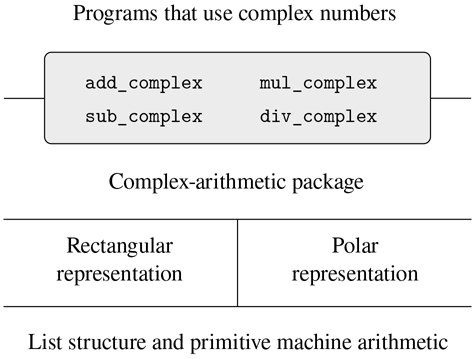

## 2.4 抽象数据的多重表示

我们引入了数据抽象，这是一种结构化系统的方法，使得程序的大部分可以独立于实现程序所操作的数据对象的选择而被指定。例如，我们在 2.1.1 节中看到了如何根据计算机语言构造复合数据的基本机制，将设计使用有理数的程序的任务与实现有理数的任务分开。关键思想是建立一个抽象屏障——在本例中，是有理数的选择器和构造器(`make_rat`、`numer`、`denom`)——将有理数的使用方式与它们在列表结构方面的底层表示隔离开来。类似的抽象障碍将执行有理数运算的函数(`add_rat`、`sub_rat`、`mul_rat`和`div_rat`)的细节与使用有理数的“高级”函数隔离开来。最终程序的结构如图 2.1：所示。

这些数据抽象障碍是控制复杂性的强大工具。通过隔离数据对象的底层表示，我们可以将设计一个大型程序的任务分成可以单独执行的更小的任务。但是这种数据抽象还不够强大，因为谈论数据对象的“底层表示”并不总是有意义的。

首先，一个数据对象可能有不止一种有用的表示，我们可能希望设计能够处理多种表示的系统。举个简单的例子，复数可能有两种几乎等价的表示方式:矩形形式(实部和虚部)和极坐标形式(幅度和角度)。有时矩形更合适，有时极坐标更合适。事实上，想象一个系统，其中复数以两种方式表示，并且操作复数的函数以任一种方式工作，这是完全合理的。

更重要的是，编程系统通常是由许多人长时间工作设计的，服从于随时间变化的需求。在这样的环境中，每个人都不可能事先就数据表示的选择达成一致。因此，除了将表示与使用隔离的数据抽象障碍之外，我们还需要将不同的设计选择相互隔离并允许不同的选择在单个程序中共存的抽象障碍。此外，由于大型程序通常是通过组合孤立设计的现有模块创建的，我们需要约定允许程序员将模块合并到更大的系统中，也就是说，不需要重新设计或重新实现这些模块。

在这一节中，我们将学习如何处理程序不同部分以不同方式表示的数据。这需要构造通用函数——可以对可能以多种方式表示的数据进行操作的函数。我们构建通用函数的主要技术将是根据具有类型标签的数据对象来工作，也就是说，数据对象包含关于如何处理它们的显式信息。我们还将讨论数据导向的编程，这是一个强大而方便的实现策略，用于用一般操作附加地组装系统。

我们从简单的复数例子开始。我们将看到类型标签和数据导向样式如何使我们能够为复数设计单独的矩形和极坐标表示，同时保持抽象“复数”数据对象的概念。我们将通过为复数(`add_complex`、`sub_complex`、`mul_complex`和`div_complex`)定义算术函数来实现这一点，这些函数使用通用选择器来访问复数的各个部分，而与数字的表示方式无关。产生的复数系统，如图 2.19 所示，包含两种不同的抽象障碍。“水平”抽象障碍与图 2.1 中的角色相同。它们将“高级”操作与“低级”表示隔离开来。此外，还有一个“垂直”障碍，让我们能够单独设计和安装替代的表现形式。

图 2.19：复数系统中的数据抽象障碍。

在 2.5 节中，我们将展示如何使用类型标签和数据导向风格来开发一个通用的算术包。这提供了一些函数(`add`、`mul`等等)，可以用来操作各种“数字”，并且在需要一种新的数字时可以很容易地扩展。在 2.5.3 节中，我们将展示如何在执行符号代数的系统中使用泛型算法。
