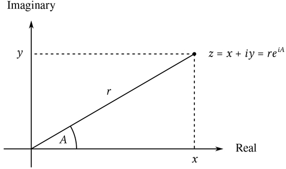
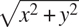

### 2.4.1 复数的表示

我们将开发一个对复数执行算术运算的系统，作为一个使用一般运算的程序的简单但不现实的例子。我们首先讨论作为有序对的复数的两种貌似合理的表示:矩形形式(实部和虚部)和极坐标形式(幅度和角度)。第 2.4.2 节将展示如何通过使用类型标签和泛型操作使两种表示在一个系统中共存。

像有理数一样，复数自然表示为有序对。复数的集合可以被认为是具有两个正交轴的二维空间，即“实”轴和“虚”轴。(参见图 2.20： 。)从这个角度来看，复数 z=x+iy(其中 I²=–1)可以认为是平面中实坐标为`x`，虚坐标为`y`的点。在这种表示中，复数的相加简化为坐标的相加:

| 实部(z1+z2) | = | 实部(z1)+实部(z2) |
| 虚部(z1+z2) | = | 虚部(z1)+虚部(z2) |



图 2.20：复数为平面上的点。

当复数相乘时，更自然的想法是用极坐标形式来表示复数，如幅度和角度( r 和`A`在图 2.20： )。两个复数的乘积是通过将一个复数拉伸另一个复数的长度，然后将其旋转另一个复数的角度而获得的向量:

| 星等(z1z2) | = | 量级(z1)量级(z2) |
| 角度(z1z2) | = | 角度(z1)+角度(z2) |

因此，复数有两种不同的表示法，适用于不同的运算。然而，从编写使用复数的程序的人的角度来看，数据抽象的原则表明，不管计算机使用哪种表示法，处理复数的所有操作都应该是可用的。例如，能够找到由直角坐标指定的复数的幅度通常是有用的。类似地，能够确定由极坐标指定的复数的实部通常是有用的。

为了设计这样一个系统，我们可以遵循我们在 2.1.1 节中设计有理数包时所遵循的相同的数据抽象策略。假设对复数的运算是通过四个选择器来实现的:`real_part`、`imag_part`、`magnitude`和`angle`。还假设我们有两个构造复数的函数:`make_from_real_imag`返回指定实部和虚部的复数，`make_from_mag_ang`返回指定幅度和角度的复数。这些函数具有这样的性质，对于任何复数`z`，两者都

```js
make_from_real_imag(real_part(z), imag_part(z));
```

和

```js
make_from_mag_ang(magnitude(z), angle(z));
```

产生等于`z`的复数。

使用这些构造函数和选择器，我们可以使用构造函数和选择器指定的“抽象数据”来实现复数上的算术，就像我们在 2.1.1 节中对有理数所做的那样。如上述公式所示，我们可以根据实部和虚部对复数进行加减运算，同时根据幅度和角度对复数进行乘除运算:

```js
function add_complex(z1, z2) {
    return make_from_real_imag(real_part(z1) + real_part(z2),
                               imag_part(z1) + imag_part(z2));
}
function sub_complex(z1, z2) {
    return make_from_real_imag(real_part(z1) - real_part(z2),
                               imag_part(z1) - imag_part(z2));
}
function mul_complex(z1, z2) {
    return make_from_mag_ang(magnitude(z1) * magnitude(z2),
                             angle(z1) + angle(z2));
}
function div_complex(z1, z2) {
    return make_from_mag_ang(magnitude(z1) / magnitude(z2),
                             angle(z1) - angle(z2));
}
```

为了完成复数包，我们必须选择一种表示，并且我们必须根据原始数字和原始列表结构来实现构造器和选择器。有两种明显的方法可以做到这一点:我们可以将一个复数以“矩形形式”表示为一对(实部、虚部)，或者以“极坐标形式”表示为一对(幅度、角度)。我们应该选择哪一个？

为了使不同的选择具体化，想象有两个程序员，Ben Bitdiddle 和 Alyssa P. Hacker，他们独立地设计复数系统的表示。Ben 选择用矩形来表示复数。有了这个选择，选择一个复数的实部和虚部就简单了，就像用给定的实部和虚部构造一个复数一样。为了找到幅度和角度，或者用给定的幅度和角度构造一个复数，他使用了三角关系

| x = r cos A | r =  |
| y=rsinA | A = arctan(`y`， x ) |

其将实部和虚部(`x`、 y )与幅度和角度( r 、 A )相关联。因此，本的表示由以下选择器和构造器给出:

```js
function real_part(z) { return head(z); }
function imag_part(z) { return tail(z); }
function magnitude(z) {
    return math_sqrt(square(real_part(z)) + square(imag_part(z)));
}
function angle(z) {
    return math_atan2(imag_part(z), real_part(z));
}
function make_from_real_imag(x, y) { return pair(x, y); }

function make_from_mag_ang(r, a) {
    return pair(r * math_cos(a), r * math_sin(a));
}
```

相比之下，Alyssa 选择用极坐标形式表示复数。对她来说，选择幅度和角度很简单，但她必须使用三角关系来获得实部和虚部。艾丽莎的表述是:

```js
function real_part(z) {
    return magnitude(z) * math_cos(angle(z));
}
function imag_part(z) {
    return magnitude(z) * math_sin(angle(z));
}
function magnitude(z) { return head(z); }
function angle(z) { return tail(z); }
function make_from_real_imag(x, y) {
    return pair(math_sqrt(square(x) + square(y)),
                math_atan2(y, x));
}
function make_from_mag_ang(r, a) { return pair(r, a); }
```

数据抽象的原则确保了`add_ complex`、`sub_complex`、`mul_complex`和`div_complex`的相同实现将与本的表示或艾丽莎的表示一起工作。
