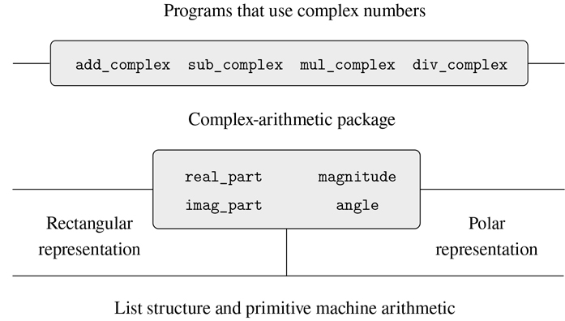

### 2.4.2 标记数据

看待数据抽象的一种方式是“最小承诺原则”的应用在实现 2.4.1 节中的复数系统时，我们可以使用本的直角坐标表示法或阿丽莎的极坐标表示法。由选择器和构造器形成的抽象障碍允许我们将数据对象的具体表示的选择推迟到最后一刻，从而在我们的系统设计中保持最大的灵活性。

最小承诺原则甚至可以延伸到更极端的情况。如果我们愿意，我们甚至可以在设计完选择器和构造函数后保持表示的模糊性，并选择使用 Ben 的表示和 Alyssa 的表示。但是，如果两种表示都包含在一个系统中，我们将需要某种方法来区分极坐标形式的数据和矩形形式的数据。否则，例如，如果我们被要求找出(3，4)对中的`magnitude`，我们将不知道是回答 5(以矩形形式解释数字)还是 3(以极坐标形式解释数字)。实现这种区分的一个简单方法是包含一个类型标签——字符串`"rectangular"`或`"polar"`——作为每个复数的一部分。然后，当我们需要操作一个复数时，我们可以使用标签来决定应用哪个选择器。

为了操作带标签的数据，我们将假设我们有函数`type_tag`和`contents`，它们从数据对象中提取标签和实际内容(在复数的情况下，是极坐标或直角坐标)。我们还将假设一个函数`attach_tag`，它接受一个标签和内容，并产生一个带标签的数据对象。实现这一点的直接方法是使用普通的列表结构:

```js
function attach_tag(type_tag, contents) {
    return pair(type_tag, contents);
}
function type_tag(datum) {
    return is_pair(datum)
           ? head(datum)
           : error(datum, "bad tagged datum – type_tag");
}
function contents(datum) {
    return is_pair(datum)
           ? tail(datum)
           : error(datum, "bad tagged datum – contents");
}
```

使用`type_tag`，我们可以定义谓词`is_rectangular`和`is_polar`，它们分别识别矩形和极性数字:

```js
function is_rectangular(z) {
    return type_tag(z) === "rectangular";
}
function is_polar(z) {
    return type_tag(z) === "polar";
}
```

有了类型标签，Ben 和 Alyssa 现在可以修改他们的代码，这样他们的两种不同的表示就可以在同一个系统中共存。每当本构造一个复数时，他都将其标记为矩形。每当艾丽莎构造一个复数时，她都将其标记为极坐标。此外，Ben 和 Alyssa 必须确保他们的函数名称不会冲突。一种方法是 Ben 在他的每个表示函数的名字后面加上后缀`rectangular`，Alyssa 在她的名字后面加上`polar`。这是本在第 2.4.1 节中修改过的矩形表示法:

```js
function real_part_rectangular(z) { return head(z); }
function imag_part_rectangular(z) { return tail(z); }
function magnitude_rectangular(z) {
    return math_sqrt(square(real_part_rectangular(z)) +
                     square(imag_part_rectangular(z)));
}
function angle_rectangular(z) {
    return math_atan(imag_part_rectangular(z),
                     real_part_rectangular(z));
}
function make_from_real_imag_rectangular(x, y) {
    return attach_tag("rectangular", pair(x, y));
}
function make_from_mag_ang_rectangular(r, a) {
    return attach_tag("rectangular",
                      pair(r * math_cos(a), r * math_sin(a)));
}
```

这是艾丽莎修改后的极坐标图:

```js
function real_part_polar(z) {
    return magnitude_polar(z) * math_cos(angle_polar(z));
}
function imag_part_polar(z) {
    return magnitude_polar(z) * math_sin(angle_polar(z));
}
function magnitude_polar(z) { return head(z); }
function angle_polar(z) { return tail(z); }
function make_from_real_imag_polar(x, y) {
    return attach_tag("polar",
                      pair(math_sqrt(square(x) + square(y)),
                           math_atan(y, x)));
}
function make_from_mag_ang_polar(r, a) {
    return attach_tag("polar", pair(r, a));
}
```

每个泛型选择器都被实现为一个函数，该函数检查其参数的标签，并调用适当的函数来处理该类型的数据。例如，为了获得一个复数的实部，`real_part`检查标签以确定是使用 Ben 的`real_part_rectangular`还是 Alyssa 的`real_ part_polar`。在任一情况下，我们使用`contents`提取裸露的、未标记的数据，并根据需要将其发送至矩形或极坐标函数:

```js
function real_part(z) {
    return is_rectangular(z)
           ? real_part_rectangular(contents(z))
           : is_polar(z)
           ? real_part_polar(contents(z))
           : error(z, "unknown type – real_part");
}
function imag_part(z) {
    return is_rectangular(z)
           ? imag_part_rectangular(contents(z))
           : is_polar(z)
           ? imag_part_polar(contents(z))
           : error(z, "unknown type – imag_part");
}
function magnitude(z) {
    return is_rectangular(z)
           ? magnitude_rectangular(contents(z))
           : is_polar(z)
           ? magnitude_polar(contents(z))
           : error(z, "unknown type – magnitude");
}
function angle(z) {
    return is_rectangular(z)
           ? angle_rectangular(contents(z))
           : is_polar(z)
           ? angle_polar(contents(z))
           : error(z, "unknown type – angle");
}
```

为了实现复数算术运算，我们可以使用 2.4.1 节中的相同函数`add_complex`、`sub_complex`、`mul_complex`和`div_complex`，因为它们调用的选择器是通用的，因此可以使用任何一种表示。比如功能`add_complex`还是

```js
function add_complex(z1, z2) {
    return make_from_real_imag(real_part(z1) + real_part(z2),
                               imag_part(z1) + imag_part(z2));
}
```

最后，我们必须选择是用 Ben 的表示法还是 Alyssa 的表示法来构造复数。一个合理的选择是每当我们有实部和虚部时就构造矩形数，每当我们有幅度和角度时就构造极坐标:

```js
function make_from_real_imag(x, y) {
    return make_from_real_imag_rectangular(x, y);
}
function make_from_mag_ang(r, a) {
    return make_from_mag_ang_polar(r, a);
}
```

由此产生的复数系统具有图 2.21 所示的结构。该系统被分解为三个相对独立的部分:复数算术运算、Alyssa 的极坐标实现和 Ben 的直角坐标实现。极坐标和矩形实现可能是由 Ben 和 Alyssa 分别编写的，这两种实现都可以被第三个程序员用作底层表示，以抽象构造器/选择器接口的形式实现复数运算函数。



图 2.21：通用复数运算系统的结构。

因为每个数据对象都用它的类型来标记，所以选择器以通用的方式对数据进行操作。也就是说，每个选择器被定义为具有依赖于它所应用的特定数据类型的行为。请注意连接不同表示的一般机制:在给定的表示实现中(比如 Alyssa 的极坐标包)，复数是一个无类型对(幅度、角度)。当一个通用选择器对多个`polar`类型进行操作时，它会去掉标签并将内容传递给 Alyssa 的代码。相反，当 Alyssa 构造一个通用的数字时，她用一个类型来标记它，以便它可以被更高级别的函数正确地识别。正如我们将在 2.5 节中看到的，当数据对象从一级传递到另一级时，这种剥离和附加标签的原则是一种重要的组织策略。
