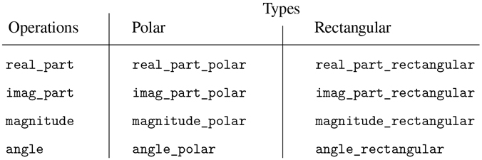

### 2.4.3 数据导向编程和可加性

检查数据类型并调用适当函数的一般策略被称为对类型的调度。这是在系统设计中获得模块化的有力策略。另一方面，如 2.4.2 节中那样实现分派有两个明显的弱点。一个缺点是通用接口函数(`real_part`、`imag_part`、`magnitude`和`angle`)必须知道所有不同的表示。例如，假设我们想要将一种新的复数表示合并到我们的复数系统中。我们需要用一个类型来标识这个新的表示，然后向每个通用接口函数添加一个子句来检查新的类型，并为该表示应用适当的选择器。

这种技术的另一个弱点是，即使单独的表示可以单独设计，我们也必须保证整个系统中没有两个函数同名。这就是为什么 Ben 和 Alyssa 不得不从第 2.4.1 节中更改他们原始函数的名称。

这两个弱点背后的问题是实现通用接口的技术不是附加的。实现通用选择器函数的人必须在每次安装新的表示时修改这些函数，与各个表示接口的人必须修改他们的代码以避免名称冲突。在每一种情况下，必须对代码进行的更改都是简单明了的，但它们仍然必须进行，这是不方便和错误的来源。这对于目前的复数系统来说不是什么大问题，但是假设复数有数百种不同的表示，而不是两种。假设在抽象数据接口中有许多通用选择器需要维护。事实上，假设没有一个程序员知道所有的接口函数或所有的表示。这个问题是真实的，必须在大型数据库管理系统这样的程序中解决。

我们需要的是进一步模块化系统设计的方法。这是由称为数据导向编程的编程技术提供的。要理解数据导向编程是如何工作的，首先要观察到，每当我们处理一组不同类型的通用操作时，我们实际上是在处理一个二维表，该表包含一个轴上的可能操作和另一个轴上的可能类型。表中的条目是为每种类型的参数实现每个操作的函数。在上一节开发的复数系统中，操作名、数据类型和实际函数之间的对应分布在通用接口函数的各种条件子句中。但是同样的信息也可以组织成表格，如图 2.22 所示。



图 2.22：复数系统运算表。

数据导向编程是一种设计程序直接使用这种表的技术。之前，我们实现了将复数算术代码与两个表示包作为一组函数进行接口的机制，每个函数对类型执行显式调度。这里，我们将把接口实现为一个函数，它在表中查找操作名和参数类型的组合，以找到要应用的正确函数，然后将它应用于参数的内容。如果我们这样做了，那么为了向系统添加新的表示包，我们不需要改变任何现有的功能；我们只需要向表中添加新的条目。

为了实现这个计划，假设我们有两个函数`put`和`get`，用于操作操作和类型表:

*   `put(`op`,` type`,` item`)`

    将项目安装在表格中，由操作和类型索引。

*   `get(`op`,` type`)`

    在表格中查找 op ， type 条目并返回在那里找到的条目。如果没有找到条目，`get`返回一个惟一的原始值，这个值由名称`undefined`引用，并由原始谓词`is_undefined`识别。 [^(41)](#c2-fn-0041)

现在，我们可以假设`put`和`get`包含在我们的语言中。在第 3 章(第 3.3.3 节)中，我们将看到如何实现这些和其他操作来操纵表。

下面是如何在复数系统中使用数据导向编程。开发了矩形表示的 Ben 实现了他的代码，就像他最初做的那样。他定义了一个函数集合或一个包，并通过向表中添加条目来告诉系统如何对矩形数字进行操作，从而将这些函数连接到系统的其余部分。这是通过调用以下函数来实现的:

```js
function install_rectangular_package() {
    // internal functions
    function real_part(z) { return head(z); }
    function imag_part(z) { return tail(z); }
    function make_from_real_imag(x, y) { return pair(x, y); }
    function magnitude(z) {
        return math_sqrt(square(real_part(z)) + square(imag_part(z)));
    }
    function angle(z) {
        return math_atan(imag_part(z), real_part(z));
    }
    function make_from_mag_ang(r, a) {
        return pair(r * math_cos(a), r * math_sin(a));
    }

    // interface to the rest of the system
    function tag(x) { return attach_tag("rectangular", x); }
    put("real_part", list("rectangular"), real_part);
    put("imag_part", list("rectangular"), imag_part);
    put("magnitude", list("rectangular"), magnitude);
    put("angle", list("rectangular"), angle);
    put("make_from_real_imag", "rectangular",
        (x, y) => tag(make_from_real_imag(x, y)));
    put("make_from_mag_ang", "rectangular",
        (r, a) => tag(make_from_mag_ang(r, a)));
    return "done";
}
```

请注意，这里的内部函数与本在独立工作时编写的第 2.4.1 节中的函数相同。为了将它们连接到系统的其余部分，不需要进行任何改变。此外，由于这些函数声明在安装函数内部，Ben 不必担心与矩形包外部的其他函数发生名称冲突。为了将这些接口到系统的其余部分，Ben 在操作名`real_part`和类型`list("rectangular")`下安装了他的`real_part`函数，对于其他选择器也是如此。 [^(42)](#c2-fn-0042) 该接口还定义了外部系统要使用的构造函数。 [^(43)](#c2-fn-0043) 这些与 Ben 内部定义的构造函数相同，除了它们附加了标签。

Alyssa 的 polar 包与之类似:

```js
function install_polar_package() {
    // internal functions
    function magnitude(z) { return head(z); }
    function angle(z) { return tail(z); }
    function make_from_mag_ang(r, a) { return pair(r, a); }
    function real_part(z) {
        return magnitude(z) * math_cos(angle(z));
    }
    function imag_part(z) {
        return magnitude(z) * math_sin(angle(z));
    }
    function make_from_real_imag(x, y) {
        return pair(math_sqrt(square(x) + square(y)),
                    math_atan(y, x));
    }    

    // interface to the rest of the system
    function tag(x) { return attach_tag("polar", x); }
    put("real_part", list("polar"), real_part);
    put("imag_part", list("polar"), imag_part);
    put("magnitude", list("polar"), magnitude);
    put("angle", list("polar"), angle);
    put("make_from_real_imag", "polar",
        (x, y) => tag(make_from_real_imag(x, y)));
    put("make_from_mag_ang", "polar",
        (r, a) => tag(make_from_mag_ang(r, a)));
    return "done";
}
```

尽管 Ben 和 Alyssa 都仍然使用他们的原始函数，并使用彼此相同的名称(例如`real_part`)，但是这些声明现在是不同函数的内部声明(参见 1.1.8 节)，因此不存在名称冲突。

复数算术选择器通过一个名为`apply_generic`的通用“操作”函数来访问表，该函数对一些参数应用通用操作。函数`apply_generic`在操作名称和参数类型下的表中查找，并应用结果函数(如果存在): [^(44)](#c2-fn-0044)

```js
function apply_generic(op, args) {
    const type_tags = map(type_tag, args);
    const fun = get(op, type_tags);
    return ! is_undefined(fun)
           ? apply_in_underlying_javascript(fun, map(contents, args))
           : error(list(op, type_tags),
                   "no method for these types – apply_generic");
}
```

使用`apply_generic`，我们可以如下定义我们的通用选择器:

```js
function real_part(z) { return apply_generic("real_part", list(z)); }
function imag_part(z) { return apply_generic("imag_part", list(z)); }
function magnitude(z) { return apply_generic("magnitude", list(z)); }
function angle(z)     { return apply_generic("angle", list(z));     }
```

注意，如果向系统中添加新的表示，这些根本不会改变。

我们还可以从表中提取构造函数，这些构造函数将被包外部的程序用来从实部和虚部以及幅度和角度生成复数。如 2.4.2 节所述，只要有实部和虚部，我们就构造矩形数，只要有幅度和角度，我们就构造极坐标:

```js
function make_from_real_imag(x, y) {
    return get("make_from_real_imag", "rectangular")(x, y);
}
function make_from_mag_ang(r, a) {
    return get("make_from_mag_ang", "polar")(r, a);
}
```

##### 练习 2.73

第 2.3.2 节描述了一个执行符号微分的程序:

```js
function deriv(exp, variable) {
    return is_number(exp)
           ? 0
           : is_variable(exp)
           ? is_same_variable(exp, variable) ? 1 : 0
           : is_sum(exp)
           ? make_sum(deriv(addend(exp), variable),
                      deriv(augend(exp), variable))
           : is_product(exp)
           ? make_sum(make_product(multiplier(exp),
                                   deriv(multiplicand(exp), variable)),
                      make_product(deriv(multiplier(exp), variable),
                                   multiplicand(exp)))
           // more rules can be added here
           : error(exp, "unknown expression type – deriv");
}
deriv(list("*", list("*", "x", "y"), list("+", "x", 4)), "x");
list("+", list("*", list("*", x, y), list("+", 1, 0)),
          list("*", list("+", list("*", x, 0), list("*", 1, y)),
                    list("+", x, 4)))
```

我们可以把这个程序看作是对要区分的表达式类型执行调度。在这种情况下，数据的“类型标签”是代数运算符符号(如“+”)，正在执行的操作是`deriv`。我们可以通过将基本的导数函数重写为

```js
function deriv(exp, variable) {
    return is_number(exp)
           ? 0
           : is_variable(exp)
           ? is_same_variable(exp, variable) ? 1 : 0
           : get("deriv", operator(exp))(operands(exp), variable);
}
function operator(exp) { return head(exp); }
function operands(exp) { return tail(exp); }
```

1.  解释上面做了什么。为什么我们不能将谓词`is_number`和`is_variable`吸收到数据导向的分派中？
2.  b. 在上面程序使用的表中写出和与积的导数的函数，以及安装它们所需的辅助代码。
3.  c. 选择你喜欢的任何附加微分规则，例如指数的微分规则(练习 2.56)，并将其安装在这个数据导向系统中。
4.  d. In this simple algebraic manipulator the type of an expression is the algebraic operator that binds it together. Suppose, however, we indexed the functions in the opposite way, so that the dispatch line in `deriv` looked like

    ```js
    get(operator(exp), "deriv")(operands(exp), variable);
    ```

    衍生系统需要做哪些相应的改变？

##### 练习 2.74

贪得无厌企业有限公司是一家高度分散的集团公司，由遍布世界各地的大量独立部门组成。该公司的计算机设备刚刚通过一种巧妙的网络接口方案相互连接起来，使整个网络对任何用户来说都像是一台计算机。贪得无厌的总裁第一次尝试利用网络的能力从部门文件中提取管理信息，她沮丧地发现，尽管所有部门文件都以 JavaScript 的数据结构实现，但不同部门使用的特定数据结构各不相同。匆忙召开了一次各司管理人员会议，以寻求一种战略来整合档案，既满足总部的需要，又保持各司现有的自主权。

展示如何用数据导向编程实现这样的策略。例如，假设每个部门的人事记录由一个文件组成，该文件包含一组以雇员姓名为关键字的记录。集合的结构因部门而异。此外，每个员工的记录本身就是一个集合(每个部门的结构不同)，其中包含以标识符为关键字的信息，如`address`和`salary`。特别是:

1.  a. 为总部实现一个`get_record`功能，从指定的人事档案中检索指定员工的记录。该功能应适用于任何部门的文件。解释各个部门的文件应该如何组织。特别是，必须提供什么类型的信息？
2.  b. 为总部实现一个`get_salary`函数，该函数从任何部门的人事档案中返回给定员工的工资信息。为了使这种操作有效，应该如何构造记录？
3.  c. 为总部实现一个`find_employee_record`功能。这将在所有部门的文件中搜索给定雇员的记录，并返回记录。假设这个函数将雇员的姓名和所有部门的文件列表作为参数。
4.  d. 当贪得无厌接手一家新公司，为了将新的人事信息纳入中央系统，必须做哪些改变？

##### 信息传递

数据导向编程的关键思想是通过显式处理操作和类型表来处理程序中的一般操作，例如图 2.22 中的表。我们在 2.4.2 节中使用的编程风格通过让每个操作负责自己的分派来组织类型上所需的分派。实际上，这将操作和类型表分解成行，每个通用操作函数代表表中的一行。

另一种实现策略是将表分解成列，而不是使用调度数据类型的“智能操作”，而是使用调度操作名称的“智能数据对象”。我们可以通过这样的方式来实现这一点:将一个数据对象(比如一个矩形数字)表示为一个函数，该函数将所需的操作名称作为输入，并执行指定的操作。在这样的规程中，`make_from_real_imag`可以写成

```js
function make_from_real_imag(x, y) {
    function dispatch(op) {
        return op === "real_part"
               ? x
               : op === "imag_part"
               ? y
               : op === "magnitude"
               ? math_sqrt(square(x) + square(y))
               : op === "angle"
               ? math_atan(y, x)
               : error(op, "unknown op – make_from_real_imag");
    }
    return dispatch;
}
```

相应的`apply_generic`函数将一个通用操作应用于一个参数，现在只需将操作的名称提供给数据对象，并让该对象完成这项工作: [^(45)](#c2-fn-0045)

```js
function apply_generic(op, arg) { return head(arg)(op); }
```

注意，`make_from_real_imag`返回的值是一个函数——内部的`dispatch`函数。这是当`apply_generic`请求执行操作时调用的函数。

这种编程风格被称为消息传递。该名称来源于这样一个形象，即数据对象是一个实体，它将请求的操作名称作为“消息”接收我们已经在第 2.1.3 节中看到了一个消息传递的例子，在那里我们看到了如何定义`pair`、`head`和`tail`，没有数据对象，只有函数。在这里，我们看到消息传递不是一种数学技巧，而是一种用一般操作组织系统的有用技术。在本章的剩余部分，我们将继续使用面向数据的编程，而不是消息传递，来讨论一般的算术运算。在第三章中，我们将回到消息传递，我们将看到它是构造模拟程序的一个强有力的工具。

##### 练习 2.75

以消息传递的方式实现构造函数`make_from_mag_ang`。该功能应类似于上面给出的`make_from_real_imag`功能。

##### 练习 2.76

随着具有通用操作的大型系统的发展，可能需要新类型的数据对象或新操作。对于三种策略中的每一种——具有显式分派的通用操作、数据导向风格和消息传递风格——描述为了添加新类型或新操作而必须对系统进行的更改。哪个组织最适合经常添加新类型的系统？对于必须经常添加新操作的系统，哪种方法最合适？
