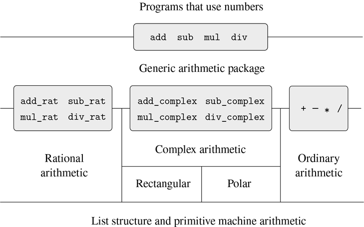

## 2.5 具有通用操作的系统

在上一节中，我们看到了如何设计可以用多种方式表示数据对象的系统。关键思想是通过通用接口函数将指定数据操作的代码与几种表示联系起来。现在，我们将看到如何使用同样的思想，不仅定义在不同表示上通用的操作，而且定义在不同类型的参数上通用的操作。我们已经看到了几个不同的算术运算包:内置于我们语言中的原始算术(`+`、`-`、`*`、`/`)、2.1.1 节中的有理数算术(`add_rat`、`sub_rat`、`mul_rat`、`div_rat`)以及我们在 2.4.3 节中实现的复数算术。我们现在将使用数据导向技术构建一个算术运算包，它包含了我们已经构建的所有算术运算包。

图 2.23：显示了我们将要构建的系统的结构。注意抽象障碍。从使用“数字”的人的角度来看，有一个函数`add`可以处理提供的任何数字。函数`add`是一个通用接口的一部分，它允许使用数字的程序统一访问独立的普通算术、有理算术和复杂算术包。任何单个算术包(如复杂包)本身都可以通过通用函数(如`add_complex`)访问，这些函数组合了为不同表示(如矩形和极坐标)设计的包。此外，该系统的结构是可加的，因此人们可以分别设计单独的算术包，然后将它们组合起来，形成一个通用的算术系统。

图 2.23：通用算术系统。
