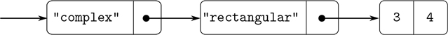

### 2.5.1 通用算术运算

设计通用算术运算的任务类似于设计通用复数运算的任务。例如，我们希望有一个普通的加法函数`add`,它像普通的原始加法函数`+`一样作用于普通的数字，像有理数函数`add_rat`一样作用于复数函数`add_complex`。通过遵循我们在 2.4.3 节中使用的相同策略来实现复数的通用选择器，我们可以实现`add`和其他通用算术运算。我们将为每种数字附加一个类型标签，并根据其参数的数据类型将通用函数分派到一个适当的包中。

通用算术函数定义如下:

```js
function add(x, y) { return apply_generic("add", list(x, y)); }
function sub(x, y) { return apply_generic("sub", list(x, y)); }
function mul(x, y) { return apply_generic("mul", list(x, y)); }
function div(x, y) { return apply_generic("div", list(x, y)); }
```

我们首先安装一个处理普通数字的包，也就是我们语言的原始数字。我们用字符串`"javascript_number"`标记这些。这个包中的算术运算是基本的算术函数(因此不需要定义额外的函数来处理未标记的数字)。因为这些操作每个都有两个参数，所以它们被安装在由 list `list("javascript_number", "javascript_number")`键入的表中:

```js
function install_javascript_number_package() {
    function tag(x) {
        return attach_tag("javascript_number", x);
    }
    put("add", list("javascript_number", "javascript_number"),
        (x, y) => tag(x + y));
    put("sub", list("javascript_number", "javascript_number"),
        (x, y) => tag(x - y));
    put("mul", list("javascript_number", "javascript_number"),
        (x, y) => tag(x * y));
    put("div", list("javascript_number", "javascript_number"),
        (x, y) => tag(x / y));
    put("make", "javascript_number",
        x => tag(x));
    return "done";
}
```

JavaScript-number 软件包的用户将通过以下函数创建(带标签的)普通数字:

```js
function make_javascript_number(n) {
    return get("make", "javascript_number")(n);
}
```

既然通用算术系统的框架已经到位，我们可以很容易地包括新的数字类型。这是一个执行理性算术的包。注意，作为可加性的一个好处，我们可以不加修改地使用 2.1.1 节中的有理数代码作为包中的内部函数:

```js
function install_rational_package() {
    // internal functions
    function numer(x) { return head(x); }
    function denom(x) { return tail(x); }
    function make_rat(n, d) {
        const g = gcd(n, d);
        return pair(n / g, d / g);
    }
    function add_rat(x, y) {
        return make_rat(numer(x) * denom(y) + numer(y) * denom(x),
                        denom(x) * denom(y));
    }
    function sub_rat(x, y) {
        return make_rat(numer(x) * denom(y) - numer(y) * denom(x),
                        denom(x) * denom(y));
    }
    function mul_rat(x, y) {
        return make_rat(numer(x) * numer(y),
                        denom(x) * denom(y));
    }
    function div_rat(x, y) {
        return make_rat(numer(x) * denom(y),
                        denom(x) * numer(y));
    }
    // interface to rest of the system
    function tag(x) {
        return attach_tag("rational", x);
    }
    put("add", list("rational", "rational"),
        (x, y) => tag(add_rat(x, y)));
    put("sub", list("rational", "rational"),
        (x, y) => tag(sub_rat(x, y)));
    put("mul", list("rational", "rational"),
        (x, y) => tag(mul_rat(x, y)));
    put("div", list("rational", "rational"),
        (x, y) => tag(div_rat(x, y)));
    put("make", "rational",
        (n, d) => tag(make_rat(n, d)));
    return "done";
}

function make_rational(n, d) {
    return get("make", "rational")(n, d);
}
```

我们可以安装一个类似的包来处理复数，使用标签`"complex"`。在创建包的过程中，我们从表中提取出由矩形和极坐标包定义的操作`make_from_real_imag`和`make_from_mag_ang`。加法允许我们使用第 2.4.1 节中相同的`add_complex`、`sub_complex`、`mul_complex`和`div_complex`函数作为内部运算。

```js
function install_complex_package() {
    // imported functions from rectangular and polar packages
    function make_from_real_imag(x, y) {
        return get("make_from_real_imag", "rectangular")(x, y);
    }
    function make_from_mag_ang(r, a) {
        return get("make_from_mag_ang", "polar")(r, a);
    }
    // internal functions
    function add_complex(z1, z2) {
        return make_from_real_imag(real_part(z1) + real_part(z2),
                                   imag_part(z1) + imag_part(z2));
    }
    function sub_complex(z1, z2) {
        return make_from_real_imag(real_part(z1) - real_part(z2),
                                   imag_part(z1) - imag_part(z2));
    }
    function mul_complex(z1, z2) {
        return make_from_mag_ang(magnitude(z1) * magnitude(z2),
                                 angle(z1) + angle(z2));
    }
function div_complex(z1, z2) {
    return make_from_mag_ang(magnitude(z1) / magnitude(z2),
                                 angle(z1) - angle(z2));
    }
    // interface to rest of the system
    function tag(z) { return attach_tag("complex", z); }
    put("add", list("complex", "complex"),
        (z1, z2) => tag(add_complex(z1, z2)));
    put("sub", list("complex", "complex"),
        (z1, z2) => tag(sub_complex(z1, z2)));
    put("mul", list("complex", "complex"),
        (z1, z2) => tag(mul_complex(z1, z2)));
    put("div", list("complex", "complex"),
        (z1, z2) => tag(div_complex(z1, z2)));
    put("make_from_real_imag", "complex",
        (x, y) => tag(make_from_real_imag(x, y)));
    put("make_from_mag_ang", "complex",
        (r, a) => tag(make_from_mag_ang(r, a)));
    return "done";
}
```

复数包之外的程序可以从实部和虚部或者从幅度和角度构造复数。请注意，最初在矩形和极坐标包中定义的底层函数是如何被导出到复杂包中，并从那里导出到外部世界的。

```js
function make_complex_from_real_imag(x, y){
    return get("make_from_real_imag", "complex")(x, y);
}
function make_complex_from_mag_ang(r, a){
    return get("make_from_mag_ang", "complex")(r, a);
}
```

我们这里有一个两级标记系统。一个典型的复数，如矩形形式的 3 + 4 i ，将被表示为如图 2.24：所示。外部标签(`"complex"`)用于将编号指向复合包装。一旦进入复杂包装，下一个标签(`"rectangular"`)用于将数字指向矩形包装。在一个大而复杂的系统中，可能有许多层次，每一层都通过一般操作与下一层连接。当数据对象被“向下”传递时，用于将它导向适当包的外部标签被剥离(通过应用`contents`)，下一层标签(如果有)变得可见，用于进一步的分派。



图 2.24：以矩形形式表示 3 + 4i。

在上面的包中，我们使用了`add_rat`、`add_complex`和其他算术函数，与最初编写的完全一样。然而，一旦这些声明是不同安装函数的内部声明，它们就不再需要彼此不同的名字:我们可以在两个包中简单地将它们命名为`add`、`sub`、`mul`和`div`。

##### 练习 2.77

Louis Reasoner 尝试对表达式`magnitude(z)`求值，其中`z`是图 2.24 中[所示的对象。令他惊讶的是，他得到的不是答案 5，而是来自`apply_generic`的错误消息，说没有对类型`list("complex")`进行操作`magnitude`的方法。他向 Alyssa P. Hacker 展示了这种交互，Hacker 说“问题是复数选择器从来不是为`"complex"`数定义的，只是为`"polar"`和`"rectangular"`数定义的。您所要做的就是将以下内容添加到`complex`包中:"](#c2-fig-0034)

```js
put("real_part", list("complex"), real_part);
put("imag_part", list("complex"), imag_part);
put("magnitude", list("complex"), magnitude);
put("angle",      list("complex"), angle);
```

请详细描述这种方法的工作原理。例如，跟踪评估表达式`magnitude(z)`时调用的所有函数，其中`z`是图[2.24](#c2-fig-0034)中显示的对象。特别是，`apply_generic`被调用了多少次？在每种情况下，分派给什么功能？

##### 练习 2.78

`javascript_number`包中的内部函数本质上只不过是对原函数`+`、`-`等的调用。不可能直接使用该语言的原语，因为我们的类型标记系统要求每个数据对象都有一个与之相关的类型。然而，事实上，所有的 JavaScript 实现都有一个类型系统，它们在内部使用。像`is_string`和`is_number`这样的基本谓词决定了数据对象是否有特定的类型。修改 2.4.2 节中的`type_tag`、`contents`和`attach_tag`的定义，以便我们的通用系统利用 JavaScript 的内部类型系统。也就是说，系统应该像以前一样工作，只是普通数字应该简单地表示为 JavaScript 数字，而不是表示为`head`是字符串`"javascript_number"`的数字对。

##### 练习 2.79

定义一个测试两个数相等的通用等式谓词`is_equal`，并将其安装在通用算术包中。这个操作应该适用于普通数字、有理数和复数。

##### 练习 2.80

定义一个测试其参数是否为零的通用谓词`is_equal_to_zero`，并将其安装在通用算术包中。这个操作应该适用于普通数字、有理数和复数。
