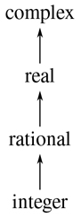
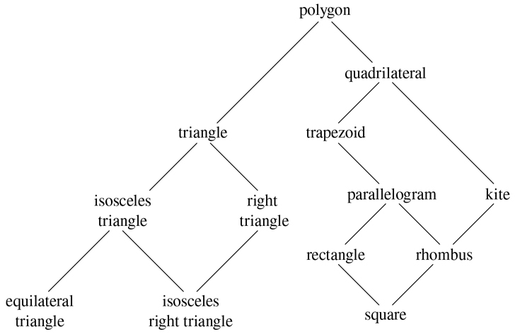

### 2.5.2 合并不同类型的数据

我们已经看到了如何定义一个包含普通数字、复数、有理数以及我们可能决定发明的任何其他类型的数字的统一算术系统，但是我们忽略了一个重要的问题。到目前为止，我们定义的操作将不同的数据类型视为完全独立的。因此，有单独的软件包用于相加，比如说，两个普通的数，或者两个复数。我们还没有考虑的是，定义跨越类型边界的运算是有意义的，比如把一个复数加到一个普通数上。我们已经煞费苦心地在我们程序的各个部分之间引入障碍，这样它们就可以被分别开发和理解。我们希望以某种谨慎控制的方式引入跨类型操作，这样我们就可以在不严重违反我们的模块边界的情况下支持它们。

处理跨类型操作的一种方法是为操作有效的每种可能的类型组合设计不同的函数。例如，我们可以扩展复数包，使其提供将复数加到普通数上的功能，并使用标签`list("complex", "javascript_number")` : [^(46)](#c2-fn-0046) 将其安装到表中

```js
// to be included in the complex package
function add_complex_to_javascript_num(z, x) {
    return make_complex_from_real_imag(real_part(z) + x, imag_part(z));
}
put("add", list("complex", "javascript_number"),
    (z, x) => tag(add_complex_to_javascript_num(z, x)));
```

这种技术是可行的，但是很麻烦。使用这样的系统，引入新类型的成本不仅仅是构建该类型的功能包，还包括构建和安装实现跨类型操作的功能。这很容易比在类型本身上定义操作所需的代码多得多。这种方法也削弱了我们额外组合独立包的能力，或者至少限制了单个包的实现者需要考虑其他包的程度。例如，在上面的例子中，处理复数和普通数的混合运算应该是复数包的责任，这似乎是合理的。然而，组合有理数和复数可能由 complex 包、rational 包或使用从这两个包中提取的操作的第三方包来完成。在设计具有许多包和许多跨类型操作的系统时，为包之间的责任划分制定一致的策略可能是一项艰巨的任务。

##### 强迫

在完全不相关的操作作用于完全不相关的类型的一般情况下，实现显式的跨类型操作尽管可能很麻烦，但却是人们所能希望的最好结果。幸运的是，通过利用潜在于我们的类型系统中的额外结构，我们通常可以做得更好。通常，不同的数据类型并不是完全独立的，并且可能存在将一种类型的对象视为另一种类型的方法。这个过程叫做胁迫。例如，如果我们被要求将一个普通数与一个复数进行算术组合，我们可以将这个普通数视为一个虚数为零的复数。这将问题转化为组合两个复数的问题，这可以由复数算术包以普通方式处理。

一般来说，我们可以通过设计强制函数来实现这一思想，强制函数将一种类型的对象转换为另一种类型的等价对象。下面是一个典型的强制函数，它将给定的普通数转换为具有实部和零虚部的复数:

```js
function javascript_number_to_complex(n) {
    return make_complex_from_real_imag(contents(n), 0);
}
```

我们将这些强制函数安装在一个特殊的强制表中，在两种类型的名称下进行索引:

```js
put_coercion("javascript_number", "complex",
             javascript_number_to_complex);
```

(我们假设有`put_coercion`和`get_coercion`函数可用于操作这个表。)通常，表中的一些槽将是空的，因为通常不可能将每种类型的任意数据对象强制转换成所有其他类型。例如，没有办法将任意复数强制转换为普通数，因此表中不会包含一般的`complex_to_javascript_number`函数。

一旦强制表被建立，我们可以通过修改第 2.4.3 节的`apply_generic`函数以统一的方式处理强制。当要求应用一个操作时，我们首先检查操作是否是为参数的类型定义的，就像以前一样。如果是这样，我们将分派到 operation-andtype 表中找到的函数。否则，我们尝试强制。为简单起见，我们只考虑有两个自变量的情况。我们检查强制表，看看第一种类型的对象是否能被强制为第二种类型。如果是这样，我们强制第一个参数并再次尝试操作。如果第一种类型的对象通常不能被强制为第二种类型，我们可以反过来尝试强制，看看是否有办法将第二个参数强制为第一个参数的类型。最后，如果没有已知的方法将一种类型强制为另一种类型，我们就放弃。下面是函数:

```js
function apply_generic(op, args) {
    const type_tags = map(type_tag, args);
    const fun = get(op, type_tags);
    if (! is_undefined(fun)) {
        return apply(fun, map(contents, args));
    } else {
        if (length(args) === 2) {
            const type1 = head(type_tags);
            const type2 = head(tail(type_tags));
            const a1 = head(args);
            const a2 = head(tail(args));
            const t1_to_t2 = get_coercion(type1, type2);
            const t2_to_t1 = get_coercion(type2, type1);
            return ! is_undefined(t1_to_t2)
                   ? apply_generic(op, list(t1_to_t2(a1), a2))
                   : ! is_undefined(t2_to_t1)
                   ? apply_generic(op, list(a1, t2_to_t1(a2)))
                   : error(list(op, type_tags),
                           "no method for these types");
        } else {
            return error(list(op, type_tags),
                         "no method for these types");
        }
    }
}
```

如上所述，与定义显式跨类型操作的方法相比，这种强制方案有许多优点。尽管我们仍然需要编写强制函数来关联类型(对于具有`n`个类型的系统，可能需要 n2 个函数)，但我们只需要为每对类型编写一个函数，而不是为每个类型集合和每个泛型操作编写不同的函数。 [^(48)](#c2-fn-0048) 我们在这里指望的是这样一个事实:类型之间适当的转换只取决于类型本身，而不取决于要应用的操作。

另一方面，对于某些应用，我们的强制方案可能不够通用。即使当要组合的两个对象都不能转换成另一个的类型时，仍然可以通过将两个对象转换成第三种类型来执行操作。为了处理这种复杂性并保持程序的模块化，通常有必要构建利用类型间关系的进一步结构的系统，这将在下面讨论。

##### 类型的层次结构

上面介绍的强制方案依赖于类型对之间自然关系的存在。通常在不同类型之间的关系上有更多的“全局”结构。例如，假设我们正在构建一个通用的算术系统来处理整数、有理数、实数和复数。在这样一个系统中，把一个整数看成一种特殊的有理数是很自然的，这种有理数又是一种特殊的实数，而实数又是一种特殊的复数。我们实际拥有的是所谓的类型的层次结构，例如，整数是有理数的一个子类型(也就是说，任何可以应用于有理数的运算都可以自动应用于整数)。相反，我们说有理数形成了整数的一个超类型。这里我们有一个非常简单的层次结构，其中每个类型最多有一个超类型和一个子类型。这种结构称为塔，如图 2.25：所示。



图 2.25：一座塔的类型。

如果我们有一个塔式结构，那么我们可以大大简化向层次结构中添加新类型的问题，因为我们只需要指定新类型如何嵌入到它上面的下一个超类型中，以及它如何成为它下面的超类型。例如，如果我们想把一个整数加到一个复数上，我们不需要显式定义一个特殊的强制函数`integer_to_complex`。而是定义整数如何转化为有理数，有理数如何转化为实数，实数如何转化为复数。然后，我们允许系统通过这些步骤将整数转换为复数，然后将两个复数相加。

我们可以按照以下方式重新设计我们的`apply_generic`函数:对于每种类型，我们需要提供一个`raise`函数，它将该类型的对象在塔中“提升”一级。然后，当系统需要对不同类型的物体进行操作时，它可以连续提升较低类型的物体，直到所有的物体在塔中处于相同的高度。(练习 2.83 和 2.84 涉及实施这种策略的细节。)

塔的另一个优点是，我们可以很容易地实现这样一个概念，即每个类型“继承”一个超类型上定义的所有操作。例如，如果我们不提供一个特殊的函数来寻找一个整数的实数部分，我们仍然应该期望`real_part`将被定义为整数，因为整数是复数的一个子类型。在一个塔中，我们可以通过修改`apply_generic`来安排这一切以统一的方式发生。如果没有为给定的对象类型直接定义所需的操作，我们将该对象提升到其父类型，然后重试。因此，我们沿着塔向上爬，一边爬一边改变我们的论点，直到我们找到一个可以执行所需操作的水平，或者到达顶部(在这种情况下，我们放弃)。

与更一般的层次结构相比，塔式结构的另一个优点是，它为我们提供了一种简单的方法来将数据对象“降低”到最简单的表示形式。例如，如果我们将 2 + 3 i 与 4–3I 相加，那么获得的答案应该是整数 6，而不是复数 6 + 0 i 。练习 2.85 讨论了实施这种下放操作的方法。(诀窍在于我们需要一个通用的方法来区分那些可以降低的对象，比如 6 + 0 i ，和那些不能降低的对象，比如 6 + 2 i 。)

##### 等级制度的不足

如我们所见，如果我们系统中的数据类型可以自然地排列在一个塔中，这就大大简化了处理不同类型上的一般操作的问题。不幸的是，通常情况并非如此。图 2.26：展示了一个更复杂的混合类型排列，这个显示了不同类型的几何图形之间的关系。我们看到，一般来说，一个类型可能有不止一个子类型。例如，三角形和四边形都是多边形的子类型。此外，一个类型可以有多个超类型。例如，等腰直角三角形可以被认为是等腰三角形或直角三角形。这个多重超类型的问题特别棘手，因为这意味着没有唯一的方法在层次结构中“提升”一个类型。找到“正确的”超类型，在其中对一个对象应用一个操作，可能需要在整个类型网络中对一个函数(如`apply_generic`)进行大量的搜索。因为一个类型通常有多个子类型，所以在类型层次结构中强制一个值“向下”也有类似的问题。在大型系统的设计中，处理大量相互关联的类型同时仍然保持模块性是非常困难的，这也是当前研究的一个领域。 [^(49)](#c2-fn-0049)



图 2.26：几何图形类型之间的关系。

##### 练习 2.81

Louis Reasoner 注意到`apply_generic`可能会试图将参数强制转换为彼此的类型，即使它们已经具有相同的类型。因此，他推断，我们需要将函数放入强制表中，将每种类型的参数“强制”为它们自己的类型。例如，除了上面所示的`javascript_number_to_complex`胁迫，他还会做:

```js
function javascript_number_to_javascript_number(n) { return n; }
function complex_to_complex(n) { return n; }
put_coercion("javascript_number", "javascript_number",
             javascript_number_to_javascript_number);
put_coercion("complex", "complex", complex_to_complex);
```

1.  a. With Louis's coercion functions installed, what happens if `apply_generic` is called with two arguments of type `"complex"` or two arguments of type `"javascript_ number"` for an operation that is not found in the table for those types? For example, assume that we've defined a generic exponentiation operation:

    ```js
    function exp(x, y) {
        return apply_generic("exp", list(x, y));
    }
    ```

    并且在 JavaScript-number 包中放置了一个求幂函数，但没有在任何其他包中放置:

    ```js
    // following added to JavaScript-number package
    put("exp", list("javascript_number", "javascript_number"),
        (x, y) => tag(math_exp(x, y))); // using primitive math_exp
    ```

    如果我们用两个复数作为参数调用`exp`会怎么样？

2.  路易斯关于必须对相同类型的争论采取某种措施的观点是正确的，还是,`apply_generic`照现在这样工作是正确的？
3.  修改`apply_generic`，这样如果两个参数具有相同的类型，它就不会尝试强制。

##### 练习 2.82

展示如何一般化`apply_generic`来处理多参数的一般情况下的强制。一种策略是尝试将所有参数强制转换为第一个参数的类型，然后转换为第二个参数的类型，依此类推。举例说明这种策略(以及上面给出的两个参数版本)不够通用的情况。(提示:考虑这样一种情况，表中有一些合适的混合类型的操作不会被尝试。)

##### 练习 2.83

假设你正在设计一个通用的算术系统来处理图 2.25 所示的类型:整数、有理数、实数、复数。对于每种类型(除了复杂的)，设计一个功能，将该类型的对象在塔中提升一级。展示如何安装一个通用的`raise`操作，它将适用于每一种类型(复杂类型除外)。

##### 练习 2.84

使用练习 2.83 的`raise`操作，修改`apply_generic`函数，使其通过连续提升的方法强制其参数具有相同的类型，如本节所述。您需要设计一种方法来测试两种类型中哪一种在塔中更高。以与系统的其余部分“兼容”的方式进行，并且不会导致在向塔添加新高度时出现问题。

##### 练习 2.85

本节提到了一种“简化”数据对象的方法，即尽可能降低数据对象的类型。为练习 2.83 中描述的塔设计一个功能`drop`来实现这个功能。关键是以某种通用的方式决定一个物体是否可以被降低。比如复数 1.5 + 0 i 可以降到`"real"`，复数 1 + 0 i 可以降到`"integer"`，复数 2 + 3 i 根本不能降。这里有一个决定一个物体是否可以降低的计划:首先定义一个通用的操作`project`，将一个物体“推”下塔中。例如，投影一个复数会涉及到扔掉虚部。然后，如果我们把一个数`project`它和`raise`结果返回到我们开始时的类型，我们得到的结果和开始时的相等，那么这个数就可以被丢弃。通过编写一个尽可能远地放下对象的`drop`函数，详细展示如何实现这个想法。您需要设计各种投影操作 [^(50)](#c2-fn-0050) 并在系统中安装`project`作为通用操作。你还需要利用一个通用的等式谓词，如练习 2.79 中所描述的。最后，使用`drop`重写练习 2.84 中的`apply_generic`，使其“简化”答案。

##### 练习 2.86

假设我们想要处理复数，其实部、虚部、幅度和角度可以是普通数字、有理数或我们可能希望添加到系统中的其他数字。描述并实施适应这种情况所需的系统变更。你必须定义像`sine`和`cosine`这样的运算，它们是普通数字和有理数的通用运算。
