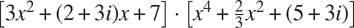
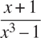
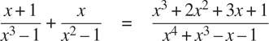

### 2.5.3 举例:符号代数

符号代数表达式的操作是一个复杂的过程，说明了大规模系统设计中出现的许多最困难的问题。一般来说，一个代数表达式可以被看作是一个层次结构，一个应用于操作数的操作符树。我们可以从一组原始对象(如常数和变量)开始构建代数表达式，并通过代数运算符(如加法和乘法)将它们组合起来。像在其他语言中一样，我们形成抽象，使我们能够用简单的术语引用复合对象。符号代数中的典型抽象是线性组合、多项式、有理函数或三角函数等概念。我们可以把这些看作复合“类型”，它们通常对指导表达式的处理很有用。例如，我们可以描述这个表达式

```js
x2 sin(y2 + 1) + x cos 2y + cos(y3 – 2y2)
```

作为`x`中的多项式，其系数是`y`中系数为整数的多项式的三角函数。

我们在这里不打算发展一个完整的代数运算系统。这样的系统是极其复杂的程序，包含了深奥的代数知识和优雅的算法。我们要做的是研究代数操作中一个简单但重要的部分:多项式的算术。我们将举例说明这种系统的设计者所面临的各种决策，以及如何应用抽象数据和一般操作的思想来帮助组织这项工作。

##### 多项式算术

我们在设计多项式运算系统时的第一个任务是决定什么是多项式。多项式通常相对于某些变量来定义(多项式的不确定)。为了简单起见，我们将把自己限制在只有一个不定项的多项式上(一元多项式)。 [^(51)](#c2-fn-0051) 我们将多项式定义为一个项的和，每个项或者是一个系数，或者是一个不定项的幂，或者是一个系数和一个不定项的幂的乘积。系数被定义为不依赖于多项式不定项的代数表达式。举个例子，

```js
5x2 + 3x + 7
```

是`x`中的简单多项式，并且

```js
(y2 + 1)x3 + (2y)x + 1
```

是`x`中的多项式，其系数是`y`中的多项式。

我们已经回避了一些棘手的问题。这几个多项式的第一个和多项式 5y2+3y+7 一样吗，还是不一样？一个合理的答案可能是“是的，如果我们把一个多项式纯粹看作一个数学函数，但是不，如果我们把一个多项式看作一种语法形式。”第二个多项式在代数上等价于`y`中的一个多项式，其系数是`x`中的多项式。我们的系统应该认识到这一点吗？此外，还有其他方法来表示多项式，例如，表示为因子的乘积，或者(对于一元多项式)表示为根的集合，或者表示为多项式在指定点集合上的值的列表。我们可以通过决定在我们的代数操作系统中，一个“多项式”将是一种特殊的语法形式，而不是它的数学含义来巧妙处理这些问题。

现在我们必须考虑如何对多项式进行运算。在这个简单的系统中，我们将只考虑加法和乘法。此外，我们将坚持认为，两个多项式组合必须有相同的不定。

我们将通过遵循熟悉的数据抽象原则来设计我们的系统。我们将使用称为 poly 的数据结构来表示多项式，它由一个变量和一组项组成。我们假设我们有选择器`variable`和`term_list`从一个多边形中提取这些部分，还有一个构造器`make_poly`从给定的变量和术语列表中组装一个多边形。一个变量将只是一个字符串，所以我们可以使用 2.3.2 节的`is_same_variable`函数来比较变量。以下函数定义了多边形的加法和乘法:

```js
function add_poly(p1, p2) {
    return is_same_variable(variable(p1), variable(p2))
           ? make_poly(variable(p1),
                       add_terms(term_list(p1), term_list(p2)))
           : error(list(p1, p2), "polys not in same var – add_poly");
}
function mul_poly(p1, p2) {
    return is_same_variable(variable(p1), variable(p2))
           ? make_poly(variable(p1),
                       mul_terms(term_list(p1), term_list(p2)))
           : error(list(p1, p2), "polys not in same var – mul_poly");
}
```

为了将多项式整合到我们的通用算术系统中，我们需要为它们提供类型标签。我们将使用标签`"polynomial"`，并在操作表中的标签多项式上安装适当的操作。我们将把所有代码嵌入多项式包的安装函数中，类似于 2.5.1 节中的安装函数:

```js
function install_polynomial_package() {
    // internal functions
    // representation of poly
    function make_poly(variable, term_list) {
        return pair(variable, term_list);
    }
    function variable(p) { return head(p); }
    function term_list(p) { return tail(p); }
    〈functions is_same_variable and is_variable from section 2.3.2〉    

    // representation of terms and term lists
    〈functions adjoin_term…coeff from text below〉

    function add_poly(p1, p2) { … }
    〈functions used by add_poly〉
    function mul_poly(p1, p2) { … }
    〈functions used by mul_poly〉    

    // interface to rest of the system
    function tag(p) { return attach_tag("polynomial", p); }
    put("add", list("polynomial", "polynomial"),
        (p1, p2) => tag(add_poly(p1, p2)));
    put("mul", list("polynomial", "polynomial"),
        (p1, p2) => tag(mul_poly(p1, p2)));
    put("make", "polynomial",
        (variable, terms) => tag(make_poly(variable, terms)));
    return "done";
}
```

多项式加法是逐项执行的。必须组合相同顺序的项(即，具有相同的不定幂)。这是通过形成相同阶的新项来实现的，该新项的系数是加数的系数之和。一个加数中的项，如果在另一个加数中没有相同阶的项，就简单地累加到被构造的和多项式中。

为了操作术语列表，我们将假设我们有一个返回空术语列表的构造函数`the_empty_termlist`和一个将新术语连接到术语列表的构造函数`adjoin_ term`。我们还假设我们有一个谓词`is_empty_termlist`来判断给定的术语列表是否为空，一个选择器`first_term`从术语列表中提取最高阶的术语，一个选择器`rest_terms`返回除最高阶术语之外的所有术语。为了操作术语，我们将假设我们有一个构造函数`make_term`，它用给定的阶数和系数构造一个术语，还有选择器`order`和`coeff`，它们分别返回术语的阶数和系数。这些操作允许我们将术语和术语列表都视为数据抽象，它们的具体表示我们可以单独考虑。

下面是为两个多项式的和构造项列表的函数； [^(53)](#c2-fn-0053) 注意，我们稍微扩展了 1.3.2 节中描述的条件语句的语法，用另一个条件语句代替`**else**`后面的块:

```js
function add_terms(L1, L2) {
    if (is_empty_termlist(L1)) {
        return L2;
    } else if (is_empty_termlist(L2)) {
        return L1;
    } else {
        const t1 = first_term(L1);
        const t2 = first_term(L2);
        return order(t1) > order(t2)
               ? adjoin_term(t1, add_terms(rest_terms(L1), L2))
               : order(t1) < order(t2)
               ? adjoin_term(t2, add_terms(L1, rest_terms(L2)))
               : adjoin_term(make_term(order(t1),
                                       add(coeff(t1), coeff(t2))),
                             add_terms(rest_terms(L1),
                                       rest_terms(L2)));
    }
}
```

这里要注意的最重要的一点是，我们使用了通用加法函数`add`来将被组合项的系数加在一起。正如我们将在下面看到的，这具有强大的后果。

为了将两个术语列表相乘，我们将第一个列表的每个术语乘以另一个列表的所有术语，重复使用`mul_term_by_all_terms`，它将给定术语乘以给定术语列表中的所有术语。得到的项列表(第一个列表的每个项一个)被累加成一个总和。将两个项相乘形成一个项，其阶数是因子阶数之和，其系数是因子系数的乘积:

```js
function mul_terms(L1, L2) {
    return is_empty_termlist(L1)
          ? the_empty_termlist
          : add_terms(mul_term_by_all_terms(
                                first_term(L1), L2),
                      mul_terms(rest_terms(L1), L2));
}
function mul_term_by_all_terms(t1, L) {
    if (is_empty_termlist(L)) {
        return the_empty_termlist;
    } else {
        const t2 = first_term(L);
        return adjoin_term(
                   make_term(order(t1) + order(t2),
                             mul(coeff(t1), coeff(t2))),
                   mul_term_by_all_terms(t1, rest_terms(L)));
    }
}
```

这就是多项式加法和乘法的全部内容。注意，由于我们使用通用函数`add`和`mul`对项进行运算，我们的多项式包能够自动处理通用算术包已知的任何类型的系数。如果我们包含一个强制机制，比如 2.5.2 节中讨论的那些机制之一，那么我们也能够自动处理不同系数类型的多项式的运算，比如



因为我们在通用算术系统中安装了多项式加法和乘法函数`add_ poly`和`mul_poly`作为类型`polynomial`的`add`和`mul`运算，所以我们的系统也能够自动处理多项式运算，例如

```js
(y + 1)x2 + (y2 + 1)x + (y – 1) · (y – 2)x + (y3 + 7)
```

原因是当系统试图合并系数时，会通过`add`和`mul`进行调度。由于系数本身是多项式(在`y`，这些将使用`add_poly`和`mul_poly`组合。结果是一种“数据导向递归”,例如，调用`mul_poly`将导致递归调用`mul_poly`,以便乘以系数。如果系数的系数本身是多项式(可能用于表示三个变量的多项式)，数据方向将确保系统将遵循另一层的递归调用，依此类推，通过数据结构规定的尽可能多的层。 [^(54)](#c2-fn-0054)

##### 表示术语列表

最后，我们必须面对实现术语表的良好表示的工作。术语列表实际上是一组以术语顺序为关键的系数。因此，在 2.3.3 节中讨论的任何表示集合的方法都可以应用于这个任务。另一方面，我们的函数`add_terms`和`mul_terms`总是从最高到最低顺序依次访问术语列表。因此，我们将使用某种有序列表表示。

我们应该如何构建表示术语列表的列表？一个考虑因素是我们想要操作的多项式的“密度”。如果一个多项式在大多数阶上都有非零系数，则称它是稠密的。如果它有许多零项，就说它是稀疏的。举个例子，

```js
A:  x5 + 2x4 + 3x2 – 2x – 5
```

是稠密多项式，而

```js
B:  x100 + 2x2 + 1
```

是稀疏的。

稠密多项式的项列表最有效地表示为系数列表。例如，上面的多项式`A`可以很好地表示为`list(1, 2, 0, 3, -2, -5)`。这种表示中的项的顺序是子列表的长度，从该项的系数开始，递减 1。对于稀疏多项式来说，这是一个可怕的表示，比如 B:会有一大串零被一些孤立的非零项打断。稀疏多项式的项列表的更合理的表示是非零项的列表，其中每个项是包含项的阶和该阶的系数的列表。在这样的方案中，多项式`B`被有效地表示为`list(list(100, 1), list(2, 2), list(0, 1))`。因为大多数多项式操作是在稀疏多项式上执行的，所以我们将使用这种方法。我们将假设术语表被表示为术语表，从最高位到最低位排列。一旦我们做出了这个决定，实现术语和术语列表的选择器和构造器就很简单了: [^(56)](#c2-fn-0056)

```js
function adjoin_term(term, term_list) {
    return is_equal_to_zero(coeff(term))
           ? term_list
           : pair(term, term_list);
}

const the_empty_termlist = null;
function first_term(term_list) { return head(term_list); }
function rest_terms(term_list) { return tail(term_list); }
function is_empty_termlist(term_list) { return is_null(term_list); }

function make_term(order, coeff) { return list(order, coeff); }
function order(term) { return head(term); }
function coeff(term) { return head(tail(term)); }
```

其中`is_equal_to_zero`如练习 2.80 中所定义。(另见下面的练习 2.87。)

多项式软件包的用户将通过函数创建(带标签的)多项式:

```js
function make_polynomial(variable, terms) {
    return get("make", "polynomial")(variable, terms);
}
```

##### 练习 2.87

为通用算术包中的多项式安装`is_equal_to_zero`。这将允许`adjoin_term`处理系数本身就是多项式的多项式。

##### 练习 2.88

扩展多项式系统以包括多项式的减法。(提示:您可能会发现定义通用求反运算很有帮助。)

##### 练习 2.89

将实现上述术语表表示的函数声明为适用于稠密多项式。

##### 练习 2.90

假设我们想要一个对稀疏多项式和稠密多项式都有效的多项式系统。一种方法是在我们的系统中允许两种术语表表示。这种情况类似于 2.4 节中的复数例子，我们允许矩形和极坐标表示。为此，我们必须区分不同类型的术语表，并使术语表上的操作通用化。重新设计多项式系统来实现这种一般化。这是一个重大的努力，而不是局部的改变。

##### 练习 2.91

一元多项式可以除以另一元多项式，得到多项式商和多项式余数。举个例子，

```js
 = x3 + x, remainder x – 1
```

除法可以通过长除法来执行。即被除数的最高阶项除以除数的最高阶项。结果是商的第一项。接下来，将结果乘以除数，从被除数中减去除数，并通过递归地将差除以除数来产生答案的剩余部分。当除数的阶数超过被除数的阶数时停止，并宣布被除数为余数。此外，如果被除数变为零，则返回零作为商和余数。

我们可以在`add_poly`和`mul_poly`的模型上设计一个`div_poly`功能。该函数检查两个多边形是否有相同的变量。如果是这样，`div_poly`去掉变量并将问题传递给`div_terms`，后者对术语列表执行除法运算。函数`div_poly`最终将变量重新附加到`div_terms`提供的结果上。设计`div_terms`来计算除法的商和余数是很方便的。函数`div_terms`可以将两个术语列表作为参数，并返回商术语列表和余数术语列表的列表。

通过填写缺少的部分来完成以下`div_terms`的定义。用它来实现`div_poly`，它接受两个多边形作为参数，并返回一个商和余数多边形的列表。

```js
function div_terms(L1, L2) {
    if (is_empty_termlist(L1)) {
        return list(the_empty_termlist, the_empty_termlist);
    } else {
        const t1 = first_term(L1);
        const t2 = first_term(L2);
        if (order(t2) > order(t1)) {
            return list(the_empty_termlist, L1);
        } else {
            const new_c = div(coeff(t1), coeff(t2));
            const new_o = order(t1) - order(t2);
            const rest_of_result = 〈compute rest of result recursively〉;
            〈form and return complete result〉
        }
    }
}
```

##### 符号代数中的类型层次

我们的多项式系统说明了一种类型的对象(多项式)实际上可能是由许多不同类型的对象组成的复杂对象。这并没有给定义泛型操作带来真正的困难。我们只需要安装适当的通用操作来执行复合类型部分的必要操作。事实上，我们看到多项式形成了一种“递归数据抽象”，因为多项式的各个部分本身可能就是多项式。我们的通用操作和面向数据的编程风格可以毫不费力地处理这种复杂性。

另一方面，多项式代数是一个系统，其中的数据类型不能自然地排列在一个塔中。例如，有可能使`x`中的多项式的系数是`y`中的多项式。也可能有在`y`中的多项式，其系数是在`x`中的多项式。这两种类型都没有以任何自然的方式“凌驾”于另一种之上，但是经常有必要将每一组中的元素加在一起。有几种方法可以做到这一点。一种可能性是通过展开和重新排列项，将一个多项式转换为另一个多项式的类型，以便两个多项式具有相同的主变量。人们可以通过对变量进行排序，从而将任何多项式转换为“标准形式”，其中最高优先级的变量占主导地位，较低优先级的变量隐藏在系数中，从而在此基础上建立一个类似塔的结构。这种策略工作得相当好，只是转换可能会不必要地扩展多项式，使其难以阅读，并且可能降低工作效率。对于这个领域或任何用户可以以各种组合形式(如三角函数、幂级数和积分)动态地使用旧类型来发明新类型的领域，塔式策略肯定是不自然的。

在大规模代数运算系统的设计中，控制强制是一个严重的问题，这并不奇怪。这种系统的复杂性很大程度上与不同类型之间的关系有关。事实上，公平地说，我们还没有完全理解强制。事实上，我们还没有完全理解数据类型的概念。然而，我们所知道的为我们提供了强大的结构化和模块化原则来支持大型系统的设计。

##### 练习 2.92

通过对变量进行排序，扩展多项式包，使多项式的加法和乘法适用于不同变量的多项式。(这个不容易！)

##### 扩展练习:有理函数

我们可以扩展我们的通用算术系统，使其包含有理函数。这些“分数”的分子和分母都是多项式，例如



该系统应该能够对有理函数进行加、减、乘、除运算，并执行如下计算



(此处的总和已通过去除共同因素进行了简化。普通的“交叉乘法”会在一个五次多项式上产生一个四次多项式。)

如果我们修改我们的 rational-算术包，使其使用一般运算，那么它将做我们想要做的，除了将分数减少到最低项的问题。

##### 练习 2.93

修改 rational-算术包以使用一般的运算，但是改变`make_rat`,以便它不试图将分数减少到最低项。通过在两个多项式上调用`make_rational`产生一个有理函数来测试您的系统

```js
const p1 = make_polynomial("x", list(make_term(2, 1), make_term(0, 1)));
const p2 = make_polynomial("x", list(make_term(3, 1), make_term(0, 1)));
const rf = make_rational(p2, p1);
```

现在使用`add`将`rf`添加到它自身。你会发现这个加法函数并没有把分数减少到最低项。

我们可以用处理整数的相同方法将多项式分数化简为最低项:修改`make_rat`将分子和分母都除以它们的最大公约数。“最大公约数”的概念对多项式有意义。事实上，我们可以使用适用于整数的相同欧几里德算法来计算两个多项式的 GCD。 [^(57)](#c2-fn-0057) 整数版是

```js
function gcd(a, b) {
    return b === 0
           ? a
           : gcd(b, a % b);
}
```

使用这个，我们可以进行明显的修改来定义一个在术语列表上工作的 GCD 操作:

```js
function gcd_terms(a, b) {
    return is_empty_termlist(b)
           ? a
           : gcd_terms(b, remainder_terms(a, b));
}
```

其中`remainder_terms`挑选出由练习 2.91 中实现的术语列表除法运算`div_terms`返回的列表的剩余部分。

##### 练习 2.94

使用`div_terms`，实现函数`remainder_terms`，并使用该函数如上定义`gcd_ terms`。现在编写一个函数`gcd_poly`来计算两个 polys 的多项式 GCD。(如果两个 polys 不在同一个变量中，该函数将发出错误信号。)在系统中安装一个通用运算`greatest_common_divisor`,对于多项式简化为`gcd_poly`,对于普通数简化为普通`gcd`。作为测试，尝试

```js
const p1 = make_polynomial("x", list(make_term(4, 1), make_term(3, -1),
                                     make_term(2, -2), make_term(1, 2)));
const p2 = make_polynomial("x", list(make_term(3, 1), make_term(1, -1)));
greatest_common_divisor(p1, p2);
```

并用手检查结果。

##### 练习 2.95

定义 P [1] ， P [2] ， P [3] 为多项式

```js
P1:  x2 – 2x + 1
P2:  11x2 + 7
P3:  13x + 5
```


如果我们使用 GCD 算法的以下修改(它实际上只在整系数多项式的情况下有效),我们可以解决练习 2.95 中展示的问题。在 GCD 计算中执行任何多项式除法之前，我们将被除数乘以一个整数常数因子，选择该因子是为了保证在除法过程中不会出现分数。因此，我们的答案将与实际 GCD 相差一个整数常数因子，但这在将有理函数简化为最低项的情况下无关紧要；GCD 将被用来除分子和分母，因此整数常数因子将被抵消。

更准确的说，如果 P 和 Q 是多项式，设 O1 是 P 的阶(即 P 的最大项的阶)，设 O2 是 Q 的阶。设`c`为 Q 的领先系数。那么可以证明，如果我们将 P 乘以整数因子 c^(1+)^O^(1-)^O^(2，)所得到的多项式可以通过使用`div_terms`算法除以 Q 而不引入任何分数。被除数乘以这个常数然后再除法的运算有时被称为 P 除以 Q 的伪除法。除法的余数被称为伪余数。

##### 练习 2.96

1.  a. 实现函数`pseudoremainder_terms`，除了在调用`div_terms`之前将被除数乘以上述整数因子外，与`remainder_terms`一样。修改`gcd_terms`以使用`pseudoremainder_terms`，并验证`greatest_common_divisor`现在产生一个关于练习 2.95 中的例子的整数系数的答案。
2.  b .GCD 现在有整数系数，但是它们比 P1 的系数大。修改`gcd_terms`，使其通过将所有系数除以它们的(整数)最大公约数，从答案的系数中移除公因数。

因此，以下是如何将有理函数简化为最低项:

*   使用练习 2.96 中的`gcd_ terms`计算分子和分母的 GCD。
*   获得 GCD 后，在除以 GCD 之前，将分子和分母都乘以相同的整数因子，这样除以 GCD 就不会引入任何非整数系数。作为因子，您可以使用 GCD 的前导系数 1+O[1]–O[2]，其中 O [2] 是 GCD 的阶，而 O [1] 是分子和分母的阶的最大值。这将确保分子和分母除以 GCD 不会引入任何分数。
*   这个操作的结果将是一个整数系数的分子和分母。由于所有的整数因子，系数通常会非常大，因此最后一步是通过计算分子和分母的所有系数的(整数)最大公约数并除以该因子来去除冗余因子。

##### 练习 2.97

1.  a. 将此算法实现为一个函数`reduce_terms`，它以两个词条列表`n`和`d`作为自变量，并返回一个列表`nn`、`dd`，它们通过上面给出的算法将`n`和`d`缩减为最低词条。还要写一个类似于`add_poly`的函数`reduce_poly`，检查两个 polys 是否有相同的变量。如果是这样，`reduce_poly`剥离变量并将问题传递给`reduce_terms`，然后将变量重新附加到`reduce_terms`提供的两个术语列表中。
2.  b. Define a function analogous to `reduce_terms` that does what the original `make_rat` did for integers:

    ```js
    function reduce_integers(n, d) {
        const g = gcd(n, d);
        return list(n / g, d / g);
    }
    ```

    并将`reduce`定义为一个通用操作，该操作调用`apply_generic`来分派给`reduce_poly`(对于`polynomial`参数)或`reduce_integers`(对于`javascript_ number`参数)。现在，通过让`make_rat`在给定的分子和分母组合成一个有理数之前调用`reduce`，可以很容易地让有理算术包将分数减少到最低项。系统现在处理整数或多项式的有理表达式。要测试您的程序，请尝试本扩展练习开头的示例:

    ```js
    const p1 = make_polynomial("x", list(make_term(1, 1), make_term(0, 1)));
    const p2 = make_polynomial("x", list(make_term(3, 1), make_term(0, -1)));
    const p3 = make_polynomial("x", list(make_term(1, 1)));
    const p4 = make_polynomial("x", list(make_term(2, 1), make_term(0, -1)));

    const rf1 = make_rational(p1, p2);
    const rf2 = make_rational(p3, p4);

    add(rf1, rf2);
    ```

    看看你是否得到正确的答案，正确地减少到最低的条款。

GCD 计算是任何对有理函数进行运算的系统的核心。上面使用的算法虽然在数学上很简单，但速度非常慢。缓慢部分是由于大量除法运算，部分是由于伪除法产生的中间系数的巨大尺寸。代数操作系统发展中的一个活跃领域是为计算多项式 gcd 设计更好的算法。 [^(59)](#c2-fn-0059)

直接操作函数的能力为编程语言的表达能力提供了类似的增长。例如，在第 1.3.1 节中，我们引入了`sum`函数，它将函数`term`作为参数，并计算在某个指定间隔内`term`的值的和。为了定义`sum`，至关重要的是我们能够把像`term`这样的函数说成是一个独立的实体，而不用考虑如何用更原始的操作来表达`term`。事实上，如果我们没有“函数”的概念，我们甚至会怀疑是否有可能定义像`sum`这样的操作。此外，就执行求和而言，如何从更原始的操作构建`term`的细节是不相关的。

[2](#c2-fn-0002a) 定义选择器和构造函数的另一种方式是
constmake _ rat = pair；
constnumer = head；T38constdenom = tail；
第一个定义将名字`make_rat`与表达式`pair`的值关联起来，表达式是构造偶对的原函数。因此`make_rat`和`pair`是同一个基本构造函数的名字。
这样定义选择器和构造函数是高效的:不是`make_rat` 调用 `pair`，`make_rat` 就是 `pair`，所以调用`make_rat`的时候只有一个函数被调用，而不是两个。另一方面，这样做挫败了跟踪函数调用或在函数调用上设置断点的调试辅助:您可能希望看到`make_rat`被调用，但您肯定不想看到对`pair`的每个调用。在本书中，我们选择不使用这种风格的定义。

[3](#c2-fn-0003a) 在 JavaScript 中，运算符`+`也可以应用于一个字符串和一个数字以及其他操作数组合，但在本书中，我们选择将其应用于两个数字或两个字符串。

[4](#c2-fn-0004a) 练习 1.22 中引入的原函数`display`返回它的参数，但是在下面`print_rat`的使用中，我们只显示了`print_rat`打印的内容，而不是解释器打印为`print_rat`返回的值。

令人惊讶的是，这个想法很难严谨地表达出来。给出这样一个公式有两种方法。一种是由 C. A. R. Hoare (1972)首创的，被称为抽象模型的方法。它形式化了“函数加条件”规范，如上面的有理数例子中所概述的。注意，有理数表示的条件是根据整数的事实(相等和除法)来陈述的。一般来说，抽象模型根据先前定义的数据对象类型来定义新类型的数据对象。因此，关于数据对象的断言可以通过将它们简化为关于先前定义的数据对象的断言来检查。另一种方法由麻省理工学院的 Zilles、IBM 的 Goguen、Thatcher、Wagner 和 Wright(参见 Thatcher、Wagner 和 Wright 1978)以及多伦多的 Guttag(参见 Guttag 1977)提出，称为代数规范。它将“函数”视为抽象代数系统的元素，其行为由对应于我们的“条件”的公理指定，并使用抽象代数的技术来检查关于数据对象的断言。Liskov 和 Zilles (1975)在论文中对这两种方法进行了调查。

[6](#c2-fn-0006a)1 . 3 . 3 节中介绍的函数`error`将显示在第一个参数之前的字符串作为可选的第二个参数，例如，如果`m`为 42:
第 7 行出错:参数不为 0 或 1–对:42

[7](#c2-fn-0007a) 这里使用的“闭包”一词来自抽象代数，如果对集合中的元素应用一个运算，产生一个元素，该元素又是集合中的一个元素，则称该元素集合在该运算下是封闭的。编程语言社区也(不幸地)使用“闭包”这个词来描述一个完全不相关的概念:闭包是一种用自由名称表示函数的实现技术。在这本书里，我们不在第二种意义上使用“结束”这个词。

[8](#c2-fn-0008a) 在本书中，我们使用列表来表示由列表结束标记终止的一串对。相反，术语列表结构指的是任何成对的数据结构，而不仅仅是列表。

值`null`在 JavaScript 中有多种用途，但在本书中我们将只使用它来表示空列表。

我们的 JavaScript 环境提供了一个原语函数`display_list`，它的工作方式类似于原语函数`display`，除了它使用列表符号而不是盒子符号。

这两个谓词的顺序很重要，因为`null`满足`is_null`并且也不是一对。

[12](#c2-fn-0012a) 事实上，这正是练习 2.28 中的`fringe`函数。这里我们将其重命名，以强调它是通用序列操作函数家族的一部分。

Richard Waters (1979 年)开发了一个程序，可以自动分析传统的 Fortran 程序，从映射、过滤器和累积的角度来观察它们。他发现 Fortran 科学子程序包中整整 90%的代码恰好符合这种范式。Lisp 作为一种编程语言取得成功的原因之一是，列表提供了一种表达有序集合的标准媒介，因此可以使用更高阶的操作来操作它们。很多现代语言，比如 Python，都吸取了这个教训。

根据 Knuth (1997b)的说法，这个规则是由 W. G. Horner 在十九世纪早期制定的，但该方法实际上是由牛顿在一百多年前使用的。霍纳法则计算多项式所用的加法和乘法比简单的方法少，简单的方法是先计算 a[n]x^n，然后将 a[n][–1]x^n^(–1)等等。事实上，可以证明任何计算任意多项式的算法都必须使用至少与霍纳法则一样多的加法和乘法，因此霍纳法则是多项式计算的最佳算法。A. M. Ostrowski 在 1954 年的一篇论文中证明了这一点(对于加法的数量),这篇论文基本上奠定了现代最优算法研究的基础。潘文石在 1966 年证明了乘法的类似陈述。Borodin 和 Munro (1975)的书提供了关于最优算法的这些和其他结果的概述。

这个定义使用了练习 2.36 中的函数`accumulate_n`。

David Turner 向我们展示了这种嵌套映射的方法，他的语言 KRC 和米兰达为处理这些结构提供了优雅的形式。本节中的例子(也见练习 2.42)改编自特纳 1981。在 3.5.3 节，我们将看到这种方法如何推广到无限序列。

我们在这里将一对表示为两个元素的列表，而不是普通的一对。这样，“对”( i ， j )就表示为`list(i, j)`，而不是`pair(i, j)`。

[18](#c2-fn-0018a) 集合 S–`x`是 S 的所有元素的集合，不包括`x`。

[19](#c2-fn-0019a)JavaScript 程序中的字符序列 // 用于引入注释。解释器会忽略从 // 到行尾的所有内容。在这本书里，我们没有使用很多注释；我们试图通过使用描述性的名称来使我们的程序自文档化。

图片语言是基于彼得·亨德森创造的语言，以构建像 M·C·埃舍尔的“广场极限”木刻图像(见亨德森 1982)。木刻包含了重复的缩放图案，类似于使用本节中的`square_limit`功能绘制的排列。

威廉·巴顿·罗杰斯(1804-1882)是麻省理工学院的创始人和首任校长。作为一名地质学家和天才教师，他曾在威廉玛丽学院和弗吉尼亚大学任教。1859 年，他搬到波士顿，在那里他有更多的时间进行研究，致力于建立“理工学院”的计划，并担任马萨诸塞州第一任煤气表州监察员。当麻省理工学院于 1861 年成立时，罗杰斯被选为首任校长。罗杰斯支持“有用的学习”的理想，这不同于当时的大学教育，过分强调经典，正如他所写的那样，“阻碍了自然和社会科学更广泛，更高和更实用的教学和学科。”这种教育同样不同于狭隘的职业学校教育。用罗杰斯的话说:

> 世界强制区分实践工作者和科学工作者是完全无用的，现代的整个经验已经证明它完全没有价值。

Rogers served as president of MIT until 1870, when he resigned due to ill health. In 1878 the second president of MIT, John Runkle, resigned under the pressure of a financial crisis brought on by the Panic of 1873 and strain of fighting off attempts by Harvard to take over MIT. Rogers returned to hold the office of president until 1881.
  Rogers collapsed and died while addressing MIT's graduating class at the commencement exercises of 1882\. Runkle quoted Rogers's last words in a memorial address delivered that same year:

> “今天我站在这里，看看这个研究所是什么样的。。。我想起了科学的起源。我记得 150 年前斯蒂芬·黑尔斯出版了一本关于照明气体的小册子，他说他的研究表明 128 粒烟煤——”
> 
> “烟煤，”这是他在地球上的最后一句话。在这里，他俯身向前，好像在查阅他面前桌子上的一些笔记，然后慢慢恢复直立的姿势，举起双手，从他在尘世的劳动和胜利的场景被翻译成“死亡的明天”，在那里，生命的奥秘被解开了，无形的灵魂在思考无限未来的新的、仍然深不可测的神秘中找到了无尽的满足。

In the words of Francis A. Walker (MIT's third president):

> 他的一生都是最忠诚和最英勇的，他死了，就像一个好骑士所希望的那样，在他的岗位上，在公共职责的角色和行为中。

[22](#c2-fn-0022a) 在`square_of_four`中，我们使用了在 1.3.2 节中引入的 Lambda  表达式的语法扩展:Lambda  表达式的主体可以是一个块，而不仅仅是一个返回表达式。这样一个λ表达式具有形状`(` 参数 `) => {` 语句 `}`或参数 `=> {` 语句 `}`。

[23](#c2-fn-0023a) 等价地，我们可以写成
constflipped _ pairs = square _ of _ four(identity，flip_vert，
identity，flip _ vert)；

[24](#c2-fn-0024a) 功能`rotate180`将油漆工旋转 180 度。使用练习 1.42 中的`compose`函数，我们可以说`compose(flip_vert, flip_horiz)`而不是`rotate180`。

函数`frame_coord_map`使用了下面练习 2.46 中描述的向量运算，我们假设已经使用了一些向量表示法。由于数据抽象，只要向量操作行为正确，向量表示是什么并不重要。

函数`segments_to_painter`使用下面练习 2.48 中描述的线段表示法。它还使用了练习 2.23 中描述的`for_each`功能。

[27](#c2-fn-0027a) 例如，图 2.11：的`rogers`油漆工就是从一张灰度图像中构造出来的。对于给定帧中的每个点，`rogers`画师确定图像中在帧坐标映射下映射到它的点，并相应地对其进行着色。通过允许不同类型的绘制者，我们利用了 2.1.3 节中讨论的抽象数据的概念，我们认为有理数表示可以是满足适当条件的任何东西。在这里，我们利用了一个事实，即画师可以以任何方式实现，只要它在指定的框架中绘制东西。第 2.1.3 节还展示了如何将线对实现为函数。画家是我们数据函数表示的第二个例子。

[28](#c2-fn-0028a) 功能`rotate90`仅适用于方形框架的纯旋转，因为它还会拉伸和收缩图像以适应旋转后的框架。

[29](#c2-fn-0029a)[图 2.10 和 2.11](#c2-fig-0017) 中的菱形图像是在将`squash_inwards`应用于`wave`和`rogers`时创建的。

第 3.3.4 节描述了这样一种语言。

如果两个字符串由相同顺序的相同字符组成，我们可以认为它们是“相同的”。这样的定义回避了一个我们还没有准备好解决的深层问题:编程语言中“相同性”的含义。我们将在第 3 章(第 3.1.3 节)回到这一点。

这本书的最初版本使用了编程语言 Scheme，这是 Lisp 的一种方言。

如果我们想更正式，我们可以指定“与上面给出的解释一致”来表示操作满足一系列规则，例如:

*   对于任何集合`S`和任何对象`x`，`is_element_of_set(x, adjoin_set(x, S))`为真(非正式地:“将一个对象邻接到一个集合产生一个包含该对象的集合”)。
*   对于任意集合`S`、`T`和任意对象`x`，`is_element_of_set(x, union_set(S, T))`等于`is_element_of_set(x, S) || is_element_of_set(x, T)`(非正式:`union_set(S, T)`的元素是在`S`或`T`中的元素)。
*   对于任何对象`x`，`is_element_of_set(x, null)`为假(非正式地:“没有对象是空集的元素”)。

正如我们在 1.2.4 节的快速指数算法和 1.3.3 节的半区间搜索方法中所看到的，在每一步将问题的规模减半是对数增长的显著特征。

我们用树来表示集合，用列表来表示树——实际上，是建立在数据抽象之上的数据抽象。我们可以将函数`entry`、`left_branch`、`right_branch`和`make_tree`视为一种将“二叉树”的抽象与我们可能希望用列表结构来表示这种树的特定方式隔离开来的方式。

[36](#c2-fn-0036a) 这种结构的例子包括`B`树和红黑树。有大量关于数据结构的文献专门讨论这个问题。参见 Cormen，Leiserson，Rivest 和 Stein 2022。

[37](#c2-fn-0037a) 练习 2.63–2.65 由保罗·希尔芬格负责。

参见 Hamming 1980 年关于霍夫曼码的数学性质的讨论。

在实际的计算系统中，由于矩形和极坐标形式之间的转换存在舍入误差，所以大多数时候矩形形式比极坐标形式更好。这就是为什么复数的例子是不现实的。尽管如此，它为使用一般操作的系统设计提供了一个清晰的说明，并为本章后面要开发的更具体的系统提供了一个很好的介绍。

[40](#c2-fn-0040a) 这里提到的反正切函数，由 JavaScript 的`math_atan2`函数计算，定义为带两个参数`y`和`x`，返回正切为 y /`x`的角度。自变量的符号决定角度的象限。

名称`undefined`在任何 JavaScript 实现中都是预先声明的，除了引用原始值之外不应该使用。

我们使用列表`list("rectangular")`而不是字符串`"rectangular"`来考虑有多个参数的操作的可能性，这些参数不都是相同的类型。

安装构造函数的类型不必是列表，因为构造函数总是被用来创建一个特定类型的对象。

[44](#c2-fn-0044a) 函数`apply_generic`使用 4.1.4 节(脚注 18)中给出的函数`apply_in_underlying_javascript`，该函数采用两个参数，一个函数和一个列表，并应用该函数，使用列表中的元素作为参数。例如，
apply _ in _ underlying _ JavaScript(sum _ of _ squares，list(1，3))
得出 10。

这种组织的一个限制是它只允许一个参数的通用函数。

我们还必须提供一个几乎相同的函数来处理类型
列表(" javascript_number "，" complex ")。

参见练习 2.82 中的概括。

如果我们聪明的话，我们通常可以用少于`n`个 ^(2 个)的强制函数来应付。例如，如果我们知道如何从类型 1 转换到类型 2，以及如何从类型 2 转换到类型 3，那么我们可以使用这些知识从类型 1 转换到类型 3。当我们向系统添加新类型时，这可以大大减少我们需要显式提供的强制函数的数量。如果我们愿意在我们的系统中构建所需的复杂程度，我们可以让它搜索类型之间的关系“图”,并自动生成那些可以从显式提供的函数中推断出来的强制函数。

这句话也出现在本书的第一版中，它现在和我们在 1984 年写它时一样真实。开发一个有用的、通用的框架来表达不同类型的实体之间的关系(哲学家称之为“本体论”)似乎非常困难。1984 年存在的混乱和现在存在的混乱之间的主要区别是，现在各种不适当的本体论理论已经体现在过多的相应不适当的编程语言中。例如，面向对象编程语言的大部分复杂性——以及当代面向对象语言之间微妙而令人困惑的差异——都集中在对相关类型的泛型操作的处理上。我们在第三章中对计算对象的讨论完全避免了这些问题。熟悉面向对象编程的读者会注意到，我们在第 3 章中有很多关于本地状态的内容，但我们甚至没有提到“类”或“继承”事实上，我们怀疑，如果不借助于知识表示和自动推理方面的工作，这些问题仅仅依靠计算机语言设计是无法得到充分解决的。

使用`math_round`原语可以将一个实数投影为一个整数，该原语返回与其参数最接近的整数。

[51](#c2-fn-0051a) 另一方面，我们会允许系数本身就是多项式的多项式出现在其他变量中。这将给予我们与完全多元系统基本相同的代表能力，尽管它确实会导致强制问题，如下所述。

[52](#c2-fn-0052a) 对于一元多项式，给出一个多项式在给定的一组点上的值可以是一个特别好的表示。这使得多项式算法极其简单。例如，为了获得以这种方式表示的两个多项式的和，我们只需要将对应点处的多项式的值相加。为了转换回更熟悉的表示，我们可以使用拉格朗日插值公式，该公式显示了在给定多项式在 n + 1 点的值的情况下，如何恢复次数为`n`的多项式的系数。

[53](#c2-fn-0053a) 这个操作非常像我们在练习 2.62 中开发的有序`union_set`操作。事实上，如果我们把多项式的项看作是一个按照不定项的幂排序的集合，那么为一个和产生项列表的程序几乎和`union_set`一模一样。

为了使这项工作完全顺利，我们还应该给我们的通用算术系统增加一种能力，通过把一个“数”看作一个系数是这个数的零次多项式，把它强制转换成一个多项式。如果我们要执行
[x²+(y+1)x+5】+[x²+2x+1】
等需要将系数 y + 1 加到系数 2 上的运算，这是很有必要的。

在这些多项式例子中，我们假设我们已经使用练习 2.78 中建议的类型机制实现了通用算术系统。因此，作为普通数字的系数将被表示为数字本身，而不是表示为其`head`是字符串`"javascript_number"`的对。

虽然我们假设术语表是有序的，但是我们已经实现了`adjoin_term`来简单地将新术语连接到现有术语表的前面。只要我们保证使用`adjoin_term`的函数(比如`add_terms`)总是用比列表中出现的更高阶的术语调用它，我们就可以摆脱这种情况。如果我们不想做这样的保证，我们可以实现`adjoin_term`类似于集合的有序列表表示的`adjoin_set`构造函数(练习 2.61)。

欧几里德算法适用于多项式的事实在代数中是形式化的，即多项式形成一种称为欧几里德环的代数域。欧几里德环是一个允许加法、减法和交换乘法的域，以及一种给环的每个元素`x`分配一个正整数“measure”m(x)的方式，该正整数的性质是 m(xy)m(x)对于任何非零的`x`和`y`给定任意一个`x`和`y`，存在一个 q 使得 y=qx+r 和 r = 0 或 m(r)<m( 从抽象的角度来看，这是证明欧几里德算法行得通所需要的。对于整数的定义域，一个整数的测度`e`就是该整数本身的绝对值。对于多项式的定义域，多项式的度量是它的次数。

在 JavaScript 中，整数的除法可以产生有限精度的小数，因此我们可能无法得到有效的除数。

Richard Zippel (1979)发现了一种计算多项式 gcd 的非常有效和优雅的方法。该方法是一种概率算法，正如我们在第一章中讨论的快速素性测试一样。Zippel 的书(1993)描述了这种方法，以及计算多项式 gcd 的其他方法。
