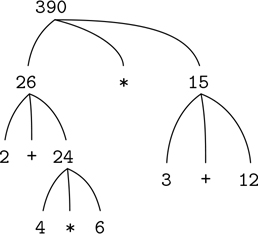

### 1.1.3 评估运算符组合

我们在这一章的目标之一是分离出关于程序化思考的问题。作为一个恰当的例子，让我们考虑，在评估运算符组合时，解释器本身也在遵循一个过程。

*   要评估运算符组合，请执行以下操作:
    1.  对组合的操作数表达式求值。
    2.  将运算符表示的函数应用于作为操作数值的参数。

甚至这个简单的规则也说明了一般过程中的一些要点。首先，观察第一步，为了完成组合的求值过程，我们必须首先对组合的每个操作数执行求值过程。因此，评估规则本质上是递归；也就是说，作为其步骤之一，它包括调用规则本身的需要。

注意递归的思想可以多么简洁地用来表达，在深度嵌套组合的情况下，否则会被视为一个相当复杂的过程。例如，评估

```js
(2 + 4 * 6) * (3 + 12);
```

要求评估规则应用于四种不同的组合。我们可以通过用树的形式表示这种组合来获得这个过程的图片，如图 1.1 所示。每个组合都由一个节点表示，节点的分支对应于该组合的运算符和操作数。终端节点(即没有分支的节点)代表运算符或数字。从树的角度来看求值，我们可以想象操作数的值向上渗透，从终端节点开始，然后在越来越高的级别上组合。总的来说，我们将会看到递归是一种非常强大的处理层次化、树状对象的技术。事实上，评估规则的“向上过滤值”形式是一种被称为树累积的通用过程的示例。



图 1.1：树形表示，显示每个子表达式的值。

接下来，观察第一步的重复应用将我们带到了需要评估的点，不是组合，而是数字或名称等原始表达式。我们通过规定来处理原始情况

*   数字的值是它们命名的数字，并且
*   名称的值是环境中与这些名称相关联的对象。

要注意的关键点是环境在决定表达中名字的意义方面的作用。在像 JavaScript 这样的交互式语言中，如果不指定任何可以为名称`x`提供含义的环境信息，谈论像`x + 1`这样的表达式的值是没有意义的。正如我们将在第三章中看到的，环境作为评估发生的背景的一般概念将在我们理解程序执行中起重要作用。

请注意，上面给出的评估规则不处理声明。例如，评估`const x = 3;`并没有将相等运算符`=`应用于两个参数，其中一个是名字`x`的值，另一个是 3，因为声明的目的正是将`x`与一个值相关联。(也就是说，`const x = 3;`不是一个组合。)

`const`中的字母以粗体显示，表示它是 JavaScript 中的一个关键字。关键字具有特定的含义，因此不能用作名称。语句中的关键字或关键字组合指示 JavaScript 解释器以特殊方式处理该语句。每个这样的句法形式都有自己的求值规则。各种各样的语句和表达式(每一种都有相关的求值规则)构成了编程语言的语法。
