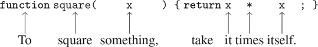

### 1.1.4 复合功能

我们已经在 JavaScript 中确定了一些在任何强大的编程语言中都必须出现的元素:

*   数字和算术运算是原始数据和函数。
*   组合嵌套提供了一种组合操作的方法。
*   将名称与值相关联的常量声明提供了一种有限的抽象方法。

现在我们将学习函数声明，这是一种更强大的抽象技术，通过这种技术，复合操作可以被命名，然后被称为一个单元。

我们首先研究如何表达“平方”的概念我们可能会说，“要计算某物的平方，需要乘以它本身。”这在我们的语言中表达为

```js
function square(x) {
    return x * x;
}
```

我们可以这样理解:



我们这里有一个复合函数，它被命名为`square`。函数表示将某物乘以自身的运算。要相乘的东西被赋予了一个本地名`x`，这个名字的作用相当于代词在自然语言中的作用。评估声明创建了这个复合函数，并将其与名称`square`相关联。 [⁶](#c1-fn-0006)

函数声明的最简单形式是

```js
function name(parameters) { return expression; }
```

名称是与环境中的功能定义相关联的符号。[⁷](#c1-fn-0007)参数是在函数体中使用的名称，用于引用函数的相应参数。参数在括号内分组，并用逗号分隔，因为它们将出现在所声明函数的应用程序中。在最简单的形式中，函数声明的主体是一个单独的返回语句、 [⁸](#c1-fn-0008) ，它由关键字`**return**`后跟返回表达式组成，当参数被函数应用到的实际参数替换时，返回表达式将产生函数应用的值。像常量声明和表达式语句一样，return 语句以分号结尾。

声明了`square`之后，我们现在可以在函数应用表达式中使用它，我们用分号将它变成一个语句:

```js
square(21);
441
```

在运算符组合之后，函数应用是我们遇到的将表达式组合成更大表达式的第二种组合。函数应用程序的一般形式是

```js
function-expression(argument-expressions)
```

其中应用程序的函数 - 表达式指定了应用于逗号分隔的参数 - 表达式的函数。为了评估一个函数应用程序，解释器遵循一个与 1.1.3 节中描述的操作符组合非常相似的过程。

*   要评估函数应用程序，请执行以下操作:
    1.  1。评估应用程序的子表达式，即函数表达式和参数表达式。
    2.  2。将函数表达式的值应用于自变量表达式的值。

```js
square(2 + 5);
49
```

这里，自变量表达式本身是一个复合表达式，运算符组合`2 + 5`。

```js
square(square(3));
81
```

当然，函数应用表达式也可以作为参数表达式。

我们也可以使用`square`作为定义其他函数的基础。例如，x²+y²可以表示为

```js
square(x) + square(y)
```

我们可以很容易地声明一个函数`sum_of_squares` [⁹](#c1-fn-0009) ，给定任意两个数字作为自变量，产生它们的平方和:

```js
function sum_of_squares(x, y) {
    return square(x) + square(y);
}

sum_of_squares(3, 4);
25
```

现在我们可以使用`sum_of_squares`作为构建进一步功能的基础:

```js
function f(a) {
    return sum_of_squares(a + 1, a * 2);
}

f(5);
136
```

除了复合函数，任何 JavaScript 环境都提供了内置于解释器或从库中加载的原语函数。除了操作符提供的原函数之外，本书中使用的 JavaScript 环境还包括额外的原函数，比如函数`math_log`，它计算参数的自然对数。 [^(10)](#c1-fn-0010) 这些额外的原函数的用法和复合函数完全一样；评估应用程序`math_log(1)`的结果是 0。事实上，人们无法通过查看上面给出的`sum_of_squares`的定义来判断`square`是内置在解释器中、从库中加载还是定义为复合函数。
