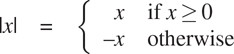
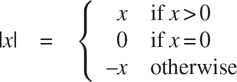
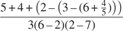

### 1.1.6 条件表达式和谓词

我们在这一点上可以定义的函数类的表达能力是非常有限的，因为我们没有办法进行测试，也没有办法根据测试的结果执行不同的操作。例如，我们不能声明一个函数，它通过测试一个数是否为非负来计算这个数的绝对值，并根据规则在每种情况下采取不同的操作



这个构造是一个案例分析，可以使用一个条件表达式用 JavaScript 写成

```js
function abs(x) {
    return x >= 0 ? x : - x;
}
```

在英语中可以表达为“如果`x`大于或等于零，则返回 x；否则返回-x。”条件表达式的一般形式是

```js
predicate ? consequent-expression : alternative-expression
```

条件表达式以一个谓词开始——也就是说，一个表达式的值要么是真要么是假，这是 JavaScript 中两个不同的布尔值。原始布尔表达式`**true**`和`**false**`通常分别计算布尔值 true 和 false。谓语后面是一个问号，后件 - 表达式，一个冒号，最后是替代 - 表达式。

为了评估一个条件表达式，解释器从评估表达式的谓词开始。如果谓词评估为真，解释器评估结果 - 表达式，并返回其值作为条件的值。如果谓词评估为假，它评估替代 - 表达式，并返回其值作为条件的值。 [^(14)](#c1-fn-0014)

单词谓词用于返回 true 或 false 的运算符和函数，以及评估为 true 或 false 的表达式。绝对值函数`abs`使用原始谓词`>=`，一个接受两个数字作为参数并测试第一个数字是否大于或等于第二个数字的操作符，相应地返回 true 或 false。

如果我们喜欢单独处理零的情况，我们可以通过编写来指定计算一个数的绝对值的函数



在 JavaScript 中，我们通过将条件表达式作为替代表达式嵌套在其他条件表达式中来表达具有多个案例的案例分析:

```js
function abs(x) {
    return x > 0
           ? x
           : x === 0
           ? 0
           : - x;
}
```

替代表达式`x === 0 ? 0 : - x`不需要括号，因为条件表达式的语法形式是右关联的。解释器忽略空格和换行符，为了可读性，这里插入了空格和换行符，以便在案例分析的第一个谓词下对齐`?`和`:`。案例分析的一般形式是

```js
p[1]
? e[1]
: p[2]
? e[2]
⁝
: p[n]
? e[n]
: final-alternative-expression
```

我们把一个谓词 p[I]和它的后置表达式 e[I]一起称为一个子句。案例分析可以看作是一个子句序列，后面跟着一个最终的替代表达式。根据条件表达式的求值，通过首先求值谓词 p1 来求值一个案例分析。如果其值为假，则对 p2 求值。如果 p2 的值也为假，则 p3 被求值。这个过程一直继续，直到找到一个值为真的谓词，在这种情况下，解释器返回子句的相应结果表达式`e`的值作为案例分析的值。如果没有发现 p 为真，那么案例分析的值就是最终替代表达式的值。

除了应用于数字的`>=`、`>`、`<`、`<=`、`===`、`!==`等原始谓词外， [^(15)](#c1-fn-0015) 还有逻辑组合运算，使我们能够构造复合谓词。最常用的三种是:

*   expression[1] `&&` expression[2]

    这个操作表达的是逻辑连词，意思和英文单词“and”大致相同。这种句法形式是句法糖[1616](#c1-fn-0016)为

    表情[1]`?`表情 [2] `: **false**`。

*   expression[1] `||` expression[2]

    这个运算表达的是逻辑析取，意思和英文单词“or”大致相同。这种句法形式是句法糖

    表达式[1]`? **true** :`表达式 [2] 。

*   `!` expression

    这个操作表示逻辑否定，意思和英文单词“not”大致相同。当表达式评估为假时，表达式的值为真，当表达式评估为真时，表达式的值为假。

注意`&&`和`||`是语法形式，不是运算符；他们的右手表达式并不总是被求值。另一方面，运营商`!`遵循第 1.1.3 节的评估规则。它是一个一元操作符，这意味着它只接受一个参数，而到目前为止讨论的算术操作符和原始谓词是二元，接受两个参数。运算符`!`位于其参数之前；我们称之为前缀运算符。另一个前缀运算符是数值求反运算符，上面的`abs`函数中的表达式`- x`就是一个例子。

作为如何使用这些谓词的一个例子，数`x`在范围 5<x10 内的条件可以表示为

```js
x > 5 && x < 10
```

语法形式`&&`的优先级低于比较运算符`>`和`<`，条件表达式语法形式`... ?... :...`的优先级低于迄今为止我们遇到的任何其他运算符，这是我们在上面的`abs`函数中使用的一个属性。

作为另一个例子，我们可以声明一个谓词来测试一个数字是否大于或等于另一个数字

```js
function greater_or_equal(x, y) {
    return x > y || x === y;
}
```

或者可选地作为

```js
function greater_or_equal(x, y) {
    return ! (x < y);
}
```

当函数`greater_or_equal`应用于两个数字时，其行为与运算符`>=`相同。一元运算符的优先级高于二元运算符，因此本例中的括号是必要的。

##### 练习 1.1

下面是一系列陈述。解释器响应每条语句打印出来的结果是什么？假设序列将按照其出现的顺序进行评估。

```js
10;

5 + 3 + 4;

9 - 1;

6 / 2;

2 * 4 + (4 - 6);

const a = 3;

const b = a + 1;

 a + b + a * b;

a === b;

b > a && b < a * b ? b : a;

a === 4
? 6
: b === 4
? 6 + 7 + a
: 25;

2 + (b > a ? b : a);

(a > b
? a
: a < b
? b
: -1)
*
(a + 1);
```

最后两个语句中条件表达式周围的括号是必要的，因为条件表达式语法形式的优先级低于算术运算符`+`和`*`。

##### 练习 1.2

将下面的表达式翻译成 JavaScript



##### 练习 1.3

声明一个函数，该函数以三个数字作为参数，并返回两个较大数字的平方和。

##### 练习 1.4

请注意，我们的评估模型允许函数表达式是复合表达式的应用程序。用这个观察来描述`a_plus_abs_b`的行为:

```js
function plus(a, b) { return a + b; }
function minus(a, b) { return a - b; }
function a_plus_abs_b(a, b) {
    return (b >= 0 ? plus : minus)(a, b);
}
```

##### 练习 1.5

Ben Bitdiddle 发明了一个测试来确定他面对的解释器是使用应用顺序求值还是正常顺序求值。他声明了以下两个函数:

```js
function p() { return p(); }

function test(x, y) {
    return x === 0 ? 0 : y;
}
```

然后他评估陈述

```js
test(0, p());
```

对于使用应用顺序求值的解释器，Ben 会观察到什么行为？对于使用正常顺序求值的解释器，他会观察到什么行为？解释一下你的答案。(假设无论解释器使用正常顺序还是应用顺序，条件表达式的求值规则都是相同的:首先对谓词表达式求值，结果决定是对结果表达式求值还是对替代表达式求值。)
